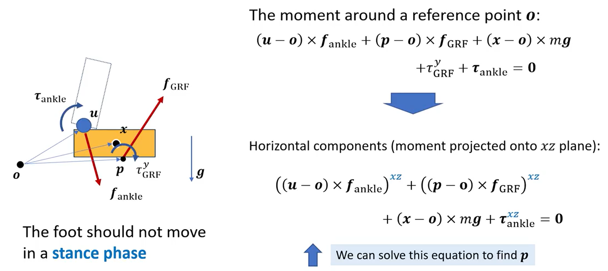
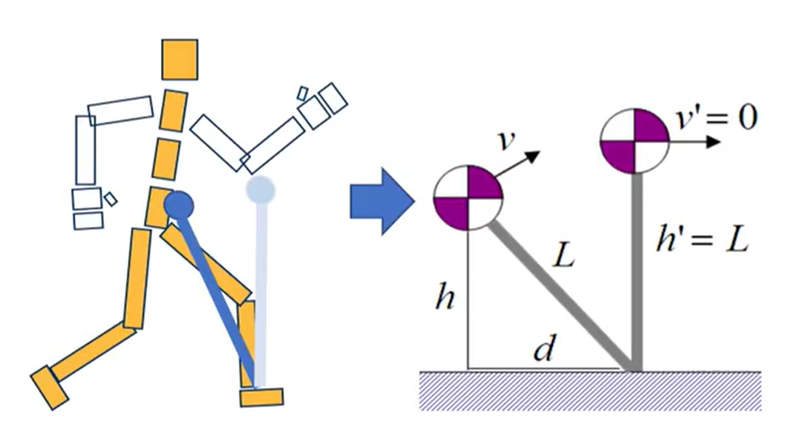
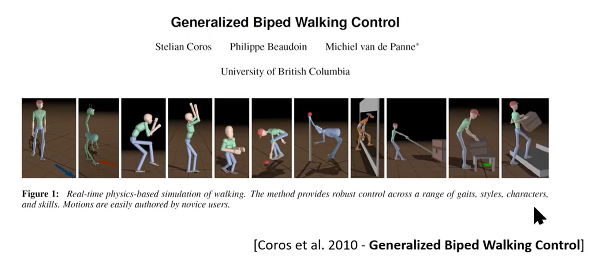
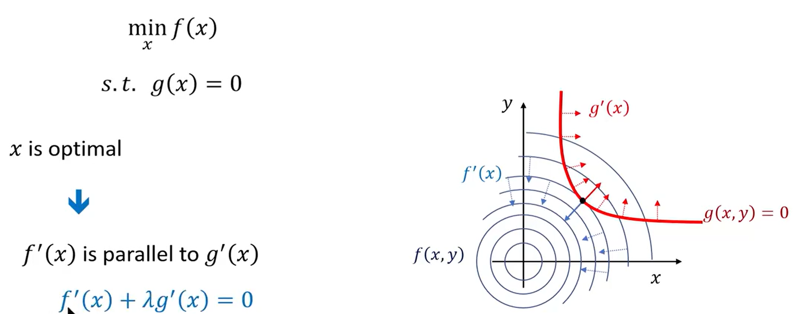
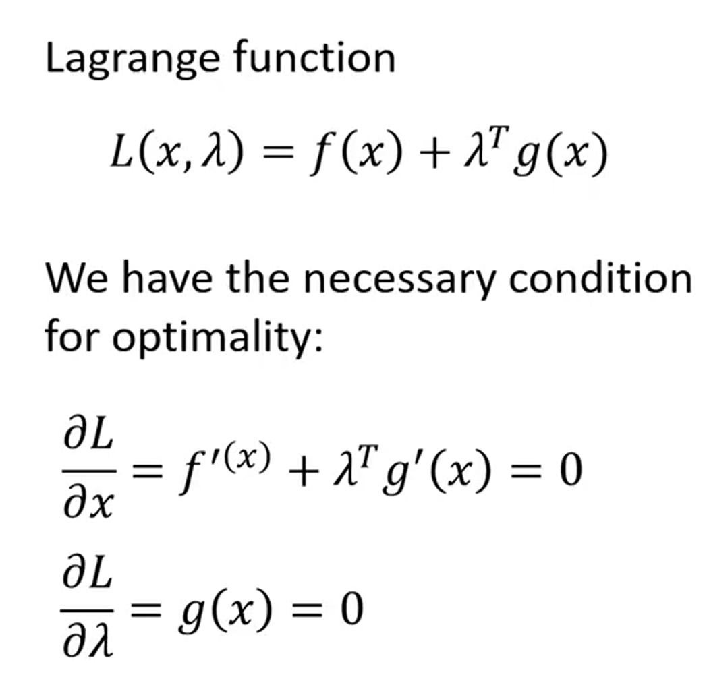
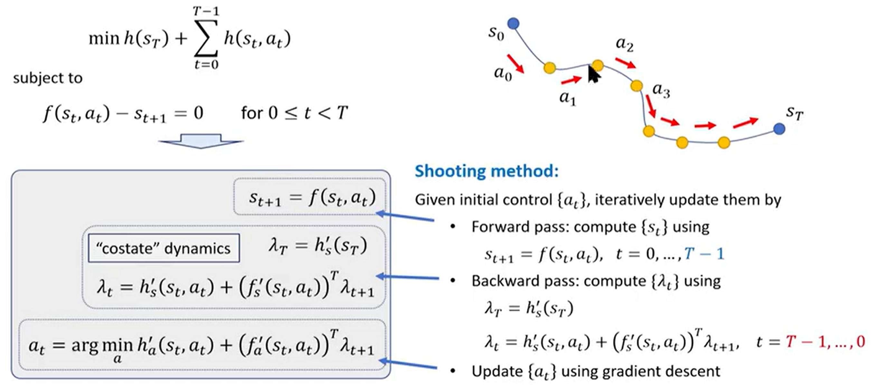
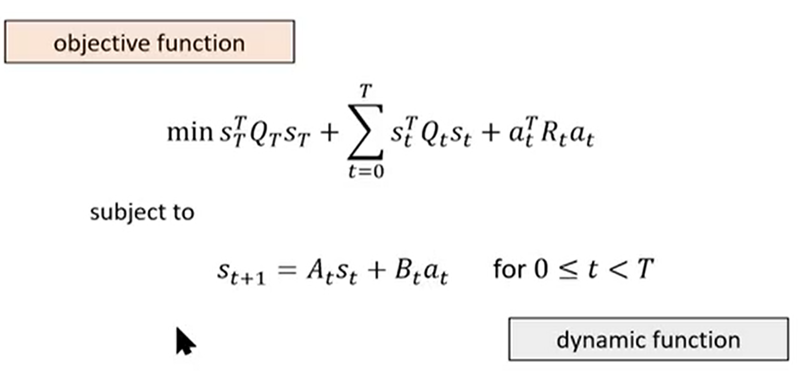
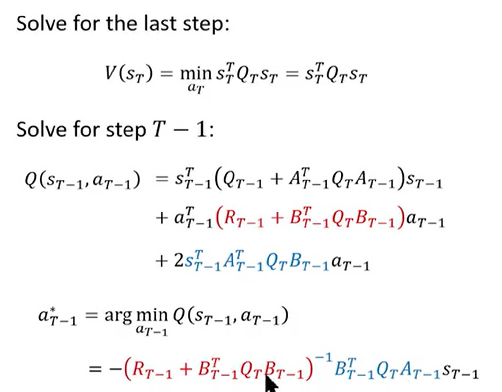
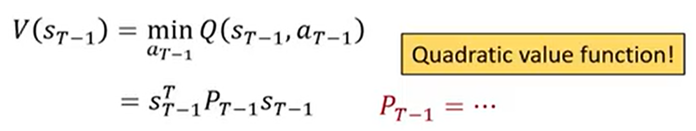
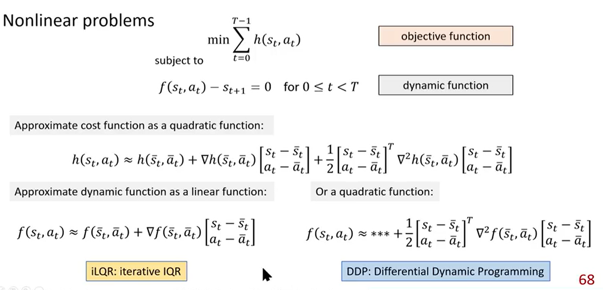

# 计算机角色动画基础

---

## lecture 2. 数学基础

### 绕轴旋转公式

Rodrigues' rotation formula: $b = a + (\sin \theta) \, u \times a + (1 - \cos \theta) \, u \times (u \times a)$

### 叉乘矩阵

[a]~x~ 称为 a 的叉乘矩阵，是一个反对称(斜对称)矩阵。

则 $a \times (b \times c) = [a]_{\times} ([b]_{\times} c) = [a]_{\times} [b]_{\times} c$ ,  $a \times (a \times c) = [a]_{\times}^2 c$

Rodrigues' rotation matrix: $R = I + (\sin \theta) [u]_x + (1 - \cos \theta) [u]_x^2$

### 猜你不记得的行列式性质

### 旋转矩阵

基础旋转矩阵：

基础旋转矩阵乘起来后就有了旋转矩阵，然后找到特征值为1的特征向量即为旋转轴。

一个旋转轴的简易求法：
$$
Ru = u, 则\ u=R^Tu \\
则\ (R-R^T)u = 0 \\
又\  R-R^T\ 是一个反对称矩阵，因此可以看作一个向量u'与u的叉乘。\\因为叉乘为0，所以该向量u'与u平行，所以u'即为对称轴。\\
u' =R-R^T= \begin{bmatrix}
r_{32} - r_{23} \\
r_{13} - r_{31} \\
r_{21} - r_{12}
\end{bmatrix}
\\单位化后即为对称轴。 
\\又由Rodrigues公式可得\ ||u'|| = 2sin\theta，即可求出旋转角。
$$

一个旋转矩阵的简易求法：（正交基变幻）

若旋转+平移，则可以这么变幻：（易理解）

### 旋转矩阵插值

插值：生成两个状态间的中间状态

一个好的插值：中间的每个 t 都是一个合法状态（而不是压扁了）；最好以常数速度转（更可控）。

所以尝试一些好的旋转矩阵表示方法。

1. **旋转矩阵自己**

   优势：方便运用。缺点：不好构造；不好插值（中间状态并不是旋转矩阵）。

2. **Euler Angles**

   表示为 xyz 三个方向的旋转。（但实际有多种操作方式，旋转顺序可以是 XYZ, XZY, YZY, ZYX 等等）

   - intrinsic rotation: object axis
   - extrinsic rotation: world axis

   优势：方便运用；好构造；好插值（需要注意奇点：$\pi$ 和 $-\pi$ 的过渡）

   缺点：万向锁影响 (Gimbal Lock)，当绕第二个轴旋转90°时，一三轴会重合，使得失去一个自由度。

3. **轴角表示**

   旋转轴+旋转角度 $(u, \theta)$，也可以写成 $u\theta$ (容易算出 u 和 $\theta$)

   优势：方便构造；方便插值（但如果想保持速度稳定的话计算复杂，and 也需要注意奇点）

   缺点：不方便运用（需要用Rodrigues，也不容易结合两个旋转）

4. **Quaternions**：四元数

   回忆平面中旋转可以用复数来运算。

   于是拓展复数，定义成为四元数。
   $$
   q = a + bi + cj + dk \in \H, \quad a, b, c, d \in \mathbb{R} 
   
   \\  i^2 = j^2 = k^2 = ijk = -1 
   \\  ij = k, \quad ji = -k 
   \\  jk = t, \quad kj = -t 
   \\  ki = j, \quad ik = -j
   \\和复数运算性质差不多，有共轭四元数\ q^* = \begin{bmatrix} w \\ -v \end{bmatrix}。
    \\则乘法有：q_1 \, q_2 = (a_1 + b_1 i + c_1 j + d_1 k) * (a_2 + b_2 i + c_2 j + d_2 k) 
   
    \\即\ q_1 \, q_2 = a_1 a_2 - b_1 b_2 - c_1 c_2 - d_1 d_2 
    \\+ (b_1 a_2 + a_1 b_2 - d_1 c_2 + c_1 d_2)i 
    \\+ (c_1 a_2 + d_1 b_2 + a_1 c_2 - b_1 d_2)j 
    \\+ (d_1 a_2 - c_1 b_2 + b_1 c_2 + a_1 d_2)k
    \\可以写成\ q = \begin{bmatrix} w \\ x \\ y \\ z \end{bmatrix} = \begin{bmatrix} w \\ v \end{bmatrix}
    \\则会更为简洁：q_1 q_2 = \begin{bmatrix} w_1 \\ v_1 \end{bmatrix} \begin{bmatrix} w_2 \\ v_2 \end{bmatrix} = \begin{bmatrix} w_1 w_2 - v_1 \cdot v_2 \\ w_1 v_2 + w_2 v_1 + v_1 \times v_2 \end{bmatrix}
    \\ *注意四元数乘法与矩阵相似，有结合律，没有交换律。
    \\类似可推得共轭：(q_1 q_2)^* = q_2^* q_1^*
    \\模长：\|q\|^2 = q^* q = qq^*
    \\倒数：q q^{-1} = 1 \quad \Rightarrow \quad q^{-1} = \frac{q^*}{\|q\|^2}
   $$

   $$
   \\ 【单位四元数】
   \\q = \begin{bmatrix} w \\ v \end{bmatrix}, \quad \|q\| = 1
    \\计算式：q = \frac{\tilde{q}}{\|\tilde{q}\|}
    \\有性质：q^{-1} = q^* = \begin{bmatrix} w \\ -v \end{bmatrix} \quad \Leftrightarrow \quad R^{-1} = R^T
   $$

   

$$
可以发现它拥有和轴角表示相同的信息量。
\\Any\ 3D\ rotation\ (v, \theta)\ can\ be\ represented\ as\ a\ unit\ quaternion.
\\四元数：q = \begin{bmatrix} w \\ v \end{bmatrix} = \begin{bmatrix} \cos \frac{\theta}{2} \\ u \sin \frac{\theta}{2} \end{bmatrix} \\

\text{角度计算：}  \theta = 2 \arg \cos w \\

\text{轴计算：}  u = \frac{v}{\|v\|} （其实就是单位化了一下）
$$

$$
可以发现旋转四元数的负数也是同一个旋转四元数
\\两个旋转的结合可以直接乘起来
$$

$$
对于插值，希望
$$

$$
方式1：直接线性插值再单位化。但速度不均。
$$

$$
方法2：SLERP\ (Spherical\ Linear\ Interpolation)
\\使得在弧线上是线性的
\\（推导不难，就是用\ t\theta\ 和起点终点向量求出中间状态向量）
$$

$$
一般会判断一下起点终点是否小于180°，采用相距最近的起点终点进行插值。
$$

---

## lecture 3. 前向和逆向运动学

Kinematics: 研究运动，不考虑质量和力。

### 前向运动学

局部坐标推全局坐标：

$$
关节方向 = 父节点关节方向 \times 自己朝向 
$$

$$
R为旋转矩阵，Q为全局坐标\\
p_1为节点1的全局向量坐标，l_0为节点1相对于节点0的局部向量坐标\\
\begin{aligned}
Q_0 &= R_0 \\
p_1 &= p_0 + Q_0 l_0 \\
Q_1 &= Q_0 R_1 \\
p_2 &= p_1 + Q_1 l_1 \\
&=(p_0 + Q_0 l_0) + Q_0 R_1 l_1\\
&= p_0 + Q_0(l_0+R_1 l_1) \\
Q_2 &= Q_1 R_2\\
&= Q_0R_1R_2
\quad 以此类推\\
\end{aligned}
$$

全局坐标推局部坐标：

一样，乘逆就可以了。

#### 关节设计

- Hinge joint (revolute joint): 单向旋转（eg. 手肘，膝盖）`自由度=1`

- Ball and socket joint: eg. 肩膀，髋 `自由度=3`

- Universal joint: `自由度=2` 类似于手腕。

  

  

一个 pose 所需要的参数：根节点位置和转角 + 每个节点转角（各关节自由度可能不同）

`如果需要可变形关节，可以加入一些关节位置参数`

> [!NOTE]
>
> 一般用 BVH 文件存储动作数据

### 逆向运动学 (IK)

知道末端点位置，求前面一系列关节的旋转。（经常多解）

不容易直接求解，所以一般把求解转为优化，优化到差值为0时即为解。

以下都是一些解决优化问题的算法，可以应用到 IK 上。除此之外，还有一些启发式算法（就不讲了）。

#### CCD

 -循环坐标下降法 Cyclic Coordinate Descent

每次动一个关节，使距离最近。则每次调整距离都会下降。

好处：简单易算

坏处：迭代次数多；对于附近的位置可能得到的解不稳定；在循环中最先动的关节移动幅度最大。

#### 梯度下降法

 -Gradient Descent 或 Jacobian Transpose

考虑函数性质，按梯度反方向下降。

每次前进距离人工规定，称为学习率。学习率太大可能会导致错过解/在解周围转等问题。

$$
(Jacobian\ Matrix)\\
\theta = (t_0, R_0, R_1, R_2,...)
$$
如何算呢？用 pytorch 之类的工具自动算吧:)

大概每算一个 Jacobian Matrix 就要对所有关节做一次叉乘，计算量大。迭代比 CCD 稍快。

#### Gauss-Newton

 -或 Jacobian Inverse

算出函数的一阶近似（泰勒展开、Jacobian 伪逆）

迭代更快，但有时 Jacobian 接近不可逆就会使伪逆矩阵数字很大，不稳定。

#### Damped Jacobian Inverse

 -或 Levenberg-Marquadt algorithm

加入 $\lambda I$ 阻尼项保证可逆（当阻尼项极大时成为一种梯度下降）

等价于添加了这么一项↓，使每个关节旋转最小。

于是，其实可以这样给不同关节不同权重，使关节动多一点/少一点。

---

## lecture 4. Keyframe Animation

### BVH 文件

开头会先定义模型 (各节点相对于父节点位置)，一般为T-pose / A-pose

相同的姿势参数作用在不同的 reference pose 上会产生不一样的姿势（eg. 胳膊抬90°），所以有时需要 **motion retargeting**（动捕是 T-pose 而角色是 A-pose）。

单个刚体：R~B~ = R~A~ Q^T^~A->B~ （B 先到 A 再到姿势）

子节点：R~Bi~ = Q~Ap->Bp~ R~Ai~ Q^T^~Ai->Bi~ （先 B 子关节转到 A 子关节，再按子关节旋转数据转，再按照父关节变回 B 的角度旋转回去一点，因为要抵消父节点从 B 变到 A 的旋转）

### Full-body IK

根据其他链条动的位置再开始计算，或者需要固定某一点时发现它动了就把它拽回去。

### Keyframe Animation

关键帧插值

- **Linear Interpolation**

  

- **Polynomial Interpolation**

  

  problem: **Runge's phenomenon**: 次数高后，靠近边缘的地方会大震荡。

- **Spline Interpolation**: 分段

  eg. **Cubic Spline**：三次样条 (常用)

  

  n segments, 4n unknown parameters.

  可构建方程组：f(x1) = x1; f(x2) = x2; 左右一阶导、二阶导相等。

  缺点：4n*4n矩阵求解复杂，且没有局部性（调一个点会动到别的）。

- **Cubic Hermite Spline**：三次厄密特样条

  除了端点值之外还要给定端点导数(速度)，即可与其他点都无关。会很好算。

  

  通过计算，发现只要每次乘以这个 Hermite Basis 就可以了。（y1, y2, m1, m2 可以扩展到多维）

  

- **Catmull-Rom Spline**

  一种 Hermite Spline 的特例。如果给不出导数，可以使左右两点的差表示导数。（较为常用）

- **SLERP**

  四元数插值方法（四元数时有讲）

  好处：可以保证速度平均（以上其他方法不保证速度平均）

  缺点：是线性插值，较为死板、机械化。

---

## Lecture 5. Data-driven Character Animation

### 如何拿到动作数据

1. 转描：劳动密集

2. 外骨骼：移动不方便。

3. 惯性传感器：可能产生漂移（积分使误差变大），可以通过重力传感器、启发性先验知识等进行修正，但很难全部修正。好处是移动方便，移动范围也可以很广。

4. 光学动捕（现在常用）：红外线打到标记点上反光，通过若干相机重建点的三维位置。缺点：点被遮挡了/认错了就需要后处理补点；还是多少会阻碍动作；动物采集不方便。

5. 基于多视角相机的无标志点动捕：还是识别关节。不容易识别准确。

6. 深度摄像头：精确度和鲁棒性还是不行。

7. 动作估计：用单个二维视频或少量标志点进行动作估计。

### 如何使用动作数据

1. 重定向（包括初始姿势、关节长短数量变化）

2. 动作连接：找两帧相似的动作，然后前后各保留一段，进行逐步插值

**Facing Frame**: 考虑角色本地坐标（一般 y 轴竖直向上，x 轴为根关节轴，z 轴为人物朝向），则可以先对齐两段动作素材的本地坐标再连接，就可以统一朝向。

也可以一开始采集数据时就全部消除根关节的旋转和位移，使得对齐更方便。（或者直接导入一个二维位移轨迹）

**Motion Graph**: 一个状态机，可以通过计算距离来判断一长串动作中哪些帧适合切换到哪些帧，但不是很准确，还是依靠人为纠正。而且动作转换往往还是需要额外动捕，而且需要等每段动作播放完才能切换。

**Motion Matching**: 更加细粒度，寻找这一帧到下一帧满足用户输入/环境变化距离最近的姿态。（这样素材都不用切分）但在距离函数设计和可控性方面可能有难点。

---

## Lecture 6. Learning-based Character Animation

### Recap: Interactive Animation

**Motion Fields**：有一堆动作，找到当前动作的 k 近邻，然后根据用户输入赋予不同的权重后叠加起来形成接下来的姿势。问题：权重如何设置？论文中采用强化学习，这个不好操作也不好迁移。

**Motion Matching**：在 Motion Fields 的基础上，只找一个最近邻。这个最近邻可能是另一套动作里的一个姿势，所以需要采用一些手段使平滑过渡（过几帧检测一次、带阻尼的混合、...）。需要好的数据结构来实现快速搜索。

这都需要计算**距离函数**，距离函数可以考虑：

1. 根节点线速度角速度
2. 手脚位置
3. 手脚线速度角速度
4. 未来 (eg. 两套动作 0.5s 后) 的位置/朝向
5. 脚和地面的接触
6. 等等

### Part 1. Statistical Models of Human Motion

如何对 “自然的人体动作” 建模？

The Low-Dimentionality of Human Motion: 其实各关节三个自由度很多都是冗余的，因为人的关节很多都有相互依赖关系。自然的人体动作在高维空间中形成一个低维曲面。

#### Principal Component Analysis (PCA)

​	——主成分分析

目标：找到一个轴，所有点在这个方向上的投影形成的标量们方差最大

*其实就是协方差矩阵的特征向量的方向。最大的特征值对应的特征向量即为最大的主成分，第二大对应第二大主成分，以此类推。

叠加更多成分就越精准。差不多覆盖 95% 的原数据其实就可以了。

当一个新姿势进入时，可以通过计算 ↓ 来判断是否自然。（在这个方向上离这个方向上点的平均位置越近越自然）（通过除以 $\sigma_k^2$，可以对每个主成分的贡献进行标准化 (加权) ）

可以把这个和 IK 结合起来，成为 IK with Motion Prior。

（实际上红色部分可以写为 $-w\ log\ p(x)$，logp(x)为一个高斯概率分布(?)极大似然估计(?)，总之就是在认为先验数据满足高斯分布的情况下，想生成出现概率尽可能大的新姿势）

（但高斯分布是很大的简化，实际概率分布函数还可以再精良一点）

### Part2. Autoregressive Model

通过条件概率，计算在前面几帧动作下，新一帧动作的概率。

为了简单一点，默认具有马尔可夫性，即此帧只与前一帧相关。

- 使用神经网络进行训练。

  仍然使用梯度下降法来进行训练，目标是最小化误差函数$F(\theta) = \sum_{(x_{t-1}, x_t)} \| f(x_{t-1}; \theta) - x_t \|$。

  因为数据集可能太大，所以每次随机选择一组(batch)，计算其梯度（为整个数据的近似梯度）。

  但是梯度怎么算呢？采用链式法则求导，即成为后向传播算法。

  

  但是如果动作有随机性怎么办呢？（往左、往右、往前都有？）

- PFNN: Phase Functioned Neural Network

  走路其实像周期性动作，把相位作为一个参数传入。

  或者在不同的相位使用不同的函数。

  - Mixture of Expert

    给多个模型看，把结果加权平均。（比如按照相位加权）

  - Weighted-Blended Mixture of Experts

    把所有专家的参数做混合，形成一个新的专家，再做推测。

  

- Advanced Phase Functions

  对于没有显性周期性的动作，可以在输入 x 时先经过一个 **门网络**(gating network) 来产生一个相位的效果，再跑大的神经网络。两三层的前向神经网络就可以较好实现门网络效果。

  

然而，如果真的要计算完整的条件概率（而不是只有前后帧），怎么办呢？

### Part3. Generative Model

几种方法：

1. Variational Autoencoders

   取数据点，通过编码函数映射到正态分布上，再用解码函数从正态分布还原到原来样本点。

   

2. 对抗生成式

   直接取正态分布空间里的点，映射到数据空间的一个概率分布，再判断这个概率分布是否和真实概率分布差不多。

   

3. Normalizing flow

   和 1 差不多，只是要求函数可逆，于是两个函数可以用一个函数表示。

   

4. Diffusion Model

   本质也是编码解码，但做了很多次编码（一点点加噪音）得到正态分布，再很多次解码。

   

生成式模型优点：可以在高斯分布中随意取一个点，就可以生成为一个动作。如果要生成一连串动作，也可以在高斯空间中画一条路径（通过强化学习？）然后生成。

---

## Lecture 8. 仿真

### 一、单个刚体

#### 相对位置计算

x 为参考点（质心）

考虑旋转矩阵是正交的，两边同时求导，发现 RRT 是一个斜对称矩阵

任何一个斜对称矩阵都和一个叉乘矩阵相对应。

所以位置导数可以写成：

所以：

#### 积分计算

##### 旋转矩阵

x 为上一时刻，x' 为下一时刻

*要注意计算完后的 R' 需要正交化（因为离散化拟合会有误差）*

##### 四元数

*同样，需要正则化*

#### 角动量计算

使用转动惯量 I 来表示：

*转动惯量为一个3x3的矩阵，转动惯量大则更不容易开始/停下转动*

##### 转动惯量的变化

因为一定可对角化，所以其实只关心三个方向上的转动惯量

#### 在刚体上施加力

可以分解为在质心上加一个力，并刚体加一个力矩（旋转）

根据推导

可以得到

联立即为**牛顿欧拉公式**（6x6 · 6x1 = 6x1）

所以仿真刚体的整体计算流程：

### 二、多刚体

#### 二维曲线约束

约束力的大小应该和物体运动方向垂直

计算约束力的方程：

求解 vn+1 和 λ

但一般计算会有误差，离开轨迹，所以 Jv 一般不等于0，会通过拉回误差

求解方程会得到中间式子，以防不可逆，常常加一个CFM（但不会太大，不然误差会很大）

#### 关节约束

刚体上的点相对于关节的距离应该保持不变↓

可以得到这样的方程：（3x12 · 12x1）

求解即可得到约束力。

因此，整个计算应为↓。包括施加的力和约束力。

*对于不同的关节，约束力的计算有所不同。

### 三、刚体和地面接触

#### 0. 接触点检测

- 离散检测（则要关注陷进地面的深度）
- 连续检测（算出实际碰撞时刻，但可能效率不高）

#### 1. Penalty-based Contact Model

- $k_pd$: 类似弹簧，劲度系数*陷入深度
- $k_pv_c$: 阻尼项，防止被弹飞

- 算出支持力后即可算出动摩擦力

#### 2. Contact as a Constraint

接触时只允许向上的速度，支持力也一定向上。不接触时支持力一定为0。

这被称为 Linear Complimentary Problem（线性互补问题）

### 四、整体计算流程

计算转动惯量、支持力；计算力带来的速度(with 关节约束)；积分得到位置和姿态。

---

## Lecture 9&10. 驱动角色

计算过程

### 关节力矩

红色项为 0，即可消为

等价于

### 前馈控制

- 前向动力学：知道 x, v, f，计算加速度 【物理引擎】
- 逆向动力学：知道 x, v, a, 计算施加的力 【controller】

- Fully-Actuated：完全驱动。控制力维度 >= #dofs。对一组 x, v, a, 一定能找到力。
- Underactuated：欠驱动。控制力维度 < #dofs（角色关节数永远小于刚体质心数）。对一组 x, v, a, 不一定能找到力。控制平衡就是努力让姿态在控制范围内。

  #### PD 控制

缺点：

1. 但是直接使用 PD 控制抵达动捕数据位置并不能很好地 track，因为本质上是一个欠驱动系统，稍有偏差就会无法回到应有状态。
2. 稳态误差（要有误差才有力，所以会停在误差可以产生重力的位置）；相位误差

#### 优化PD控制

##### 欠驱动系统问题

Sol1. root force/torque（在虚拟世界里加一个没有施力者的力，上帝之手）

Sol2. 混合仿真动画

##### 相位偏差与稳态误差问题

Sol1. trajectory optimization. 

- 即优化

  硬约束比较难达到可以使用软优化

  （可以通过近似变量(v约等于kx)来减少需要优化的变量个数，来简化优化）

【优化方法】

- 梯度优化不太work：（也有很多梯度没法算）

  

- 一些启发式的方法：通过若干样本点来估计优化。

  

  1. CMA-ES 方法：预测一个高斯分布（根据前一波的 elite 点来更新均值和方差）

     

     （需要每一次从头开始仿真，而且如果有多个局部最优解也不好收敛）

  2. SAMCON 方法：序列蒙特卡洛方法，一步步优化（每一步拿出 elite 点再仿真下一步）。

  

  

  

  这样可以给局部最优解更多考察机会，最终选择一条最接近的 trajectory。

Sol2. 调高 kp (但可能会太僵硬；造成仿真数值不稳定)

##### 仿真数值不稳定问题

- kp大 -> A的特征值大。时间步长大 -> A的特征值大。

  若 A的特征值超过1，则矩阵连乘($S_n = Z^n S_1$)后趋于无穷，系统不稳定。

  所以 kp 越大，要求仿真时间步长越小。

  对于 kp = 200, kd = 20 for a 50 kg character，仿真步长一般是 0.5~1ms，不然就飞了。

Sol1. 使用半隐式欧拉会更加稳定。

### 反馈控制

当发生扰动时，还要保持平衡、继续原来的动作。则需要添加 correction force。

#### Static Balance

- 如何保持平衡：重心投影落在接触面内。

  

- 继续使用 PD 控制来保持平衡： 一般将力矩加在脚踝。

##### Jacobian Transpose Control

- 直接 PD 计算，为需要加在质心上的力。然后计算要达到这个力所能产生的同样效果，应该在关节上加怎样的力矩。（一般下半身来保持平衡）

  

  即，推导可得 

- *这样也可以计算出蹲下站起、转身所需要的力矩

- Fancier Strategy：也可以控制 root 的角动量。

- 但如果扰动力过大、需要走两步来保持平衡，就无法使用此方法了。

---

## Lecture 11. 学走路

走路是两只脚交替 stance - swing 的过程。（有两只脚 stance 的时间）

### Zero-Moment Point

将地面给的力分解为垂直地面方向和水平地面方向：

把力等价为施加在压力中心上，则水平方向力矩为0：

考虑到支撑脚在所有力的作用下是静止的：

- 如何找到 P 点（合力矩的水平分量为0）：解方程↓

  

  若 P 算出来并不在 polygon 内部，则算出来的 P 并非 ZMP，则真正的 ZMP 点水平力矩无法为 0，则会让脚翻动 --> 摔倒。

  保持平衡：保证 ZMP 呆在 polygon 内部。

#### 如何控制（ZMP-Guided Control）

建立简化模型，计算出质心移动轨迹，然后再处理。

但 ZMP 是时时刻刻保证平衡，而人倾向于不断失去平衡再找到平衡来省力。

### 更多简化模型

#### Inverted Pendulum Model (IPM)

- 使用 [重心-脚] 倒立摆来规划落脚位置 

  1. 根据重心位置速度计算出落脚点，使重心摆到90度时正好速度为0
  2. IK 或样条计算出腿部姿态
  3. PD control

- 较为鲁棒↓

  

#### SIMBICON

1. 跟踪一组动作

2. 控制上半身保持竖直（计算上半身和迈开的腿所需力矩，另一条腿来提供该力矩）

3. 质心平衡：二维情境下，假设腿部需要摆动的角度 = 跟踪的摆动角度 + 参数 * 质心位置 + 参数 * 质心速度

   （但不同动作需要调不同参数，不同 dimension 也有不同参数）

---

## Lecture 12. 优化控制与强化学习

### 一、Constrained Optimization

如果值函数的梯度和限制曲线的梯度夹角小于 90 度，则在接近更优解。所以得到最优解的必要条件↓

所以有拉格朗日乘子法：对拉格朗日函数取得极值的 x 即为对原值函数取得极值的 x。

所以轨迹优化：(优化a)

即 **Pontryagin's Maximum Principle**：

（属于开环控制）

### 二、动态规划

- Bellman Optimization：行为价值/状态价值、Bellman Equation...

### 三、Linear Quadratic Regulator (LQR)

LQR 问题定义：线性运动方程，二次优化方程

（P很复杂，但可以写成这个形式）

则容易求解。

对于非线性问题，可以泰勒展开形成二次函数。

为 Model-based Method. 问题：

- 运动方程可能不知道、不精确
- 系统有噪声
- 系统非线性

### 四、强化学习

其实和最优控制目标相似，只是不清楚系统方程。

### How to Solve MDP: Policy Gradient

把不能算的东西用统计数据替代。

