# 计算机网络

---

2025秋

# Lecture 1. 网络基础知识

- TCP/IP协议标志现代互联网诞生。
- 网络学什么？实体、服务、协议、实现与管理
- 个域网Pan、局域网LAN、城域网MAN、广域网WAN

## 一、实体

> [!NOTE]
>
> 计算机网络的构成：
>
> - 网络边缘
>   - 端系统：位于互联网边缘与互联网相连的计算机和其他设备
>   - 端系统由各类主机(host)构成：桌面计算机、移动计算机、服务器、其他智能终端设备
> - 接入网
>   - 连接边缘端系统与网络核心
>   - 通信链路 (光纤、铜缆、无线电、激光链路)
> - 网络核心
>   - 由互联端系统的分组交换设备和通信链路构成的网状网
>   - 关键技术：分组交换（路由器、链路层交换机）

1. 【网络边缘】主机（/ 端）的命名：

   - 每个网卡有唯一的设备ID（48位mac地址）
   - IP地址可以根据需要配置（iPv4 32位，iPv6 128位）
   - 主机名（一个字符串，方便记忆），eg. pku.edu.cn

2. 【接入网】使主机连到[边缘路由器][端系统Host去往任何其他远程端系统的路径上的第一台路由器]的网络

   - 有线网：使用物理介质连通，传输单位为bit，为引导型介质，双向传输
     - 双绞线：两根绝缘铜线互相缠绕为一对，电话线为1对双绞线，网线为4对双绞线。
     - 同轴电缆：两根同心铜导线，同时传输多个频率通道，可根据频率调台。
     - 光纤：玻璃纤维传光脉冲，一个脉冲传一位，高速（依靠光折射所以大概2/3光速），受干扰低。
       - 有源光纤网络AON：每个用户独立线路，速度快，但成本高、能耗大
       - 无源光纤网络PON：用户共享线路，成本低、能耗低
   - 无线网：为非引导型介质，[半双工]() `同一时刻只能单向传输`

3. 【网络核心】Internet架构

   - ISP：Internet service provider，端系统通过本地网络提供商（access ISP）接入Internet，本地网络提供商之间也需要互相连接，产生了一个结构极度复杂的当今Internet。

     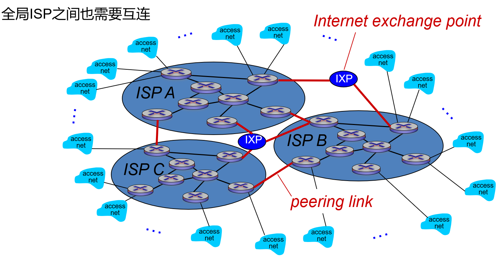

     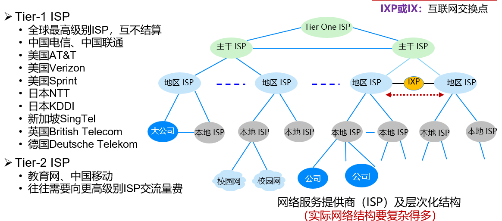
     $$
     互联网公司（Google、微软）也组建自己网络，使得数据中心与用户距离更近 \\这种网络常称为内容提供网络
     $$


## 二、服务

网络的功能、接口、质量

- 路由：要去到目标服务器，下一个结点去哪里
- 转发：跳！

### 交换

1. 分组交换：把数据分成多个包，每个包独立传输。需要存储，收到整个包后再往下传输。

   - 容易拥塞

     Sol. 虚电路：用分组模拟电路交换行为，但自身开销大，性能难以保证。

2. 电路交换：先建立链接，预留资源，连接建立后物理通路被通信双方独占，性能好。

   - 可以通过频分/时分实现多路复用

### 应用程序需求

1. 面向连接：传输数据之前先建立对话链接（eg. 打电话）。每个请求后，对方产生一个确认动作。

   六个核心服务原语：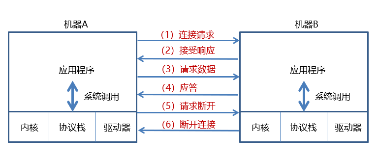

2. 无连接：不需要事先建立链接（eg. 微信）。

### 性能指标

- 带宽(bit/s)：网络中某通道传送数据的能力，即单位时间内网络中的某信道所能通过的“最高数据率”。

- 包转发率(PPS packet per second): 

  - **线速转发**：设备能够以其端口的物理最大速率无阻塞地处理和转发数据包，即数据包的转发速率与端口的标称带宽完全匹配，不存在性能瓶颈。大包更容易实现线速转发，小包CPU处理压力很大。

- 比特率(bit/s): 网络设备往通道里注入数据的速度

- 吞吐量(bit/s): 单位时间内通过某个网络位置的数据量

- 有效吞吐量(goodput bit/s)：单位时间内接收到的有效信息

- 利用率：吞吐量/带宽

- 丢包率：丢失数据包/总发送数据包

- 时延：数据从一端到另一端所需要的时间。总时延=[传输时延](= 发送时延 = 注入时延 = Length(bit)/传输介质写速率(bit/s))+传播时延+处理时延+排队时延

  - 传输+处理：硬件设备10微秒-几十纳秒，软件设备毫秒-微秒。

    ​			优化：设计专有硬件芯片、开发操作系统模块。

  - 传播：与距离、介质有关，光纤2/3光速，微波光速。

    ​	   优化：铺专线开隧道架站点。

  - 排队：最不确定因素，严重时可达秒级。

    - 如果排队queue满了，就会发生丢包

    - 排队论
      - 到达模型：分组怎样到达，平均到达速率A，峰值到达速率P（难以测量）
        - 平均等待时间W（难以测量）
        - 平均队列长度L（容易测量得到）
        - Little's Law(1961): L = A * W

  - 往返时延RTT(round-trip time)

  - 时延带宽积 = 传播时延 * 带宽，表示管道容量，即填满时能装多少比特。[推导](第一组数据从发送到接收的时间*第一组数据量，即为所有正在管道里传输的数据量)

  - 时延抖动：时延的变化

  - 延迟丢包：到得太晚，应用程序不再需要


## 三、协议

为进行网络中的数据交换而建立的规则、标准或约定，即网络协议(network protocol)。通信双方需要共同遵守，互相理解。

- 三要素：
  - 语法：规定数据格式
  - 语义：规定要完成的功能
  - 时序：规定各种操作的顺序（类似于双方讲话的顺序）
- 网络协议以头部封装的形式定义，数据被封装为协议载荷：


## 四、计网的分层

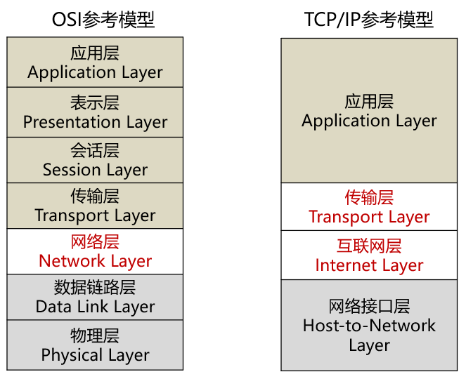

- OSI: 从未真正被实现，技术实现糟糕。
- TCP/IP：先设计再实现，所以模型有些缺陷。

### 框架图

1. 接入层：[物理层](如何表示01) + [数据链路层](如何处理01)

   考虑在单条链路上如何通信。

   - 实体：两端两张网卡。
   - 命名：物理地址（MAC地址）
   - 经典协议：（有线）以太网，（无线）WiFi、蜂窝网、蓝牙
   - 服务与管理：把比特流处理为消息流（成帧），差错检测与纠正，链路复用（如何共用、减少干扰）。

2. 网络层：主机之间跨多跳链路通信

   - 实体：主机
   - 命名：IP地址
   - 经典协议：IP, (BGP, ICMP, ARP)
   - 服务与管理：路径选择，流量控制

3. 传输层：主机间端到端通信

   - 实体：套接字（抽象的通信端点）
   - 命名：IP地址+端口
   - 经典协议：TCP, UDP
   - 服务与管理：连接管理，丢包重传，拥塞控制`(控制发送方发送速度)`，负载均衡

4. 应用层：封装典型网络业务，如web、文件下载

   - 实体：应用程序
   - 命名：域名+端口
   - 经典协议：HTTP, POP3, (FTP, BT, DNS)

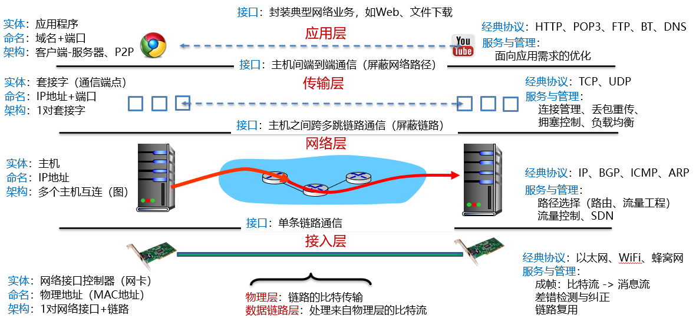

### 分层的实现

- 发送端：层层封装头部数据。接收端：层层解封装头部数据。

  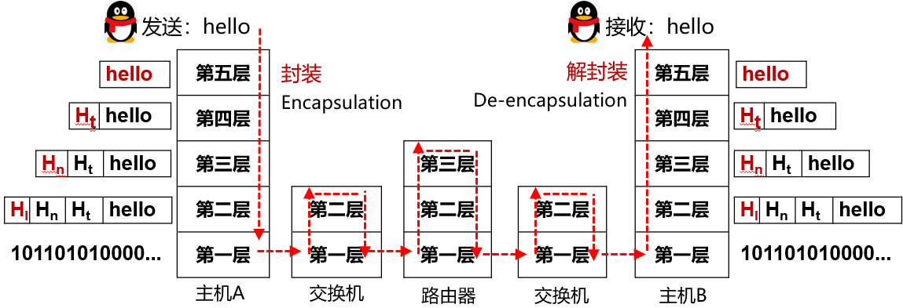

  传统交换机不支持多跳(只能直连)，传统路由器支持多跳。现代交换机和路由器已经不做区分（都支持二层与三层转发）。

- 特征：

  1. 复杂功能由端系统实现。聪明终端+笨网络（由端系统负责丢失恢复等复杂功能），实现了建立在简单的、不可靠部件上的可靠系统。`电话系统则为笨终端+聪明网络，则不方便扩展`

     缺陷：各层之间功能重叠；网络资源管理与性能控制依赖端系统，网络核心只能进行粗粒度流量，难以协同端系统应对大流量。

  2. 以 IP 协议为核心。IP over everything, everything over IP. 作为一个基本中间节点。

     缺陷：IP 协议本身很难升级，IPv6 现在还没推广。

---


# Lecture 2. 应用层

负责不同主机上的程序的交互，通过socket和传输层交互。socket起到一个门的作用。

1. 接口

   - 希望传输层提供的服务：可靠传输，高吞吐，低时延，安全
   - 实际传输层提供的服务：
     - TCP服务：面向连接，丢包重传，有序传输，流量控制(防止接收方过载)，拥塞控制(防止网络核心过载)
     - UDP服务：无连接，可能丢包；但是它简单！性能好！
     - 无法保证延迟、吞吐量、安全，没有加密功能`(在网络上进行明码传输)`。
       - SSL：一个应用层技术，提供数据安全性。提供TCP数据加密、保证隐私与数据完整、可以在传输另一端验证、传输加密后的数据。

2. 通信实体

   - 为每个应用以IP地址+端口号命名（给socket命名）`HTTP服务器：80`

3. 架构

   (1) 客户/服务器方式 (Client/Server)

   - 客户端发起请求，服务器响应。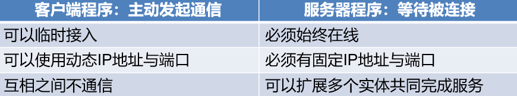

   - 客户端和服务器都在应用层。

   - 进程处理方式

     - 无连接循环方式：只有一个socket进行服务，一次只服务一个，按先后顺序来。
     - 面向连接循环方式：服务进程对每个连接请求创建对应的连接socket，服务完成后关闭，再处理下一个连接请求。
     - 面向连接并发方式：一个服务socket负责接收请求，然后派发临时socket负责处理请求，临时socket端口号同一，但可以根据客户端口号来区分应该把信息传到哪儿。
     - 无连接并发方式：还是一个个来。

     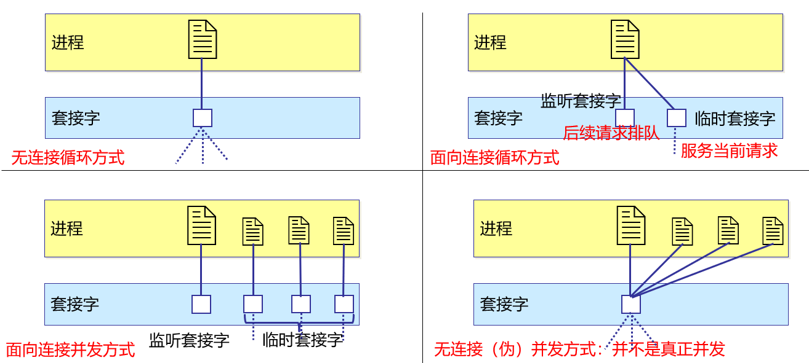

   - lab1推荐TCP实现面向连接的循环方式

   (2) 对等方式 (Peer to Peer, P2P)

   - 不区分请求方和响应方。

4. 协议

   - 开放协议 (HTTP, FTP, SPML, ...)、私有协议 (微信)


## 一、WWW体系结构与协议

- 服务器：存储web对象，通过URL描述位置。
  - URL：Uniform Resource Locators。用同一个格式对不同对象进行编号。
- 客户端：发出请求，接收响应，显示渲染。

### Web 对象

- 静态对象与静态网页

- 动态对象与动态网页（交互信息）

  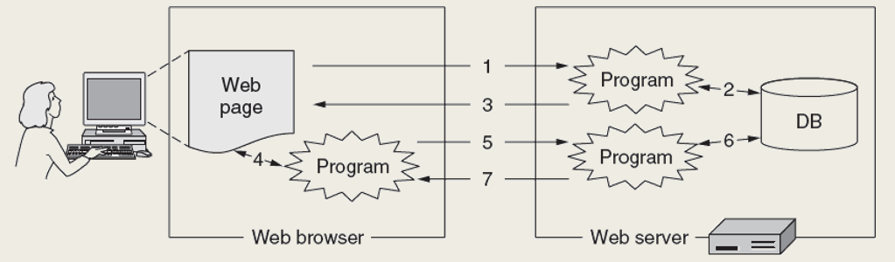

  1. 通用网关接口CGI (common gateway interface): 一种标准，定义了如何在服务器端生成动态Web *（规定了如何创建动态文档、输入数据如何提供给应用程序、输出结果如何使用）*

     ```c++
     //c++ CGI程序
     #include <iostream>
     using namespace std;
     int main() {
         // 向Web服务器输出响应头，声明响应内容的类型是HTML格式
         // 两个连续的换行符(\n\n)是CGI规范要求的，用于分隔响应头和响应体（实际HTML内容）
         cout << "Content-type:text/html\n\n";
     
         // 获取QUERY_STRING的值，该变量存储了HTTP GET请求的查询字符串（URL中?后面的内容）
         // getenv函数用于读取系统/环境变量，返回值是const char*类型，若变量不存在则返回NULL
         const char *queryString = getenv("QUERY_STRING");
         
         if (queryString != NULL) {
             // 若存在查询字符串，用HTML的<h2>标题标签输出该字符串
             cout << "<h2>" << queryString << "</h2>" << endl;
         } else {
             // 若未获取到查询字符串，输出提示信息（<p>段落标签）
             cout << "<p>No query string</p>" << endl;
         }
     
         string postData, tmpData;
         // postData：用于存储拼接后的完整HTTP POST请求数据
         // tmpData：用于临时存储每次从标准输入读取的POST数据片段
     
         // 【CGI读取POST数据】
         // 在CGI规范中，POST数据通过标准输入（cin）传递给程序
         // 循环读取标准输入中的所有数据，逐段拼接至postData，最终得到完整的POST数据
         while (cin >> tmpData) {
             postData += tmpData;
         }
     
         if (postData != "") {
             // 若存在POST数据，用HTML的<div>标签输出该数据
             cout << "<div>" << postData << "</div>" << endl;
         } else {
             cout << "<p>No post data</p>" << endl;
         }
     
         return 0;
     }
     ```

  2. [脚本语言](指一个程序由另一个程序解释执行，比如web浏览器来解释执行，比如JavaScript、PHP)+数据库技术：PHP在服务器端执行服务逻辑，JavaScript在客户端执行web内容展示。

  3. LAMP：运行在服务器端的架构，Linux、Apache、MySQL和PHP（或 Perl、Python）。

  4. AJAX：运行在浏览器端的架构，Asynchronous JavaScript and XML。特点：异步交互（可以部分刷新，而不全部重新加载）

- 超链接：连向其他url。

### HTTP 协议

HyperText Transfer Protocol

- 在传输层通常使用TCP协议，默认使用TCP的**80端口**。
- 为**无状态协议**，不保留之前请求的状态信息。效率低，简单。（有状态协议维护状态相对复杂，在客户端或服务器出现故障时，需要保持状态的一致性等）

#### HTTP 发展现状

1. HTTP/1.0：三次握手 + 请求 + 响应 + 关闭连接。

   每次链接要经历TCP慢启动阶段`因为不确定网速，TCP每次会以慢速率先开始传`。

2. HTTP/1.1：默认持久链接（响应后继续保持链接）

3. HTTP/1.1-pipeline：

   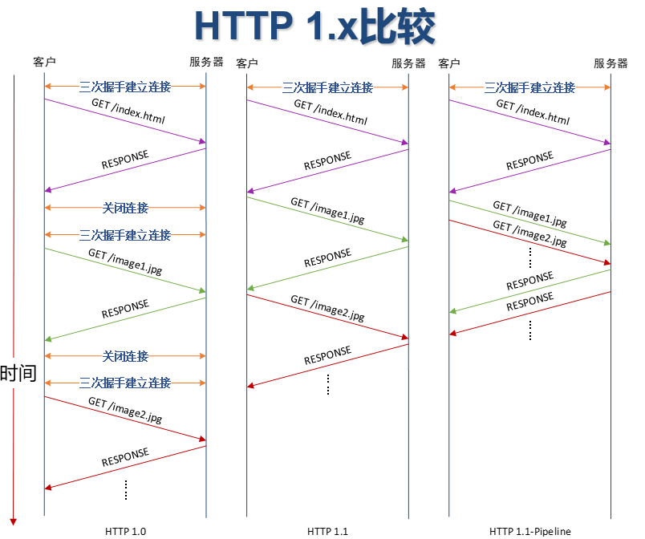

4. HTTP/2：请求/响应允许交错，还可以自定义优先级。服务器可以主动推送消息`（确认客户端存活）`。允许应用层进行流量控制（HTTP/1.1完全依赖TCP）。

5. HTTP/3：主要是传输层变化，将TCP替换为UDP+QUIC。`(将在传输层章节介绍)`

#### 请求报文结构

开始行(**请求行**)+首部行+实体主体

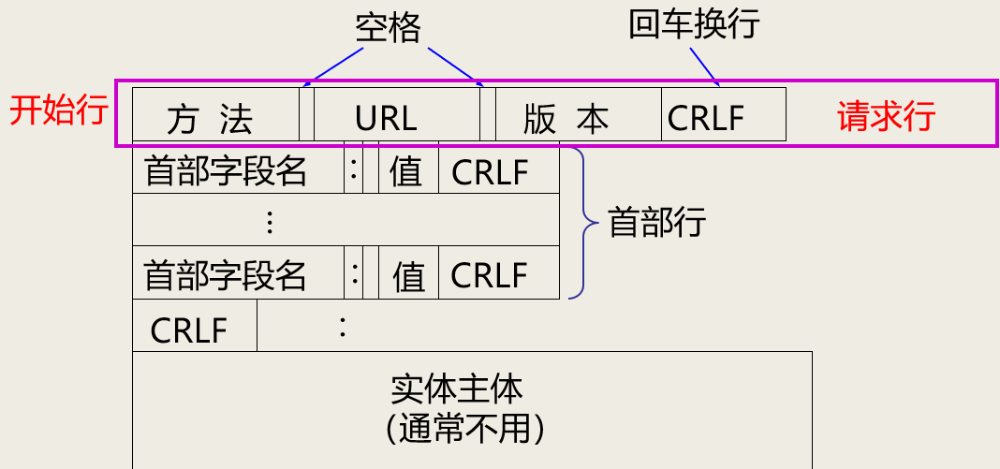

- 方法：对所请求的对象进行的操作，实际上也就是一些命令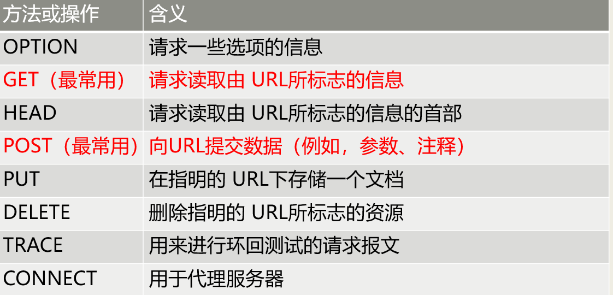

- URL：有时URL会带一些参数，参数以“?”开始，每个参数的形式为“name=value”，参数之间以“&”隔开。

  eg. https://course.pku.edu.cn/webapps/blackboard/execute/announcement?method=search&context=course_entry&course_id=_86320_1&handle=announcements_entry&mode=view

- GET与POST：

  GET方法参数写在请求行URL里，通常浏览器或服务器对URL长度有限制，因此参数长度有限，只允许传输ASCII字符，也不能用于传输敏感信息。

  POST方法的参数在实体主体中，参数长度没有限制。POST有可能反复付一笔钱，无法收藏具体页面*（因为参数信息并不保存在url中）*

#### 响应报文结构

与请求报文类似：开始行(**状态行**)+首部行+实体主体

状态码：

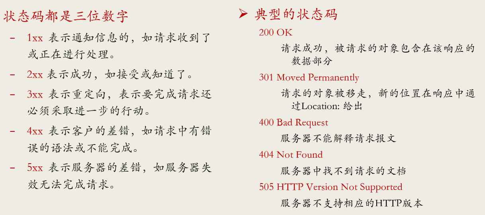

*作业中可以用wireshark抓包debug。*

#### 缓存优化

1. Web缓存技术：在浏览器主机/代理服务器上保存经常访问的Web对象。

   难点：缓存与服务器一致性问题

   Sol1. 启发式缓存更新策略：服务器发起，传递Last-Modified字段和Expires字段。

   ​	较少使用，因为服务器难以预测什么时候Web对象更新。

   Sol2. 询问式缓存更新策略：客户端发起，传递关键字头If-modified-since询问原始服务器Web副本是否已更新

   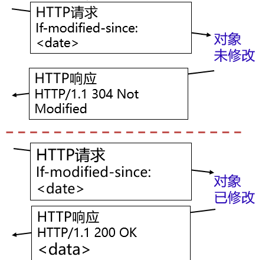

#### Cookie

- 服务器用Cookies保持用户状态。服务器在HTTP响应的首部行里使用一个关键字头**set-cookie**，服务器分配的cookie内容具有唯一性。后继的HTTP请求中使用服务器响应分配的cookie，表明这个请求是之前请求的后续。

- Cookie保存在用户的主机中，由浏览器管理。Web服务器建立后端数据库，以cookie作为关键字，记录相关信息

- Cookies一般包含5个字段

  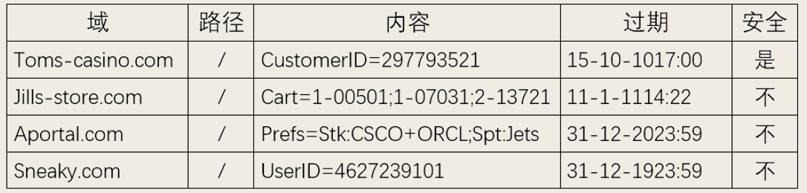

  1. 域指明Cookie来自何方，每个域为每个客户分配Cookie有数量限制。

  2. 路径标明服务器的文件树中哪些部分可以使用该Cookie。

  3. 内容采用“名字=值”的形式，是Cookie存放内容的地方，可以达到4K容量，内容只是字符串，不是可执行程序。

  4. 安全指示：浏览器只向使用安全传输连接的服务器返回Cookie。

- 好处：减少反复身份验证

- 问题：攻击者从本地文件获取了cookie值后即可用此身份登录网站。

其他安全问题：

- 服务器可以限制访问权限。无状态下客户端需要在每个请求中携带认证信息，通常在HTTP请求头中包含关键字authorization，使用“用户名-密码”，如果请求头中无authorization，则服务器拒绝访问，并在响应头中包含WWW authenticate：


## 二、域名系统DNS

### 域名系统服务

域名系统 **D**omain **N**ame **S**ystem: 负责维护域名与IP地址的映射关系。

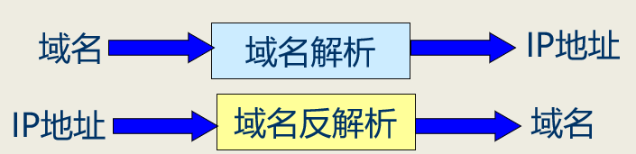

- 多个域名映射到一个IP：同一个主机可能有多个别名

- 一个域名对应多个IP：同一域名可以由多个主机进行服务，DNS起了延迟优化与负载均衡的作用。

  

#### 历史-hosts.txt

ARPANET时期，使用hosts.txt文件列出了所有计算机名称和它们的IP地址，所有主机在晚上从指定站点上获取hosts.txt文件。

Hosts文件至今也仍在操作系统中使用，优先级高于DNS。*有些网站（比如部分国外合法网站），可能因为 “DNS 污染”（解析时被恶意导向错误 IP）导致无法打开。此时如果能找到该网站的 “真实有效 IP”，写进 hosts 文件，就能绕过被污染的 DNS，直接访问网站。*

中心化的DNS，缺陷：每天万亿次的查询*（Comcast: 每天6000亿DNS查询，Akamai: 每天2.2万亿DNS查询，读操作远大于写操作，需要毫秒级响应）*；可靠性与安全性。


#### 现代分布式DNS

- 1987年发布了DNS的RFC文档（RFC1034、RFC1035），采用了一种层次的、基于域的命名模式，并使用分布式数据库系统实现。

- 采用层次树状结构的命名方法**（域树(domain tree)）**，由若干个域名服务器*（aka.名字服务器）*完成查询。

  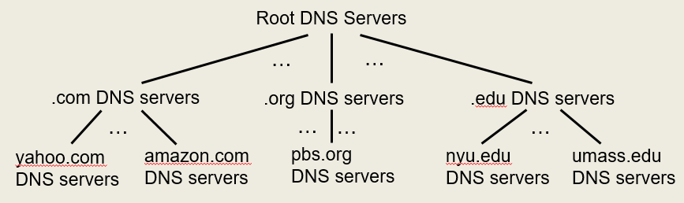

- *域名的结构由若干个分量组成，各分量之间用小数点(.)隔开，总长不超过255个字符。各分量分别代表不同级别的域名 (≤63字符)，合法域名中，点“.”的个数至少为一个。*

##### 顶级域名 TLD（Top Level Domain）

1. 国家或地区顶级域nTLD，也记为ccTLD (cc: country code)

   eg. .cn 表示中国，.us 表示美国，.uk 表示英国。目前有300多个.

2. 基础设施域 .arpa (Address and Routing Parameter Area)

   专用于Internet基础设施目的, 目前有二级域ip6.arpa；iris.arpa；in-addr.arpa；uri.arpa；urn.arpa；home.arpa；as112.arpa；in-addr-servers.arpa；ipv4only.arpa等

3. 通用顶级域gTLD

   早期规定了20个通用顶级域名，2011年批准新通用顶级域名(New Generic Top-level Domain，New gTLD)，截至2020年，已注册有1200多个通用顶级域名。

   eg. .com, .edu, .net, .org, .gov

##### 二级域名（.cn下）

1. 类别域名：.edu.cn 教育 .gov.cn 政府 .org.cn 非营利组织 .net.cn 网络服务
2. 行政区域名：34个：每个行政区域名为两个字母，例如北京bj
3. 无类别域名：eg. www.baidu.cn、www.tianya.cn等

##### 域名的管理

- 每一级域名归上一级域名机构负责
- Internet的域名管理机构: ICANN [www.icann.org](http://www.icann.org/) *全称: Internet Corporation for Assigned Names and Numbers*
- 我国的其它二级域名注册由中国互联网络信息中心(CNNIC)负责


### 域名服务器

保存域树的信息、负责域名解析；保存相邻服务器信息，自身数据丢失时可以找人问。域名解析过程对用户透明。

##### 根服务器

每个根服务器都知道所有的顶级域名服务器(TLD name servers)的域名及其IP地址。当用户在浏览器输入域名时，本地 DNS 服务器会先检查自身缓存，若没有该域名的 IP 记录，就会询问根服务器，根服务器负责告知应该访问哪个顶级域名服务器。

- IPv4根服务器共有13套，域名分别是a.rootservers.net 到 m.rootservers.net（并不是13台机器）

- 更改根服务器数据只在a.rootservers.net上进行，然后同步到另外12套中。每套都有多个镜像(mirrored)根服务器，其内容定期与上述对应的根服务器同步*(已设置了1000多台镜像根服务器)*

- 2016年，全球新部署25套IPv6根服务器，中国有4套。

##### 顶级域名服务器

管理所有二级服务器

##### 二级域名字服务器

- 各个二级域名单位根据自己的具体情况把所属域名划为若干个管辖区(zone)，简称为区。比如一个小公司的网站可能区管辖范围为整个域，而www.baidu.com, cloud.baidu.com, mail.baidu.com可能就分为三个区管理，每个区设置相应的权威名字服务器（可能有很多台主机）。

  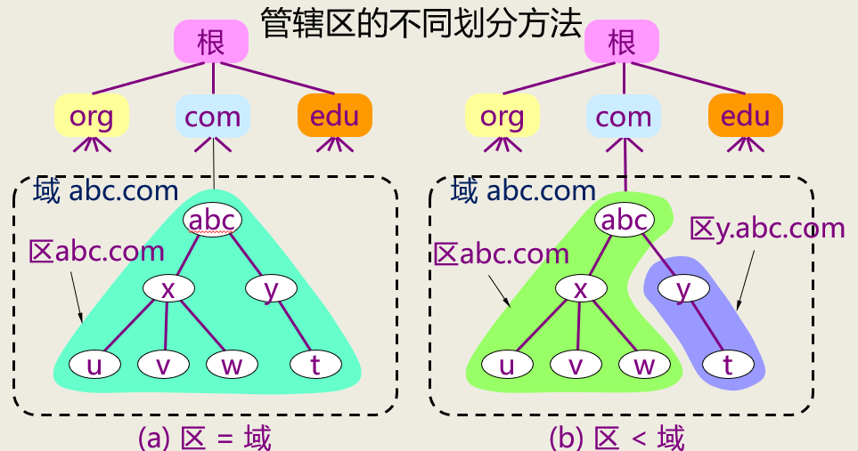

  每一个主机都必须在某个二级域名字服务器处注册登记。

##### 本地DNS服务器

每一个Internet服务提供者ISP(Internet Service Provider), 都至少有一个本地DNS服务器（又称递归服务器），距离用户主机较近。最简单的部署层次是只有一层本地域名字服务器，即三级域名字服务器，实际部署中，解析请求路径上的递归服务器/本地域名服务器可能有多层。本地 DNS 是 “用户与全球 DNS 的中间代理人”。


### 域名解析与DNS协议

当某一应用进程需要进行域名解析时，该应用进程将域名放在DNS请求报文发给本地DNS服务器。本地如果有，则将对应IP地址放在应答报文中返回给应用进程。若没有，则向更上层查询。

- 递归查询：一般本地使用。热心的服务器，替请求者继续向上递归查询，请求者无需额外操作。

- 迭代查询：一般二级以上使用。把下一跳应查询的域名服务器IP地址告诉查询者，由请求者自己继续向该服务器发起新的查询。

  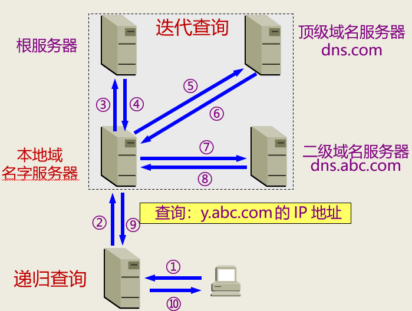

#### DNS报文

采用UDP协议，**端口号53** *（因为如果丢了就再发一次请求就好了）*

报文格式：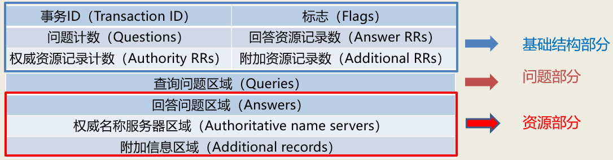

##### 基础结构部分

- 事务ID：是DNS 请求与响应之间的 “唯一匹配凭证”，确保 “谁发的请求，就能收到谁的响应”，这个编号由客户端在发送请求时随机生成。

- 标志：DNS报文中的标志字段

  > QR（Query/Response）：查询请求/响应的标志信息。查询请求时值为0；响应时值为1
  >
  > Opcode：操作码。其中，0表示标准查询；1表示反向查询；2表示服务器状态查询
  >
  > AA（Authoritative）：授权应答，该字段在响应报文中有效。值为1时表示名称服务器是权威服务器；值为0时表示不是权威服务器
  >
  > TC（Truncated）：表示是否被截断。值为1时，表示响应已超过512字节并已被截断，只返回前512个字节
  >
  > RD（Recursion Desired）：期望递归。该字段能在一个查询中设置，并在响应中返回。该标志告诉域名服务器必须处理这个查询（递归查询）。如果该位为0，且被请求的域名服务器没有一个授权回答，它将返回一个能解答该查询的其他域名服务器列表（迭代查询）
  >
  > RA（Recursion Available）：当值为1时，表示服务器支持递归查询。该字段只出现在响应报文中。
  >
  > Z：保留字段，在所有的请求和响应报文中，它的值必须为0
  >
  > Rcode（Reply code）：返回码字段，表示响应的差错状态。常用Rcode有
  >
  > 0. NoError，表示没有错误
  > 1. FormErr，表示报文格式错误，服务器不能理解请求的报文
  > 2. ServFail，表示域名服务器失败，因为服务器的原因导致没办法处理这个请求
  > 3. NXDomain，表示域名不存在
  > 4. NotImp，表示查询类型不支持，即域名服务器不支持查询类型
  > 5. Refused，表示拒绝应答，一般是服务器由于设置的策略拒绝给出应答
  >
  > 

- 问题计数：本次DNS查询的 “问题个数”

- 回答资源记录数：本次查询得到的 “有效答案个数”

- 权威资源记录数：负责该域名的 “权威服务器个数”

- 附加资源记录数：辅助后续查询的 “额外数据个数”

##### 问题部分

用来显示DNS查询请求的问题，通常只有一个问题


- 查询名(name)：一般为要查询的域名，有时是IP地址（用于反向查询）
- 查询类型(type)：DNS查询请求的资源类型 *(如A类型表示由域名获取对应的IP地址)*
- 查询类(class)：地址类型，通常为互联网地址，值为1(IN) *其他值包括CS、CH等，表示各种早期非Internet互联网的地址*

##### 资源部分

只在响应报文中出现。分为三个板块，都使用DNS资源记录格式：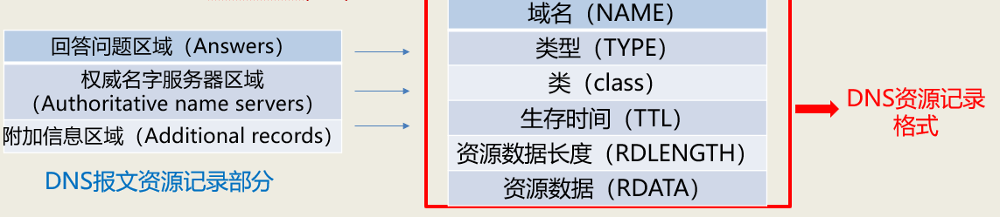

- 域名：DNS请求的域名
- 类型：资源记录的类型，与问题部分中的查询类型值相同
- 类：地址类型，与问题部分中的查询类值相同
- 生存时间：以秒为单位，表示资源记录的生命周期。取出资源记录后决定保存及使用缓存数据的时间，也表明该资源记录的稳定程度，稳定的信息会被分配一个很大的值。
- 资源数据长度：资源数据的长度
- 资源数据：表示按查询段要求返回的相关资源记录的数据

> 类型详解：
>
> - A: name是主机名，value是IPv4地址
> - CNAME：name是别名，value是主机名的规范名称
> - NS：name是请求域名，value是管理请求域名的权威服务器的主机名
> - MX：name是请求域名，value是与请求域名关联的SMTP邮件服务器的名称
> - SOA：name是请求域名，value是请求域名的DNS区域的权威性信息
> - TXT：name是请求域名，value是某个主机名或域名设置的说明
> - AAAA：name是主机名，value是IPv6地址
> - PTR：name是IP地址，value是与给定 IP 地址关联的域名
>
> 


#### 域名系统高速缓存

1. 缓存“域名->IP”映射
2. 缓存顶级域名字服务器信息. eg. 本地域名服务器可以直接向 .com 顶级域名服务器发送查询请求报文，不必先访问根域名服务器

- 主机一般也缓存域名有关信息

- 缓存有时限：为保持高速缓存中的内容正确，域名服务器应为每项内容设置计时器并处理超时项目。当回答一个查询请求时，在响应中都指明绑定有效存在的时间值。

  

#### 安全问题

几乎所有DNS流量都是基于UDP**明文传输**的，DNS的资源记录未加上任何的认证和加密措施。

- 通信链路窃听：窃听者可以像窃听其他流量一样监听DNS流量，从而查看到用户所有的DNS查询信息
- 服务器收集：用户的每条查询信息都可以被服务器记录下来
- 用户的源IP地址是否需要保密

##### DNS认证：DNSSEC安全机制

域名服务器用自己的私有密钥对资源记录(Resource Record, RR)进行签名，解析服务器用域名服务器的公开密钥对收到的应答信息进行验证。如果验证失败，表明这一报文可能是假冒的，或者在传输过程、缓存过程中被篡改了。

工作流程：

- 解析器收到一个标准的A记录 (IP地址) 和 一个同名的RRSIG记录，其中包含test.net这个授权域的数字签名(用test.net的私有密钥来签名的)
- 解析服务器再次向test.net的域名服务器查询响应的公开密钥，即DNSKEY资源记录，用其中的公钥验证上述记录(关于www.test.net的RRSIG记录)的真实性与完整性。


## 三、电子邮件服务

### 邮件格式

- SMTP

  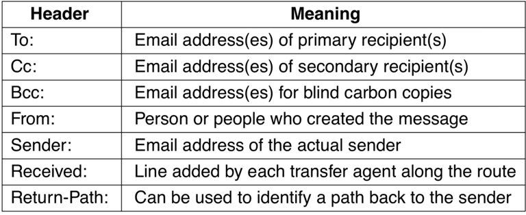

  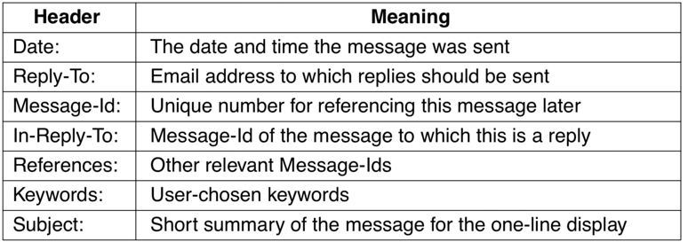

- MIME

  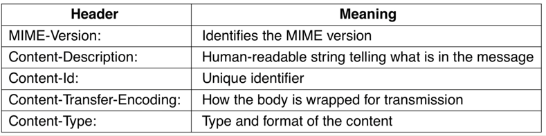

  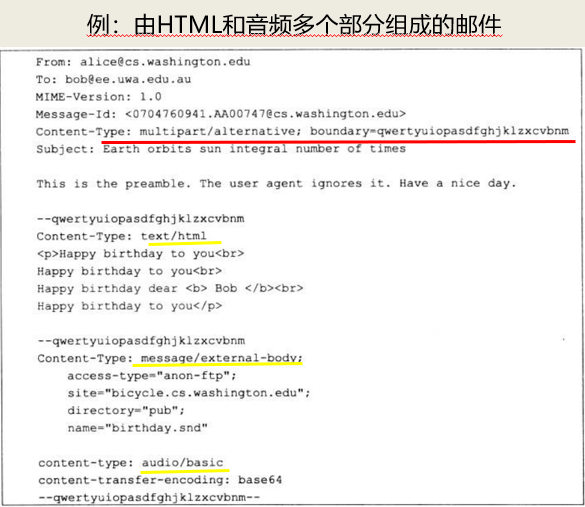

### SMTP协议

- SMTP的3个阶段：连接建立、邮件传送、连接关闭

- 实际实现：客户端通过连接向服务器发送一系列命令，服务器一一响应

  - 命令: ASCII字符串
  - 响应: 状态码+短语
  - SMTP是一个简单的ASCII协议，邮件必须为7位ASCII

- eg. SMTP会话：alice@xyz.com给bob@someschool.edu发送一个邮件, S为server，C为customer。

  

- SMTP的不足

  - 不包括认证：FROM可以声称为任何发件人。
  - 传输ASCII而不是二进制数据：编码效率低下。
  - 邮件以明文形式出现

- 因为SMTP是一个推协议，不能一直查询Bob是否在线、也不确定Bob IP地址，所以需要采用另一个协议来让Bob自己取走邮件：POP3、IMAP或Webmail。

  

### POP3 协议

POP3的三个阶段：

1. 认证(Authorization)：处理用户登录的过程

   ```py
   S: +OK POP3 server ready 
   C: user bob 
   S: +OK 
   C: pass hungry #密码
   S: -ERR
   C: pass hungry12345
   S: +OK user successfully logged on
   ```

2. 事务处理(Trnsactions)：用户收取电子邮件，并将邮件标记为删除

   ```python
   C: list #邮件列表
   S: 1 498 
   S: 2 912 
   S: . 
   C: retr 1 #通过邮件号获取邮件
   S: <message 1 contents>
   S: . 
   C: dele 1 #将邮件标记为删除
   C: quit #更新（见3.）
   S: +OK POP3 server signing off
   ```

3. 更新(Update)：将标为删除的电子邮件删除

### IMAP协议

POP3改进版本，允许用户在不同的地方使用不同的计算机随时上网阅读和处理自己的邮件

- IMAP服务器把每个邮件与一个文件夹联系起来，当邮件第一次到达服务器时，它与收件人的INBOX文件夹相关联，收件人能够把邮件移到一个新的、用户创建的文件夹中，阅读邮件，删除邮件等。
- 与POP3不同，IMAP服务器维护了用户状态信息，eg. 文件夹的名字以及哪些邮件与哪些文件夹相关联。
- IMAP具有允许用户代理获取邮件某些部分的命令，比如不想获取音频或视频片段
- 缺点：如果用户没有将邮件复制到自己的PC上，则邮件一直是存放在IMAP服务器上，则必须要与IMAP服务器建立连接。

### Webmail

使用Web作为界面，用户代理就是普通的浏览器，用户及其远程邮箱之间的通信通过HTTP进行。


## 四、其他应用层协议

### P2P

- 避免单一中心化结点造成的性能瓶颈

- eg. 文件分发瓶颈比较：考虑服务器上有大小为F的文件，需要分发给N个节点，需要多长时间？（u为上传带宽，d为下载带宽）

  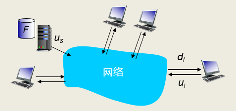

  - 基于client-server架构

    服务器上传需要 NF/u~s~ 时间

    假设dmin是客户端中最小的下载带宽，则客户端下载需要 F/dmin 时间

    则总耗时为 T~C-S~ ≥ max{NF/u~s~, F/dmin}

  - 基于p2p架构

    服务器至少上传一次文件：F/u~s~

    客户端下载至少需要 F/dmin

    考虑客户端互相之间传输文件，总下载量为NF，总上传速率为 u~s~ + Σu~i~

    则总耗时为D~P2P~ ≥ max{F/u~s~, F/dmin, NF/(u~s~ + Σu~i~)} 

    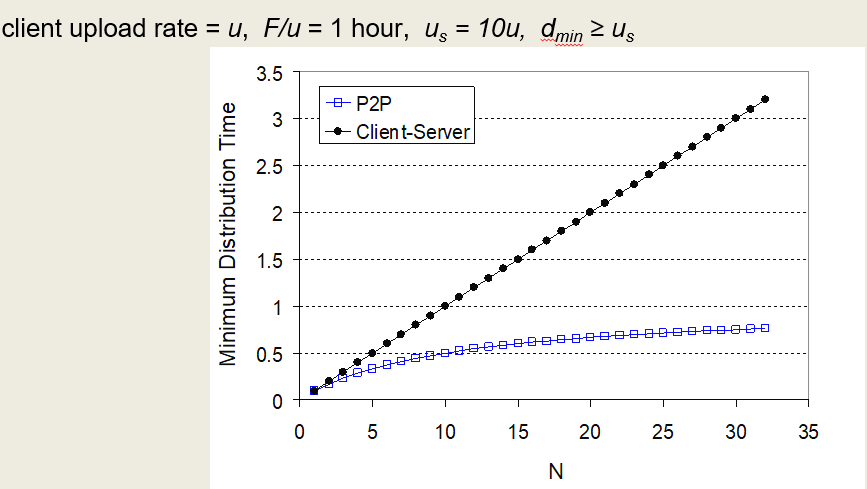

#### Peer索引

关键问题：给定资源，查询拥有资源的peer *Peer可以随时加入或者退出，也可以动态更改IP地址*

##### 中心化索引

1) 每个peer需要连接中心化服务器, 告知: 自身IP地址 & 拥有内容
2) Alice下载文件时，先向中心化服务器查询某个内容的拥有者Bob
3) Alice向Bob提出请求

缺陷：单点故障、性能瓶颈。

##### 洪泛请求 Query Flood

- 每个peer独立建立索引，记录自身拥有的资源

- Peer之间形成一个图（graph），使用TCP连接（通常每个peer建立小于10个连接）

  *peers与TCP连接形成的网络，又被称为Overlay网络，是建立在 Underlay 网络（底层物理网络）之上的虚拟网络，是逻辑上的网络结构。*

- 每个peer向邻居peer查询，如果邻居peer没有该资源，则邻居peer向自身邻居递归查询。结果沿查询路径返回最初的查询发起者。

缺陷：产生大量网络消息，可扩展性有限。

##### 混合索引

- 介于中心化索引与洪泛索引之间

- 节点间连为层次化结构：超级结点之间可以任意建立连接，每个普通结点连向至少1个超级结点。普通结点与超级结点间使用中心化索引，超级节点间使用洪泛索引。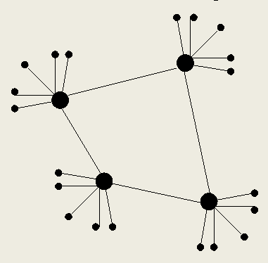

  

#### P2P实例

##### Gnutella协议

纯粹的P2P协议

1. 新加入结点Alice通过 [candidate peers 列表](应用自身维护的一个长期存在的主体列表)，找到其他peers
2. Alice遍历列表里每个peer，直到与某个peer Bob建立TCP连接
3. 洪泛：Alice发送Ping消息给Bob，Bob将这个Ping消息转发给所有邻居，邻居们也不断重复
4. Peers收到Ping消息后，向Alice回复Pong消息
5. Alice收到Pong消息后，可以建立新的TCP连接

##### BitTorret协议

并不是纯P2P协议

- 块：文件被划分为256Kb大小的块(chunk)
- 中心化的跟踪器(Tracker)：一个独立服务器，维护着一个正在主动上传和下载该内容的所有其他对等用户列表，Peer可以通过Tracker（跟踪器）找到其他Peers。
- Torrent：所有正在交换某个文件的peer，组成一个torrent（种子）

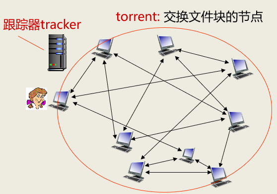

过程（当一个peer想加入torrent获取资源）：

1. 向追踪器注册，加入torrent中。*初始没有任何块，随后从其他peers逐渐获取文件块。*
2. peers彼此之间交换各自拥有的块清单，下载与上传文件块可同时进行，也与其他peers互相交换各自知道的peers。
3. 节点可以动态的加入与退出。

但是大家可能下载完后就自私地离开了。优化策略：

- **选择罕见的块**优先下载：Alice周期性地向其他peers查询他们的文件块列表，从列表中选择自己缺失的文件块请求下载，优先选择罕见的块
- 趋向于**匹配**那些和自己传输能力差不多的节点：Alice向给自己发送数据最快的4个peers发送chunks, 暂时不对其余peers发送（“choke”), 每10秒重新计算给自己发的最快的前4个结点。
- 一个对等节点对其他对等节点做出的贡献越大，预期得到的**回报**就越大：每隔30秒随机选择1个peer向其发送数据，选择相信(“optimistically unchoke”)该peer，有可能该结点将来可能产生回报，成为top 4。

BitTorrent现状：下载速度不及预期（大型网站下载速度其实很快）；版权纠纷；政府、主流网站封杀；Peers缺乏共享精神；恶意Peers结点......

##### Skype

基于P2P的即时通讯 *是私有的应用层协议，通过逆向工程推断出的工作原理*

- 层次化结构：超级结点上的索引系统记录用户名 -> IP地址

  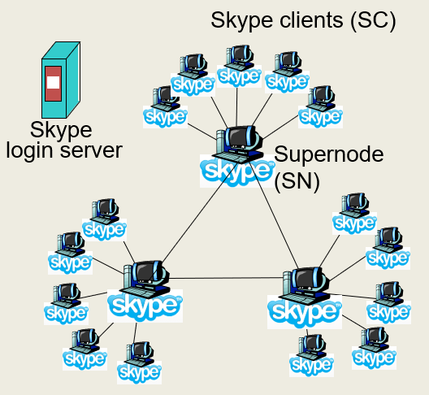

- 好处：避免网络管理导致普通结点之间无法直接建立连接。*考虑到网络地址转换（Network address translation，NAT），防火墙等*

##### 天网Maze (@北大)

北大计算机系网络所开发P2P-based文件分享系统，03年开发，最高500万注册用户，10万用户同时在线，后更名为AmazingStore。有积分原则、排队策略、惩罚非法资源等机制。

##### 区块链

去中心化账本（去中心化数据库），每个Peer存储一部分数据，数据记录在区块上。

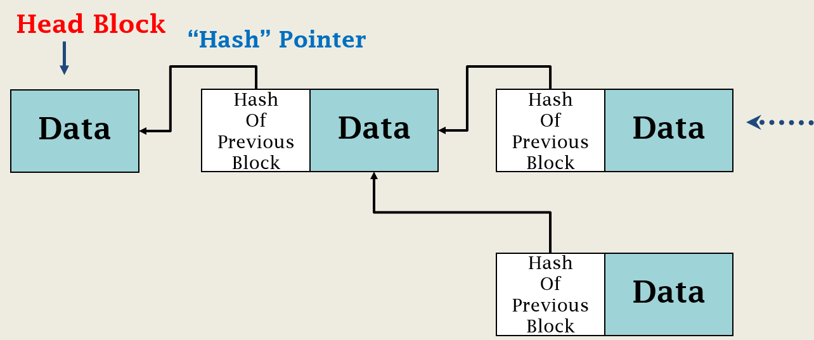

核心问题：如何决定写权力 *分布式系统经典问题：共识*

- 比特币解决共识问题：挖矿
  - 每周周期(10min)生成一个区块
  - 一个周期内，最早解决某个计算问题的peer获得该周期（区块）写权力
  - 对于几乎同时产生的区块，看各自获得认可peers人数

##### 分布式哈希表

- 核心挑战：如何管理[key](资源的唯一标识)->peer映射 *不希望暴力遍历peers，而是对peers与key进行组织，优化搜索*
  - peers可能随时加入或退出
  - 需要追踪关键字存储位置的变化
  - 追踪器以中心化的方式，记录各个peers的活跃情况与保存关键字

分布式哈希表（distributed hash tables, DHTs) 不需要中心化追踪器，就能查询每个key在哪个peers上。DHT是一个概念，具体有多种实现方式。

最常用的实现：Chord (2001) *许多实际存储系统基于Chord进行去中心化peers管理*

1. 对所有peers地址，以及key计算哈希值

2. 哈希值取模后，排列在一个圆环上

3. 每个key由圆环上顺时针方向的下一个peer负责存储

4. 若查询失败，则继续沿着顺时针方向查询

5. Peers加入或退出时，需要更新操作. 可以延迟更新，但增加查询开销
   - 当新Peer加入：通知前驱结点、后续Peer更改邻居关系，从后续Peer迁移数据。
   
     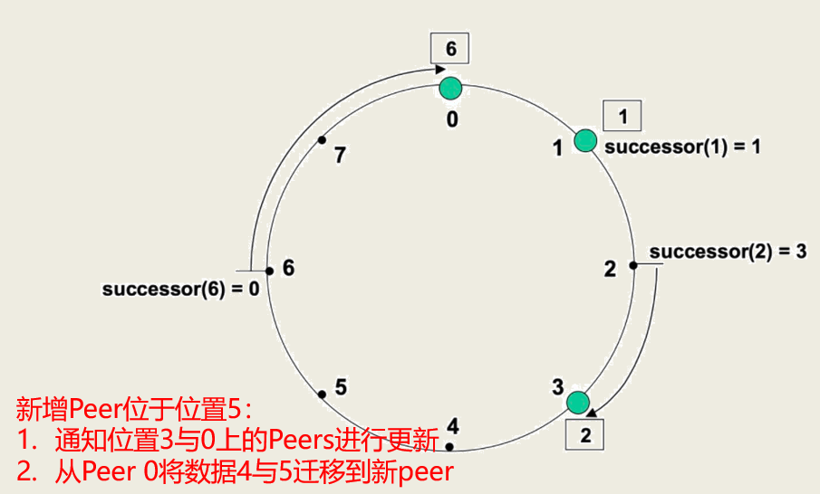
   
   - 当Peer正常退出：通知前驱结点、后续Peer更改邻居关系，将数据迁移至后续Peer。
   
   - 当Peer异常退出、发送数据丢失：每份数据在多个peer上进行备份，一旦发现异常退出，从备份数据中进行恢复（比如备份在后三个节点上）

问题：哈希值具有不确定性，节点分布(负载)可能不均衡；Peer之间能力不一样。

- Sol. 拆分虚拟节点。假设结点1存储资源最多，划分前：数据4、5、6、7、0都存在结点0，结点1只存数据1；划分后：结点1存储数据1、4、5、6。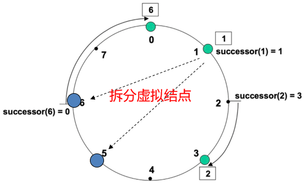


### 流媒体

流媒体：连续媒体（音视频）经压缩编码、数据打包后，经过网络发送给接收方，接收方对数据进行重组、解码和播放。

常见流媒体服务：1. 媒体点播(录播)、2. 媒体直播、3. 实时交互(腾讯会议)。

特性：端到端性能约束；时序性约束（必须按照一定的顺序连续播放）；具有一定程度的容错性（丢失部分数据包也可完成基本功能）

##### 传输内容

1. 视频编码标准：
   - H.264：最主流的编码；支持不同分辨率、比特率；兼容性好
   - H.265：H.264的升级，视频内容压缩50%；硬件成本高，专利许可费高
   - VP9：Google开源视频编码标准，与H.265相当性能，无许可费
   - AV1：开源标准，比H.265与VP9性能更好，开源免费
2. 音频编码标准：AAC，MP3，Opus等
3. 媒体容器格式：封装视频与音频
   - MP4：支持多种视频编码与音频编码，兼容性最好
   - MKV：多音轨、多字幕，适合电影电视剧；兼容性不如MP4
   - FLV：支持编码最少；早期因为跨平台、交互性好，用于网络流媒体，现逐渐淘汰

##### 面临的挑战

- 目标：流媒体服务质量（画质、启动延迟、平滑、交互性）

- 现实约束：网络条件有限（带宽有限、动态变化、延迟抖动、丢失、异构性）

- 如何在“尽力服务”的网络传输条件下获得良好的视频质量？

  - UDP不保障可靠传输（丢包、乱序）

  - 即使是TCP，也只保证不丢包与顺序（而且引入额外处理开销），但无法提供带宽与延迟保障

    

#### 媒体点播

##### 流程

1. 浏览器用户使用 HTTP 的 GET 报文接入到Web服务器；这个超链指向一个[元文件](有音/视频文件的统一资源定位符URL)

2. Web服务器把该元文件装入 HTTP 响应报文的主体，发回给浏览器

3. 浏览器调用媒体播放器，把提取出的元文件传输给媒体播放器

4. 媒体播放器使用元文件中的 URL，向媒体服务器发送 HTTP 请求报文，要求下载音/视频文件

5. 媒体服务器发送 HTTP 响应报文，把音/视频文件发送给媒体播放器；媒体播放器边下载边解压缩边播放（通过时间戳同步音频流和视频流）

   

##### 问题

- 由于网络传输抖动特性，分组不一定按时抵达。

  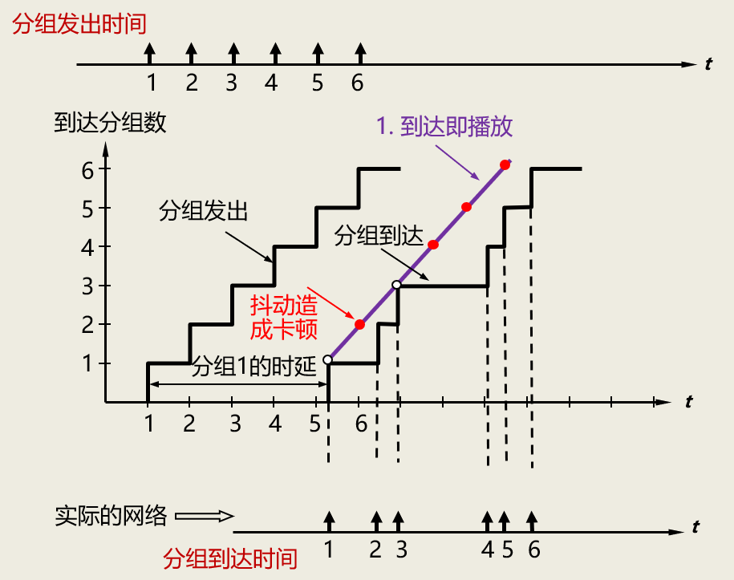

- sol：推迟播放时间。客户端播放的是本地缓冲区的内容，而不是立即播放来自网络的实时内容。坏处：增加了时延（所以视频网站要先播广告）

  基于2个阈值控制：

  - 缓冲区内容小于低阈值标记：数据即将播完，容易出现卡顿；需要加速传输
  - 缓冲区内容大于高阈值标记：占用过多存储空间；可以减慢传输
  - 需要多大缓存，服务器以多快速率发送，都需要特定网络协议支持

  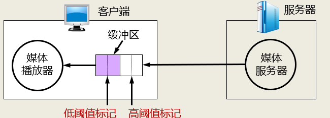

  

#### 直播与实时音视频

- 信令协议：对建立的连接起控制作用，如RTSP
- 数据传送协议：使音/视频能够以时延敏感属性传送，如RTP/RTCP

使用TCP还是UDP？

- UDP不可靠但效率高，更适合实时类应用
- UDP需要自行实现流控算法，增加了开发成本和复杂性
- UDP传输音视频可能会被路由器丢弃或防火墙阻拦，而TCP可以畅通无阻


#### 流媒体协议

##### RTP与RTCP（传输层）

- 实时传输协议 RTP (Real-time Transport Protocol) ：单纯地调用UDP
- 实时传输控制协议 RTCP (RTP Control Protocol) ：与 RTP 配合使用，主要功能：服务质量的监视与反馈、媒体间的同步、播组中成员的标识。也使用UDP。

##### RTSP（应用层）

实时流式协议RTSP (Real-Time Streaming Protocol)：根据用户的操作对播放情况进行控制（如：暂停/继续、后退、前进等），又称为“互联网遥控协议”。

- 是**有状态协议**，它记录用户所处于的状态（初始化状态、播放状态或暂停状态）

- RTSP控制分组既可在 TCP 上传送，也可在 UDP 上传送*（使用UDP时，底层就是使用RTP+RTCP）*

- 过程

  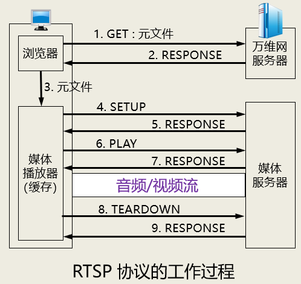

  4开始为RTSP协议指令

  4, RTSP 客户与媒体服务器的 RTSP 服务器建立SETUP连接

  6, RTSP 客户发送 PLAY 报文，开始下载音/视频文件的特定位置

  7, RTSP 服务器发送响应 RESPONSE 报文后开始传输音视频数据（使用RTP协议传输内容）

  8, RTSP 客户发送 TEARDOWN 报文断开连接

##### RTMP（应用层）

Adobe开发，最初用于Flash媒体传输，后被广泛使用。

##### RSVP（网络层）

让网络层预留一些资源（公网上中转多服务商比较难实现，通常用于专网）

##### MMS（应用层）

微软流媒体协议 MMS (Microsoft Media Server Protocol): 支持UDP、TCP，但是不使用RTP与RTCP，而是微软内部的ASF格式。逐渐淘汰。

##### WebRTC

随着HTTP5的出现，传输流媒体协议逐渐减少，WebRTC以及其他基于HTTP的协议为最新流媒体技术。

网页实时通信 WebRTC（Web Real-Time Communication）：由Google发起的实时音视频通信开源项目

- 使用UDP
- 使用 Secure RTP（SRTP）与 Secure RTCP（SRTCP） 对媒体数据进行封装与传输控制
- 用流控制传输协议 SCTP 提供类似 TCP + [TLS](加密) 的特性

##### 基于HTTP的协议

> MPEG-DASH：也叫DASH over HTTP，全称 Dynamic Adaptive Streaming over HTTP
>
> HLS（HTTP Live Streaming）：Apple开发，面向iOS、Safari浏览器等Apple生态
>
> HDS：Adobe开发，原本想取代RTMP作为对Flash的新支持，但由于Flash停止更新，HDS也停止更新。*RTMP由于自身不限于Flash，仍在广泛使用（虽然也在减少）*
>
> Microsoft Smooth Streaming：逐渐淘汰

1. 优化传输码率

   DASH：动态自适应来选择合适码率 *Dynamic Adaptive Streaming over HTTP*

   - 基本思想：完整视频被拆分为固定时长 (2s-10s) 的视频片段(segment)，每段有不同码率的版本，与其对应的元文件（URL）一同存放于DASH服务器。客户端基于网络条件、缓冲大小等，对每个视频片段选择合适的视频码率来下载。

   - 自适应码率ABR算法(Adaptive bitrate)：

     i. 基于吞吐量的算法：使用滑动窗口平均估计未来吞吐量，选择不高于估计值的最大码率视频

     ii. 基于缓冲的算法：使用缓冲区满的级别来决定下一个视频块的请求码率

     iii. 放弃请求规则：如果算法检测到下载该视频块的过程有卡顿，则终止当前请求，重新下载低码率的

   - *由于网络可用带宽难于预测，因此寻找最佳码率是有挑战的问题。*

2. 优化视频编码

   可扩展视频编码SVC (Scalable Video Coding)：

   - 当带宽不足时，只对基础层的码流进行传输和解码
   - 当带宽充足时，可以传输和解码增强层的码流来提高视频的质量
   - 优点：确保传输基础层来避免卡顿，使用富裕的带宽传输增强层，充分利用带宽
   - 缺点：编解码复杂度增加，有多个增强层时开销过大

   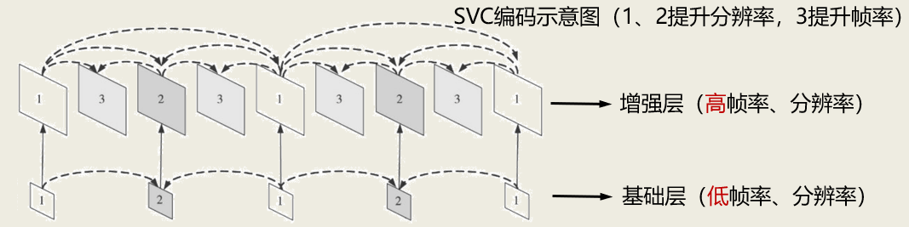

3. 优化传输层、网络层

   - 传输层：拥塞控制*（可以看网络拥塞情况来决定怎么传）*、快速丢包恢复*（如果已经过了就不用传了）*、多路径传输*（eg. 流量+WIFI）*

   - 网络层：网络调度、服务质量感知测量、边缘计算

     

#### 流媒体传输实例

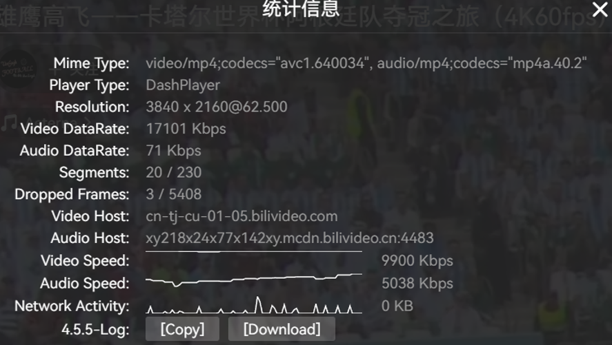

- avc1：视频编解码方案

- mp4a：音频编解码方案

- segments：划分的文件块，已经传了20/230个文件块

- Frames：一共传输了5408个分组，丢失了3个

- network activity：可以看到一个一个视频块传输

  

### 内容分发网络 (CDN)

问题提出：怎样将内容分发给同时发起访问的数百万用户？

内容分发网络CDN：Content Delivery Network，or Content Distribution Network。多个CDN服务器负责分摊单个服务器压力。

- CDN服务提供商：Akamai、蓝讯、世纪互联、网宿等
- 互联网内容提供商（ICP）：腾讯、百度等
- 互联网服务提供商（ISP）：移动、联通、电信等

##### 获取资源

1. 客户端选择

   客户端向原服务器请求内容，服务提供者返回[拷贝“清单”](存储了内容拷贝的CDN节点)：通过清单,客户端以可支持的最高速率检索到内容。如果网络路径拥塞，可能会选择不同的拷贝或网络速率

   

2. 服务器端选择资源：将请求调度到某个CDN服务器。

   方法i. HTTP重定向：当用户请求资源时，原始服务器会决策出最适合的 CDN 服务器，然后通过HTTP响应让用户去找该 CDN 服务器。

   方法ii. DNS辅助实现CDN：向负载均衡 DNS 发起请求，负载均衡 DNS 根据位置、负载等因素，返回最优 CDN 服务器的地址。

   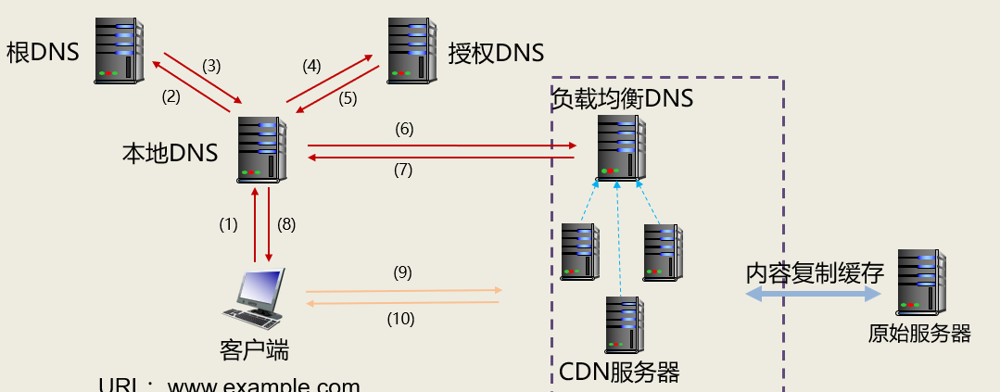

   方法iii. 网站所有者直接放CDN链接

   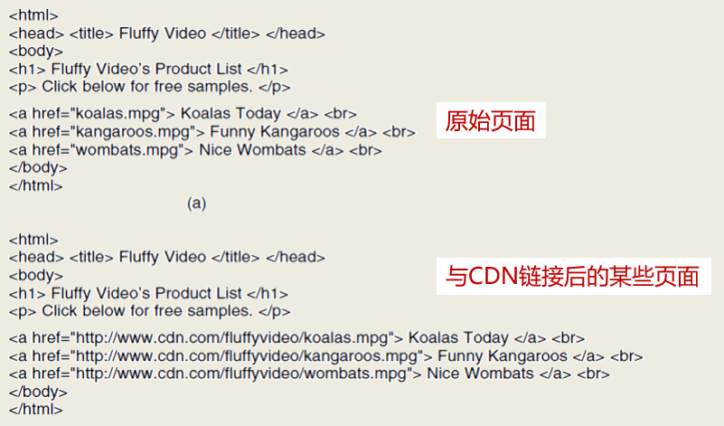


### Telnet

- 目标：远程登录，远程操作
- 核心问题：解决异构计算机系统的差异性问题，主要体现在对终端键盘输入命令的解释上
- 主要贡献：引入网络虚拟终端NVT（Network Virtual Terminal）: 定义一组通用字符集，通过统一的数据表示，来保证不同硬件、软件与数据格式的终端与主机之间通信的兼容性
- 工作过程：
  1. 本地Telnet客户进程与远程主机上的Telnet服务器进程建立TCP连接，默认端口23 
  2. 将本地终端上输入的用户名和口令及以后输入的任何命令或字符转化为NVT格式传输给服务器
  3. 远程服务器将NVT格式的字符转换为自身能够识别和处理的字符格式
  4. 本地终端再将远程主机输出的NVT格式的数据转化为本地格式并显示，以此类推。


### FTP

文件传输协议FTP(File Transfer Protocol)是Internet上使用最广泛的应用层协议之一

- 难处：网络环境下复制文件具有复杂性，计算机存储数据的格式不同；文件目录结构和文件命名规则不同；对于相同的文件存取功能，操作系统使用的命令不同；访问控制方法不同...

- 提供服务：FTP提供交互式的访问，允许用户指明文件的类型与格式，并允许文件具有存取权限。FTP屏蔽了各计算机系统的细节，适用于在异构网络中任意计算机之间传送文件。

  [RFC959](文件传输协议（FTP）的官方规范)早在1985年就已经成为Internet的正式标准

- 使用C/S方式实现

- 工作过程：

  1. 服务器主进程打开TCP21端口，等待客户进程发出的连接请求
  2. 客户可以用分配的任意一个本地端口号与服务器进程的TCP21端口进行连接 
  3. 客户请求到来时，服务器主进程启动控制进程与数据进程来处理客户进程发来的请求
  4. 服务器控制进程与数据进程对客户进程的请求处理完毕后即终止。
  5. 服务器主进程返回，继续等待接收其他客户进程发来的连接请求，服务器主进程与从属进程（控制进程、数据进程）并行工作

- 两个端口，两个连接：

  1. 控制连接：在整个会话期间一直保持，客户进程发出的文件传输请求通过控制连接发送给服务器控制进程（工作在TCP21端口）。控制连接不用来传输文件。服务器控制进程在接收到客户进程发送来的文件传输请求后就创建数据传输进程（工作在TCP20端口）和数据连接。
  2. 数据连接：用来连接客户进程和服务器数据传输进程，实际完成文件的传输。服务器数据传输进程在文件传输完毕后关闭数据连接并结束运行。

  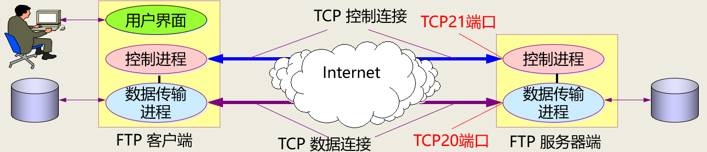

### TFTP

简单文件传输协议TFTP(Trivial File Transfer Protocol) 是一个很小且易于实现的文件传输协议，与FTP是两个不同协议。

- 使用C/S方式和UDP协议实现
- 只支持文件传输而不支持交互
- 数据传输：以[PDU](也称为文件块 (block)，按序从1开始编号)为单位进行传输。每次传送的数据PDU中有512字节的数据，但最后一次可不足512字节。若文件长度恰好为512字节的整数倍，则在文件传输完毕后，还必须在最后发送一个只含首部而无数据的数据PDU。
- 工作过程：
  - 每发送完一个文件块后就等待对方的确认，确认时应指明所确认的块编号
  - 发完数据后在规定时间内收不到确认就要重发该数据PDU
  - 文件请求方若在规定时间内收不到下一个文件块，也要重发确认PDU
  - 开始工作时，TFTP客户进程发送一个读请求PDU或写请求PDU给TFTP服务器进程，其UDP端口号为69。TFTP服务器进程要选择一个新的端口和TFTP客户进程进行通信。

### SNMP

网络管理协议，具体内容在课上不做展开。

> 网络管理的目的：有效利用网络资源，及时报告和处理网络故障，保障网络正常、高效运行。
>
> 网络管理的功能：配置管理，故障管理，性能管理，计费管理，安全管理。
>
> 网络管理系统：
>
> - 管理器（Manager）：网络管理进程，提供网络管理用户界面，完成管理任务
> - 管理对象（Managed Object）：网络中的软硬件系统
> - 代理（Agent）：管理对象中的进程，负责与管理器交互
> - 管理信息库（MIB，Management Information Base）：存储网络信息
>   - 本地MIB：每个代理管理自己的本地MIB，仅包含本地设备相关信息
>   - 网络MIB：代理与管理器交换网络状态信息，共同构成整个网络的MIB
> - 网络管理协议（Network Management Protocol）
>   - TCP/IP的简单网络管理协议SNMP（Simple Network Management Protocol）
>   - OSI的公共管理信息协议CMIP（Common Management Information Protocol）

---


# Lecture 3. 传输层

## 一、传输层基本概念

> N个清华学生分别给N个北大学生寄快递：
>
> 主机 = 大学
>
> 程序 = 学生
>
> 消息 = 信件（被装在信封内）
>
> 传输层 = 将快递从发送者手里取走，交给对应的接收者
>
> 网络层 = 两校快递站之间的传递（可能经过多跳）

- 传输层与应用层的接口：套接字 *应用程序需要发送进程时将报文推到门外，需要接收进程时打开门即可收到报文*

- 传输层与网络层的接口：调用网络层接口，并进行必要的增强。

  网络层尽最大努力在终端间交付分组，但不提供任何承诺。传输层可以通过差错恢复、重排序等手段提供可靠、按序的交付服务，但传输层无法提供延迟保证、带宽保证等服务。

传输层协议：UDP和TCP。

### 套接字

#### 端口号

端口号是一个16比特的数，是套接字标识的一部分，每个套接字在本地关联一个端口号。

- 熟知端口：0～1023，由公共域协议使用
- 注册端口：1024～49151，需要向[IANA](The Internet Assigned Numbers Authority：互联网数字分配机构，负责分配和管理互联网中IP 地址、域名和TCP/UDP公共端口号等数字资源的机构)注册才能使用
- 动态和/或私有端口：49152～65535，一般程序使用

报文段中会写源端口号（与发送进程关联的本地端口号）和目的端口号（与接收进程关联的本地端口号）

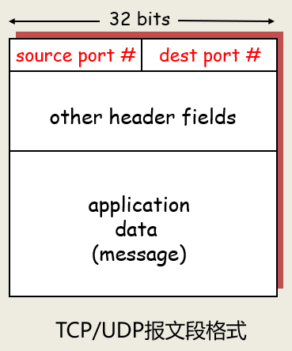

##### 端口号的分配

- 自动分配（客户端通常使用）：创建套接字时不指定端口号，由操作系统从49152～65535中分配。

- 使用指定端口号创建套接字（服务器通常使用）：创建套接字时指定端口号，实现公共域协议的服务器应分配保留端口号（0～1023）。

  

#### 套接字的复用与分用

问题：如何通过端口号，将数据对应到正确的套接字？

- （发送端）复用：传输层从多个套接字收集数据，交给网络层发送
- （接收端）分用：传输层将从网络层收到的数据，交付给正确的套接字

##### UDP

使用<IP地址, 端口号>二元组进行标识。服务器使用一个套接字服务所有客户。

##### TCP

一个TCP服务器为了同时服务很多个客户，使用两种套接字

- 监听套接字：服务器平时在监听套接字上等待客户的连接请求，该套接字具有众所周知的端口号

- 连接套接字：服务器在收到客户的连接请求后，创建一个连接套接字，但使用原监听端口号。每个连接套接字只与一个客户通信，即只对应接收具有以下四元组的报文段：

  {源IP地址 = 客户IP地址，源端口号 = 客户套接字端口号，目的IP地址 = 服务器IP地址，目的端口号 = 服务器监听套接字的端口号}

  

### 传输粒度与报文边界

- UDP：以报文为单位进行传输，应用可以感知到报文边界
- TCP：字节流传输，应用感知不到报文边界 *TCP可能划分、合并报文*


## 二、UDP

- 唯一必须的功能：分用复用
- 可选功能：检查是否出错

### UDP报文结构


- 用于复用和分用的字段：源端口号、目的端口号
- 用于检测报文错误的字段：报文总长度、校验和（checksum）

#### 校验和

- 发送方：将报文段看成是由16比特整数组成的序列，对这些整数序列计算校验和并放到UDP报文段的checksum字段。

  1. 将数据划分为一系列16-bit整数
  2. 将所有整数相加：每次将1个整数与当前和(sum)相加，如果相加结果最高位为1（16比特溢出），则将1加到低位16bit部分。
  3. 将最终结果取反

- 接收方：对UDP报文（包括校验和）及伪头求和，若结果为0xFFFF，认为没有错误。

- 计算UDP校验和时，要包括伪头、UDP头和数据三个部分

  - 计算校验和时，checksum字段填0
  - UDP伪头信息取自IP报头，包括：源IP地址，目的IP地址，UDP的协议号，UDP报文段总长度。
  - 计算校验和时包含伪头信息，是为了避免由于IP地址错误等造成的误投递

- UDP校验和的使用是可选的，若不计算校验和，该字段填入0

  

#### 缓冲区

通常端系统实现（如Linux）：无发送缓冲区、有接收缓冲区

1. 发送方：从应用层获取的数据，传输层加上UDP头部后直接交给网络层

   - 长消息的分片、缓冲依赖于网络层、链路层提供

2. 接收方：应用程序处理报文时间不固定，所以需要一个缓冲区。每个socket一个缓冲区，存储着来自不同发送方的报文，应用层可以感知到报文边界。

   

#### UDP优势

- 应用可以尽可能快地发送报文（不用建立连接、不限制发送速率）
- 报头开销小
- 协议处理简单
- 适合流媒体类应用、单次请求/响应为主的应用。*若应用要求基于UDP进行可靠传输，由应用层实现可靠性。*


## 三、TCP-可靠传输

TCP：在一对通信的进程之间提供一条理想的字节流管道，不保留报文边界。点到点通信*（仅涉及一对通信进程）*，全双工*（可以同时双向传输数据）*。

机制：建立连接；可靠数据传输；流量控制；拥塞控制。

### Intro

##### 可靠传输概念

不可靠信道：

1. 外部信号干扰导致比特错误（数据损坏）
2. 链路过载导致数据丢失
3. 多路径导致乱序

可靠传输：保证数据在不可靠信道上完整、正确、有序地传到

##### 可靠传输问题

可靠传输不仅是TCP中的问题，在网络的各个层次都需要考虑*（eg. OSI模型中的链路层，各类基于UDP的应用层协议(如TFTP)，5G通信，时延敏感网络，远程直接内存访问(Remote Direct Memory Access，RDMA)）*

本节课关注：以上三种不可靠信道类型。不关注：有意篡改、编造等。

##### 可靠传输模型

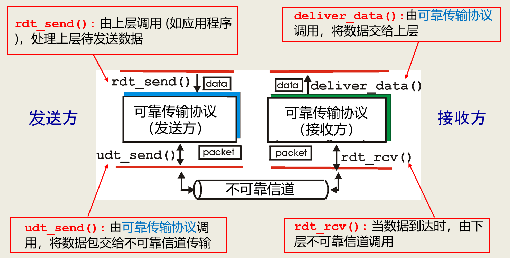

##### 术语说明

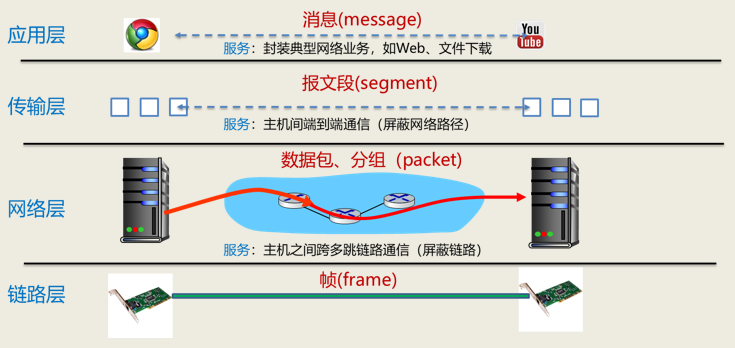

但现在一般统一使用packet指代应用层以下的数据。


### 一般的可靠性方案

#### 场景1：完美信道-乌托邦协议([rdt][reliable data transfer]1.0)

*假设：报文不会丢失或受损，发送方/接收方的网络层始终处于就绪状态，发送方/接收方能够生成/处理无穷多的数据。*

```c++
//发送方
while (true) {
	from_upper_layer(&data);
	packet = make_pkt(data);
	to_lower_layer(packet);
}
//接收方
while (true) {
	wait_for_event(&event);
	from_lower_layer(&packet);
	extract_data(packet, &data);
	to_upper_layer(data);
}
```


#### 场景2：有错但不丢包信道

*假设：信道传输时，数据包中某些比特会发生0-1翻转，但可以被校验检测*

思想方法：自动重传请求（ARQ, Automatic Repeat reQuest）

1. 发送方发送数据
2. 接收方反馈（“没听清！重传！” / “明白了，然后呢？”）
3. 发送方重发/发新数据

##### rdt2.0协议

反馈内容：ACKs (acknowledgements) /NAKs (negative acknowledgement)

- 接收方：若检测数据包有错，返回NAK；否则，完成接收后回复ACK
- 发送方：发送一个数据包后暂停，等待ACK或NAK到达后发送下一个包
- *ACK与NAK的内容是不重要的，称为哑帧（dummy frame）*

rdt2.0是最简单的[ARQ][Automatic Repeat reQuest]协议，此类协议又称停-等式协议（stop-and-wait）——发送1个报文后就停下，等待收到反馈后再发。

缺陷：如果ACK或NAK出错，则发送方不知道接收方的状况

- 选择1：发送方通知接收方重传ACK或NAK

  缺陷：通知本身也可能出错，陷入死循环

- 选择2：采用更复杂的校验技术，不仅可以检测差错，还能纠正差错

  缺陷：每个ACK/NAK都需要额外的计算和解码，开销大

- 选择3：发送方直接重传

  缺陷：接收方收到多份数据

  一般采用这个选择。发送方在数据包中加上序号Seq，区分不同数据包；接收方忽略序号重复的数据包。
  
  - 序号值范围多大？
  
  - 在停等协议下，序号seq只需要区分当前数据包是否是前一次发送的重传，1 bit足够
  
    - 前一次发送的seq=0，重传继续seq=0，下一个数据包seq=1
  
    - 前一次发送的seq=1，重传继续seq=1，下一个数据包seq=0

##### rdt2.1协议

实现选择3。

##### rdt2.2协议

在ACK中加上最近成功接收的seq，发送方就可以判断最近发送是否成功（通过比较ACK的seq与自己的seq）。NAK就不再需要。当ACK出错或ACK.seq != seq，发送方进行重传。


#### 场景3：有错且可丢包通道(rdt3.0)

假设：信道不仅会出错，还会丢失数据包，但不会乱序。

rdt3.0：发送方增加一个计时器(timer)，如果经过一段时间没有收到确认，发送方将超时，于是再次发送该数据包。*（如果数据包只是发生了延迟（而不是丢失），会导致接收方收到多个数据包，可以通过seq判断重复数据。）*

- 当收到了不符合的ACK，马上重传or等待超时?

  rdt3.0选择等待超时，因为默认是迟到的上一条ACK，从而减少重传数量。

  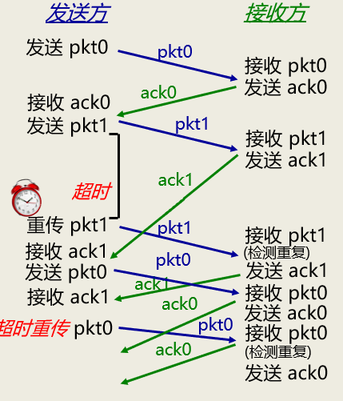


#### 停等式协议的效率

rdt 2.0, rdt 2.1, rdt 2.2, rdt 3.0都是停等式协议

- F = 数据大小 (bits)
- R = 信道发送速率 (bits/second) *把数据注入信道*
- I = 信道传播延迟 *不考虑接发送端与收端处理延迟、接收端发送ACK延迟*
- 数据发送时间 (Time to transmit a single frame) = F/R
- 往返延迟 RTT =2I
- 工作时间是F/R，空闲时间是RTT
- 信道利用率 (line utilization)=F/(F+R∙RTT)
- 当 F<R∙RTT 时：信道利用率 < 50%

信道利用率很低：

- 考虑[长肥网络](传播延迟长、带宽肥)传短帧，假如 1000 bit frames + 1 Mbps channel + 270 ms propagation delay，那么每一帧的发送时间是1毫秒(1000 bits/(1,000,000 bits/sec)). 由于传播延迟较长，发送者在541毫秒之后才能收到确认，信道利用率1/541。
- 停止等待协议的问题是只能有一个没有被确认的帧在发送中
- 一种提高效率的方法：使用更大的帧
  - 但是帧的最大长度受到信道比特错误率（BER，Bit Error Ratio）的限制，帧越大，在传输中出错的概率越高，将导致更多的重传


### 一般可靠性方案的性能优化

#### 流水线传输

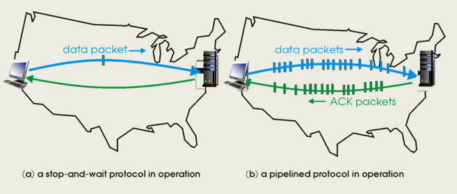

需要更新的是：

1. 增大序号seq的范围（seq被确认后可以复用）

2. 发送方需保存所有未被确认的数据包

3. 需要确定最多有 N=? 个未确认的数据包：发送方降低缓存未确认包的内存开销；接收方避免处理速度跟不上发送速度；减少带宽开销；有限bit位即可表示seq。*N由多种机制共同决定：后续内容：流量控制、拥塞控制。*

   **滑动窗口机制**：对可以连续发出的最多报文数（已发出但未确认的报文）作限制，循环重复使用有限的报文序号。发送窗口：在收到对方确认的信息之前，可以连续发出的最多数据报文数；接收窗口：可以连续接收的最多数据报文数。通常发送窗口大小 = 接收窗口大小。

4. 处理多个数据包的丢失、损坏、超长延迟

   有2种方法：回退N步（Go-back-N，GBN）、选择重传（Selective Repeat，SR）

##### 回退N步

当接收端收到一个出错报文或乱序报文时，丢弃并且不发送确认。发送端超时后，重传所有未被确认的报文。

- 发送方保存所有未确认数据包，构成一个先进先出队列*（seq值连续，只需维护seq的上下界）*。只维护一个计时器，为上次成功接收之后的时间或上次超时重传之后的时间。

- 接收端无需保存数据包，只要记住下一个期望收到的seq。如果收到的不是期望seq的数据包，忽略并重发seq-1作为ACK。

  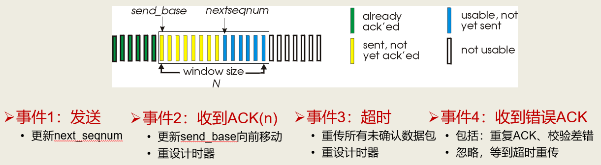

- 优点：减轻接收端负担

- 缺点：重传包数量大，增加发送端与信道负担

##### 选择重传

接收方对每个数据包独立确认。若发送方发出连续的若干包后，收到对其中某一包的ACK错误，或某一包的定时器超时，则只重传该出错或超时的数据包。

- 发送端需要对每个包维护计时器

- 接收端需要缓存已经接收的数据包，以便按顺序交付给上一层。（如果重复收到N以内的数据包，需要重传ACK；如果重复收到N以前的数据包，直接忽略即可，因为发送方肯定已经move on）

  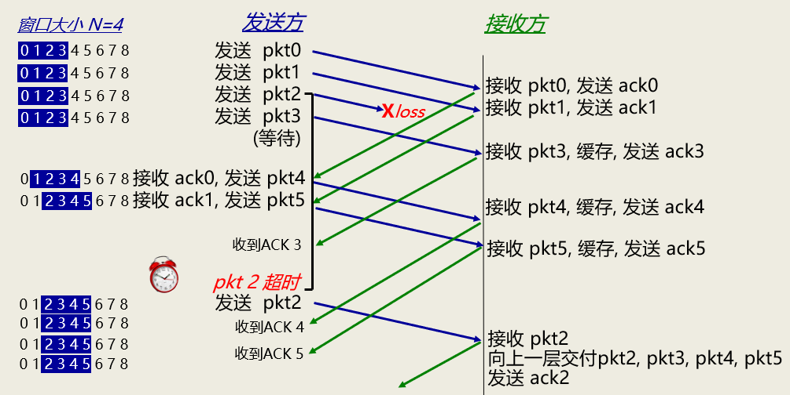

- 优点：减少重传数量

- 缺点：接收端缓存、发送端逐包计时器

> [!NOTE] 
>
> 窗口大小不能超过seq取值空间的一半。因为假设上一批所有的ACK都没收到，需要下一批所有seq都不与上一批重叠。
>
> 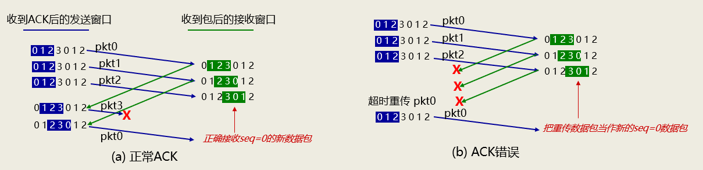
>
> 对回退N步而言，seq大小是N+1即可。
>
> >如果严重乱序怎么办？
> >
> >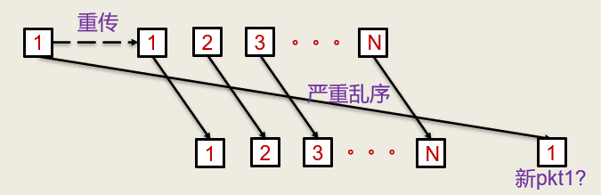
> >
> >1.实际的TCP的N足够大
> >
> >2.实际的网络层不允许一个pkt在网络内存活过长时间 (有生命值)


### TCP可靠数据传输

#### TCP概述

- 对字节建立序号，而非报文

- ACK值为下一个期望的字节序号，而非当前已经收到的最后一个字节

- ACK值放在正常数据包里（捎带，piggyback）

  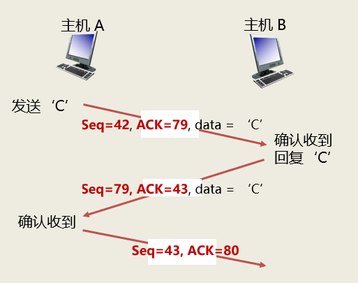

  > 主机A向主机B发送仅包含一个字符‘Ｃ’的报文段：发送序号为42, 确认序号为79（对前一次数据的确认）
  >
  > 主机B将字符‘Ｃ’发送给主机A，发送序号为79，确认序号为43（对收到‘Ｃ’的确认）......

- 乱序处理：协议没有明确规定实现方式

  - 接收端不缓存：可以正常工作，处理简单，但效率低。

  - 接收端缓存：效率高，但处理复杂。

  - 通常会缓存。

    

#### TCP发送端

- 定时器的使用：仅对最早未确认的报文段使用一个重传定时器（与GBN类似）*因为定时器开销不小*
- 重发策略：超时后仅重发第一个未确认的报文段（与SR类似，因为接收端缓存了失序的报文段）

##### 事件处理

1. 收到应用数据：创建并发送TCP报文段。若当前没有定时器在运行（没有已发送、未确认的报文段），启动定时器。
2. 超时: 重传包含最小序号的、未确认的报文段，重启定时器。
3. 收到ACK：如果确认序号大于基序号（已发送未确认的最小序号），更新基序号；如果发送窗口中还有未确认的报文段，重启定时器，否则终止定时器。

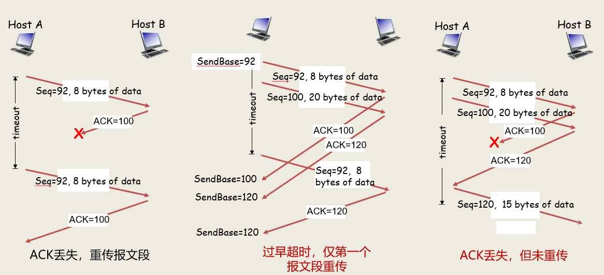

##### 优势

- 只使用一个定时器且只重发第一个未确认报文，避免了超时设置过小时重发大量报文段

- 利用流水式发送和累积确认，可以避免重发某些丢失了ACK的报文段

  

#### TCP发送端优化

##### 超时值设置

- 直观上，超时值应大于RTT，但RTT是变化的，所以需要实时测量从发出某个报文段到收到其确认报文段之间经过的时间（称SampleRTT）

- 由于SampleRTT波动很大，更有意义的是计算其平均值（称EstimatedRTT）

- 平均RTT的估算方法（指数加权移动平均）：EstimatedRTT = (1- a) * EstimatedRTT + a * SampleRTT *典型地，a=0.125*

  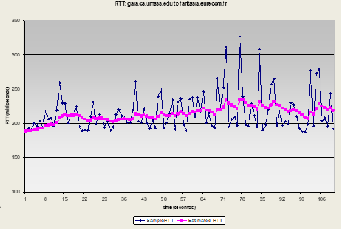

- 瞬时RTT和平均RTT有很大的偏差，所以加上一些偏差作为安全距离。

  安全距离的大小与RTT的波动幅度有关，估算SampleRTT 与 EstimatedRTT的偏差（称DevRTT）：

  DevRTT = (1-b) * DevRTT + b * |SampleRTT - EstimatedRTT| *典型地，b=0.25*

  设置重传定时器的超时值：TimeoutInterval = EstimatedRTT + 4 * DevRTT

细节问题：

1. TCP确认的二义性问题：重传的TCP报文段使用与原报文段相同的序号，发送端收到确认后 ，无法得知是对哪个报文段进行的确认，那么对重传报文段测量的SampleRTT可能不准确。

   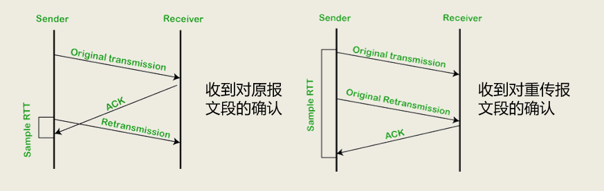

   Sol. 忽略有二义性的确认，只对一次发送成功的报文段测量SampleRTT 并更新EstimtedRTT。

2. 但是简单忽略重传报文段也有问题：重传意味着超时值可能偏小了，需要增大。不更新超时值的话，超时值就可能一直偏小，一直重传。

   Sol. 定时器补偿策略：发送方每重传一个报文段，就直接将超时值增大一倍（不依赖于RTT的更新）*效果：若连续发生超时事件，超时值呈指数增长（至一个设定的上限值）*

3. 结合上述所有，得到超时值Karn算法：

   - 使用EstimatedRTT估计初始的超时值
   - 若发生超时，每次重传就超时值加倍，直到成功传输一个报文段为止
   - 若收到上层应用数据、或某个报文段没有重传就被确认了，用最近的EstimatedRTT估计超时值

##### 快速重传

- 仅靠超时重发丢失的报文段，恢复太慢！发送方可利用重复ACK检测报文段丢失：

  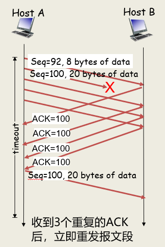

  发送方通常连续发送许多报文段，若仅有个别报文段丢失，发送方将收到多个重复序号的ACK。多数情况下IP按序交付分组，重复ACK极有可能因丢包产生。

- 所以，快速重传：TCP协议规定，当发送方收到对同一序号的3次重复确认时，立即重发包含该序号的报文段。（快速重传即指在定时器到期前重发丢失的报文段）


#### TCP接收端优化

##### 推迟确认

为减小通信量，接收端可以在收到若干个报文段后，发送一个累积确认的报文段。

- 问题：若延迟太大，会导致不必要的重传；推迟确认造成RTT估计不准确。

- Sol：推迟确认的时间最多为500ms；接收方至少每隔一个报文段使用正常方式进行确认。

  |                    接收端事件                    |                        接收端动作                         |
  | :----------------------------------------------: | :-------------------------------------------------------: |
  | 收到一个期待的报文段，且之前的报文段均已发送确认 | 推迟发送确认，在500ms时间内若无下一个报文段到来，发送确认 |
  |  收到一个期待的报文段，且前一个报文段被推迟确认  |               立即发送确认（估计RTT的需要）               |
  |         收到一个序号超前的报文（有间隙）         |          立即重复发送当前的确认（便于快速重传）           |
  |          收到部分或全部填充间隙的报文段          |        立即发送确认；更新确认序号（推进发送窗口）         |


## 四、TCP-管控

### TCP 报文格式

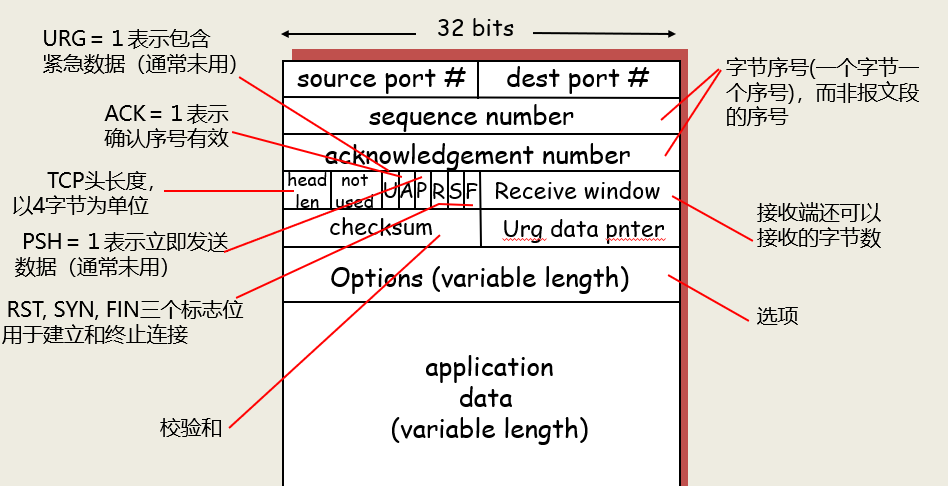

- TCP头最多60字节：固定五行占20字节，options段长度不定，最多40字节。
- 字节序号：发送序号为数据载荷中第一个字节在字节流中的序号，确认序号为期望接收的下一个字节的序号。

options 可以包括：

- 最大段长度 (MSS maximum segment size)：TCP段(segment)中可以携带的最大数据字节数

  - 建立连接时，每个主机可声明自己能够接受的MSS，通常声明1460字节*（以太网物理上限1500字节，-20 TCP头 -20 IP头）若对端没有声明，IPv4缺省值536字节，IPv6缺省值1220* 

    *MSS 的作用是为了避免 IP 分片（在 IP 层对数据报进行分片会增加网络开销和处理复杂度），让 TCP 段的大小适配底层网络的传输能力，从而提高传输效率。*

- 窗口比例因子 (window scale)：实际接收窗口大小 = 传输的window_size值 * 2^window_scale^，在建立连接时确认

- 允许选择确认 (SACK)：最初的TCP协议只使用累计确认，改进的TCP协议引入选择确认，允许接收端指出缺失的数据字节。


### TCP连接管理

#### 建立TCP链接

##### 两次握手的缺陷

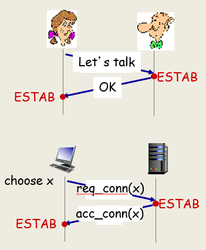

客户端确认了服务器在线，但服务器没有确认客户端在线。如果遇到了不稳定的网络情况，可能会被扣两次钱！


所以：三次握手。

##### 三次握手建立连接

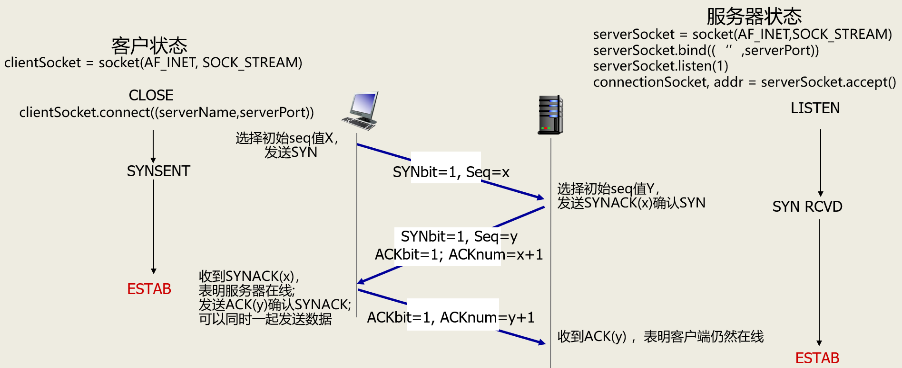

1. 客户TCP发送SYN 报文段（SYN=1, ACK=0）：给出客户选择的起始序号，不包含数据
2. 服务器TCP发送SYNACK报文段（SYN=ACK=1）：给出服务器选择的起始序号，不包含数据，服务器端分配缓存和变量
3. 客户发送ACK报文段（SYN=0，ACK=1）：确认服务器的起始序号，可能包含数据，客户端分配缓存和变量


在建立连接的过程中，双方互相确定参数也很重要，包括起始序号、MSS等。

##### 起始序号选择

- 需求：避免新、旧连接上的序号产生重叠

- 早期基于时钟的起始序号选取算法：每个主机使用一个时钟，以二进制计数器的形式工作，每隔ΔT时间计数器加1，新建一个连接时，以本地计数器值的最低32位作为起始序号。

  - ΔT需要取较小的值（4微秒）：足够的增长速度，避免新旧连接序号重叠
  - 需要使用较长的字节序号（32位）：使序号回绕的时间够长

  问题：支持的网络带宽有限；序列号可预测，已被攻击

- 现代操作系统：基于密码学哈希函数；维护序号池、随机抽取


#### 关闭TCP链接

客户端、服务器都可以主动关闭连接，通过在TCP segment中设置FIN bit = 1 *: 我不想说话了！*

- 一旦发送FIN，就不能再发送数据（但可以回复ACK） ，只能接收数据
- 一旦收到对方的FIN之后，知道对方不再发送消息 -> 可以在己方数据发送完后安全关闭

四次挥手过程：2端各自发送FIN，也各自确认对方的FIN（可以优化：FIN与ACK可以一起发送 *你不想说话了？很好，我也不想说了！*）**状态名字不用记*

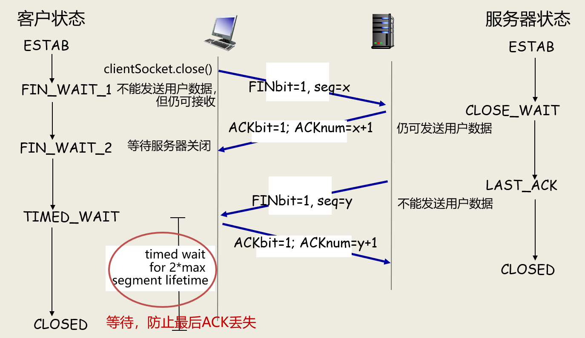

##### 异常情况

- 丢包：那就重传
- 一端下线了：重试失败若干次后，要么放弃链接，要么试着重新建立连接，取决于操作系统实现。


#### TCP握手协议的安全隐患

##### SYN洪泛攻击

fact：服务器在收到SYN段后，发送SYNACK段，**并分配资源**，若未收到ACK段，服务器超时后重发SYNACK段。如果 一直收不到ACK段，会丢弃未完成的连接，SYN超时的典型值为30秒~120秒。

洪泛攻击：攻击者采用伪造的源IP地址，向服务器发送大量的SYN段，却不发送ACK段。这样一来，服务器为维护一个巨大的半连接表耗尽资源，就无法处理正常客户的连接请求，表现为服务器停止服务。

##### TCP端口扫描

1. SYN扫描：发送端向目标端口发送SYN报文

   若收到SYNACK段，表明目标端口上有服务在运行

   若收到[RST段][RST 段（Reset Segment）是一种用于重置连接的控制报文段，主要作用是异常终止一个 TCP 连接或拒绝非法的连接请求。]，表明目标端口上没有服务在运行

   *若什么也没收到，表明路径上有防火墙，有些防火墙会丢弃来自外网的SYN报文段。*

2. FIN扫描：发送端向目标端口发送FIN报文

   若收到ACK=1、RST=1的TCP段，表明目标端口上没有服务在监听。*服务器以为是之前已经关闭了的连接*

   若没有响应，表明有服务在监听（RFC 973的规定）*收到了一个莫名其妙的报文，以为出错了所以丢弃*

   有些系统的实现不符合RFC 973规定，如在Microsoft的TCP实现中，总是返回ACK=1、RST=1的TCP段，这就不太好扫描。

知道工作端口号后，就可以知道服务器的信息（比如这是个http服务器/ssh服务器），从而进行对应攻击。


### TCP流量控制

目的：保护接收端缓冲区不溢出。

#### 如何控制流量

- 接收缓存中的可用空间称为接收窗口：RcvWindow = RcvBuffer - (LastByteRcvd - [LastByteRead][应用程序取走的最后一个字节])

- 接收方将RcvWindow放在报头中，向发送方通告接收缓存的可用空间

- 发送方限制未确认的字节数不超过接收窗口的大小，即 LastByteSent - LastByteAcked ≦ RcvWindow

  特别是，当接收方通告接收窗口为0时，发送方必须停止发送

  

#### 问题：非零窗口通报

当接收窗口变为非0时，接收方应通告增大的接收窗口，但是如果发送方不发报文，就不会触发接收方的回应呀。

Sol. 那就让发送方发点东西：TCP协议规定发送方收到“零窗口通告”后，可以发送“零窗口探测”报文段，从而接收方可以发送包含接收窗口的响应报文段。

具体实现：

- 发送端收到零窗口通告时，启动一个坚持定时器（Persistent Timer）
- 定时器超时后，发送端发送一个零窗口探测报文段（序号为上一个段中最后一个字节的序号），接收端在响应的报文段中通告当前接收窗口的大小
- 若发送端仍收到零窗口通告，重新启动坚持定时器。


#### 糊涂窗口综合症

当数据的发送速度很快、而消费速度很慢时，接收方不断发送微小窗口通告，发送方不断发送很小的数据分组，导致大量带宽被浪费。

##### 接收方策略

- **Clark策略**：通告零窗口之后，仅当窗口大小显著增加之后才发送更新的窗口通告 *(即窗口较小时，一直反馈零窗口)*
  - 什么是显著增加：窗口大小达到缓存空间的一半或者一个MSS*（反正可以发一个完整的TCP段了）*，取两者的较小值
- 与推迟确认结合：推迟发送ACK后推迟间隔内有更多数据被消费（一种希望）（但最多推迟500ms，且至少每隔一个报文段使用正常方式进行确认）

##### 发送方策略

发送方应积聚足够多的数据再发送，以防止发送太短的报文段。但应该等待多长时间？

- 若等待时间不够，报文段会太短
- 若等待时间过久，应用程序的时延会太长
- 而且，TCP不知道应用程序会不会在最近的将来生成更多的数据

**Nagle算法**：

1. 在新建连接上，当应用数据到来时，组成一个TCP段发送（那怕只有一个字节）
2. 如果有未确认数据，后续到来的数据放在发送缓存中。
3. 当数据量达到一个MSS（反正后面也一次发不完了）且窗口大小大于等于MSS（对面收得下），或收到所有已发数据的确认（网络情况应该还不错），用一个TCP段将缓存的字节全部发走。

- 优点：适应网络延时、MSS长度、发送方速度的各种组合，常规情况下不会降低网络的吞吐量。
- 缺点：增加延迟，尤其与延迟确认共同使用时；不考虑接收端是否真的消费了数据。*所以一般追求极端低时延的应用会关闭nagle算法，which is 内置 in TCP*


### TCP拥塞控制

目的：保证路由器和交换机不被淹没。

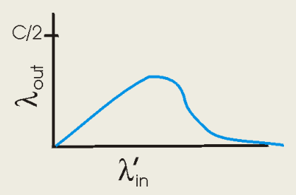
$$
发太多了之后，反而什么都收不到
$$
拥塞控制的常用方法：

1. 网络内部的拥塞控制（路由器交换机提供显式反馈）：古老，或实验性。
2. 端到端拥塞控制（端系统通过观察丢包和延迟，自行推断拥塞情况）：传统TCP采用此方法。

#### TCP 拥塞策略

##### 限制机制

拥塞窗口 congestion window (cwnd)：限制 LastByteSent-LastByteAcked ＜ cwnd

*此时流量可以约略计算为$\frac{cwnd}{RTT} Byte/sec$*

##### 总体策略思路：AIMD

- AI：additive increase. 若无丢包，每经过一个RTT，将cwnd增大一个MSS，直到检测到丢包

- MD：multiplicative decrease. 发送方检测到丢包后，将cwnd的大小减半（但不能小于一个MSS）

  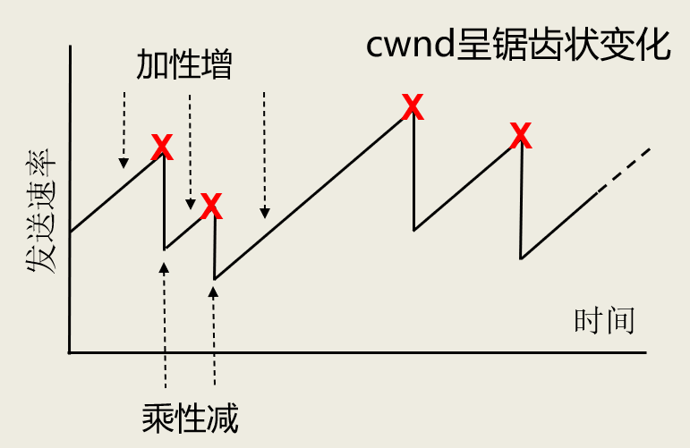

- 实际的拥塞策略由慢启动、拥塞避免、快速恢复3部分组成，近似实现AIMD。

##### 慢启动

- 在新建连接上，令cwnd = 1 MSS。

- 在新建连接上**指数增大**cwnd，直至检测到丢包 or 达到足够大发送速率（此时终止慢启动）

  具体实现：每收到一个ACK段，cwnd增加一个MSS（大致等价于每个RTT加倍）

  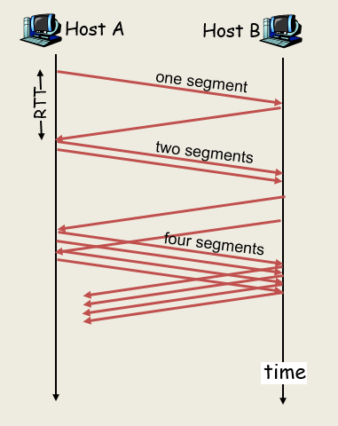

- 慢启动指数增长到一定程度后，进入拥塞避免阶段

##### 拥塞避免

- 当cwnd增大到一定程度时，若继续指数增长，容易导致拥塞

  因此将指数增长改为**线性增长**：每当收到ACK， cwnd = cwnd + MSS*(MSS/cwnd)

  eg. MSS = 1460字节，cwnd = 14600字节时，收到第一个ACK，cwnd增加1/10 * MSS。即收到10个ACK后，cwnd大约增加1个MSS。

- 慢启动与拥塞避免的界限：维护 **ssthresh** 阈值变量

  当cwnd < ssthresh，为慢启动阶段， cwnd指数增长

  当cwnd >= ssthresh，为拥塞避免阶段，cwnd线性增长

  ssthresh与cwnd一样，也根据网络状态动态调整

- 仍然在增长cwnd，最终超过网络可用带宽时，开始丢包，改变策略。

  *事实上，无论慢启动阶段还是拥塞避免阶段，都可能遇到丢包。需要更新cwnd，以及ssthresh，甚至更改cwnd的计算策略*

##### 快速恢复

考虑到丢包分为超时和收到3个重复ACK两种情况，所以根据不同拥塞情况进行调控。

- TCP Tahoe (1988): 统一对待丢包，发生丢包即重新开始慢启动。

  - 将ssthresh降低至cwnd/2
  - 将cwnd=1MSS

  

- TCP Reno (1990):

  若超时，则重新开始慢启动。

  若收到三个ACK，则进入快速恢复阶段：

  *注意：当收到3个重复ACK时，才叫做进入快速恢复阶段，此时cwnd比ssthresh大3*

  - 将ssthresh降低至cwnd/2

  - 将cwnd降至当前cwnd/2+3

  - 快速恢复新机制：

    情形1. 继续收到该重复ACK：每次将cwnd增加1个MSS（网络状态尚可，那为了发送一些新的数据，需要扩大一下窗口）

    情形2. 收到新ACK：降低cwnd至ssthresh，进入拥塞避免阶段（恢复正常计数，而不是越过丢包的包计数）

    情形3. 超时：进入慢启动

  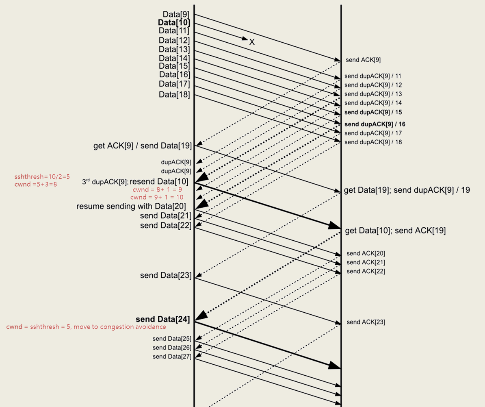

##### 整理

|      State      |       Event        |                      TCP  Sender Action                      |           Commentary           |
| :-------------: | :----------------: | :----------------------------------------------------------: | :----------------------------: |
|  慢启动  (SS）  |    收到新的确认    | cwnd  = cwnd + MSS; If  (cwnd > ssthresh)     set state to “Congestion Avoidance” |    每经过一个RTT，cwnd加倍     |
| 拥塞避免   (CA) |    收到新的确认    |                cwnd  = cwnd+MSS * (MSS/cwnd)                 | 每经过一个RTT，cwnd增加一个MSS |
|    SS or CA     | 收到3个重复的确认  | ssthresh  = cwnd/2,   cwnd  = Threshold+3,   Set  state to “Fast Recovery” |   cwnd减半加3，然后线性增长    |
|    SS or CA     |        超时        | ssthresh  = cwnd/2,     cwnd  = 1 MSS,  Set  state to “Slow Start” |  cwnd降为一个MSS，进入慢启动   |
|    SS or CA     | 收到一个重复的确认 |                     统计收到的重复确认数                     |   cwnd  和  ssthresh 都不变    |


#### TCP连接的吞吐量

考虑一个长期存活的TCP连接的平均吞吐量（忽略慢启动阶段）：近似AIMD。

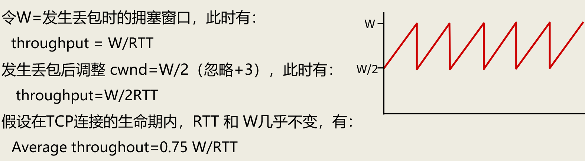

75%的利用率ok吗？在过去已经相当可观，现在可能有更多的需求。


#### TCP的公平性

目标：如果K条TCP连接共享某条带宽为R的瓶颈链路，每条连接应具有平均速度R/K

考虑两个连接时的情形（考虑两者同时进行同样的策略，因为网络情况对大家是一致的）

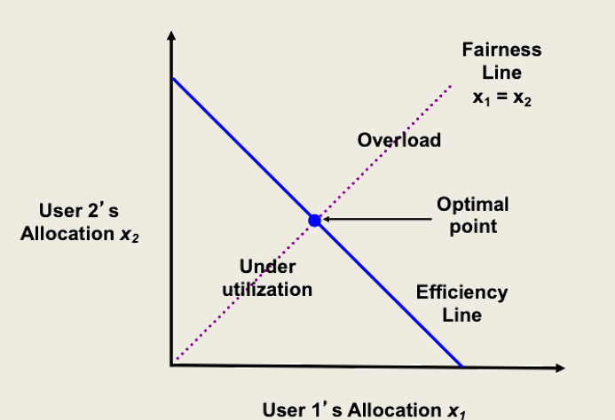

- AIAD线性调整时，会平行于efficiency line移动

- MIMD乘法调整时，会沿着和原点的连线移动

  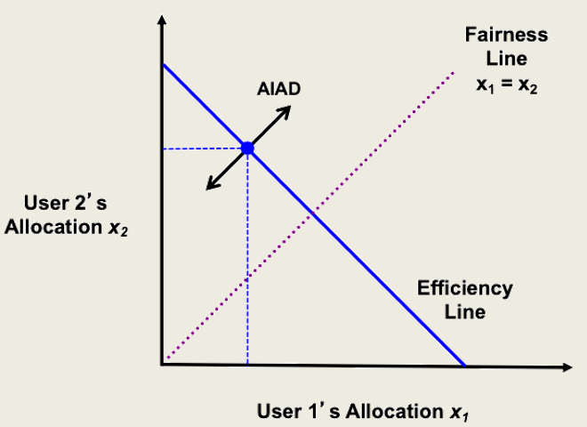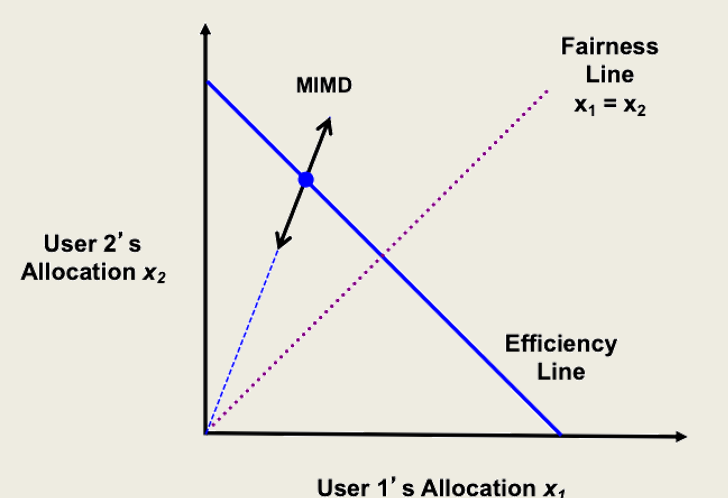

  因此AIMD调整会逐渐趋向 optimal point

  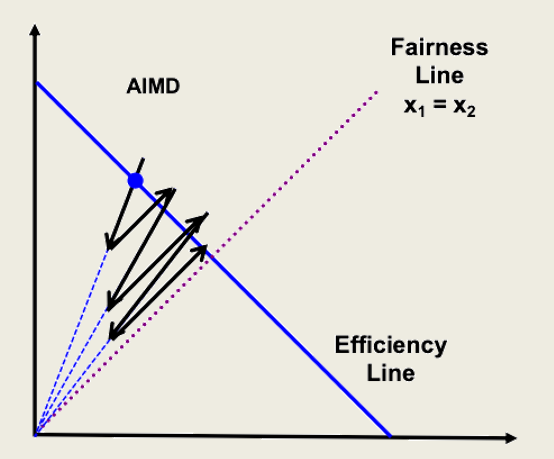

##### 参数不同时不能保证公平性

- RTT，MSS等
- 若应用（如web）可以建立多条并行TCP连接，也不能保证带宽在应用之间公平分配。eg. 一条速率为R的链路上有9条连接。若新应用建立一条TCP连接，获得速率 R/10；若新应用建立11条TCP，可以获得速率 0.55R!
- 此外，考虑UDP，UDP并不做拥塞控制。所以有的网络会屏蔽UDP流量，以防UDP抢占了过多流量。


## 五、新型拥塞控制

拥塞控制的两个核心要素：拥塞避免与快速恢复。（慢启动不占多少时间）

以下介绍一些现代拥塞控制优化。

#### 慢启动优化

初始窗口大小，1 MSS 实在太小了！从 10 MSS 开始比较好👍


#### TCP New Reno

思想：快速恢复阶段不应该那么快结束，应该等到所有丢包都重传完了再退出快速恢复阶段。

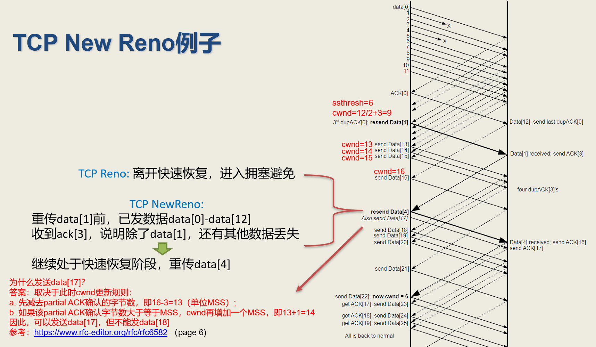

但是每个RTT只能判断并重传1个丢包。


#### SACK

Selective Acknowledgements

思想：用TCP头部一次性告知丢了哪些包。

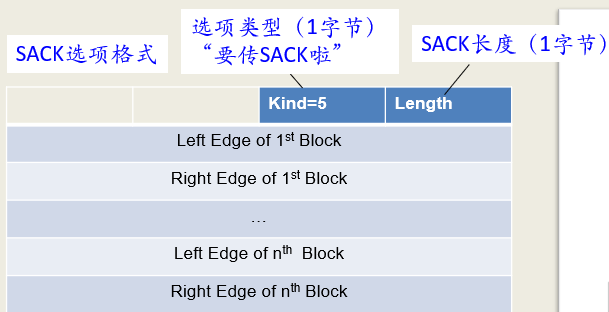

传递已接收的连续块。每个块（left+right）共8字节信息。类型+长度2字节。所以最多传4个块，使用34字节的option。


#### TCP BIC

Binary Increase Congestion

想解决问题：网络状况稳定时，锯齿状无法充分利用信道。

思想：二分查找确定稳定传输的最大窗口大小。

- 当发生丢包时，乘性减，重置Wmax和Wmin：Wmax = 丢包窗口大小，Wmin = Wmax/2。

- 每经过一个RTT，若无丢包发生，便将窗口设置到Wmax和Wmin的中点，Wmin = (Wmax+Wmin)/2

  - 实现：通过ACK驱动。每收到一个ACK，cwnd += (需要上升的高度) * MSS / cwnd

  - 有最大最小上升高度限制

    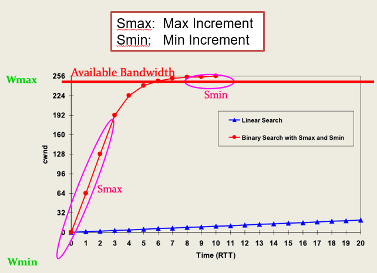

- 如果达到了Wmax还没丢包，就按照对称路径继续往上走。

  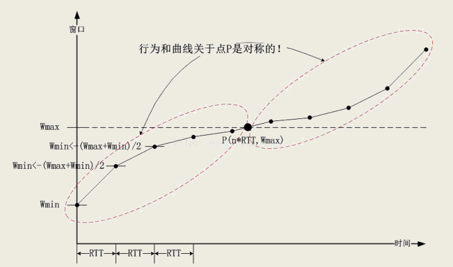

【致命问题】不公平性

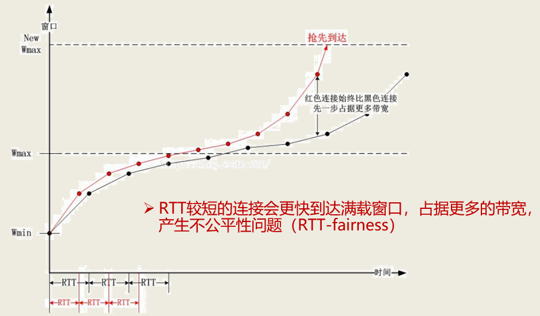


#### CUBIC

默认拥塞控制算法。

思想：窗口增长函数仅仅取决于当前距离上次丢包经过的时间t，从而，窗口增长完全独立于网络的时延RTT。

- CUBIC将BIC算法连续化，用三次函数拟合BIC算法曲线（CUBIC：三次函数(与BIC无关)）

- 拥塞窗口成为距上次丢包的时间t的函数。

  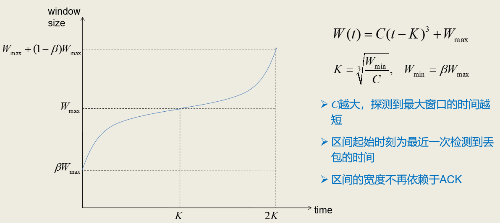

  β：可以调，一般为1/2。

  C：以多快的速度逼近Wmax  *K（达到Wmax的时间）就会随着移动*


#### TCP Vegas

如今用得不多，主要关注轻量级系统（无人机、卫星、...）

思想：用RTT值来调整拥塞窗口（而不是通过丢包）

- 监控RTT，通过RTT来估计当前的实际吞吐量

- 如果实际吞吐量与期望吞吐量差别不大甚至更好（差距小于α/RTT）：线性地增加cwnd

- 如果实际吞吐量比我们的期望吞吐量要小很多（差距大于β/RTT）：线性地减少cwnd

- 位于α/RTT和β/RTT中间：不变，观望。

  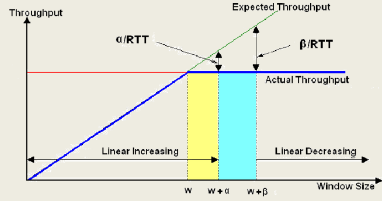

*重传优化：因为可以计算RTT，所以当计算得到的当前 RTT 超过了预设的 Timeout 时，发送方会直接判定上一段数据段已丢失，并主动触发重传操作。*


#### TCP Westwood

如今用得不多，主要运用于无线网络。

思想：根据ACK的到达速率来进行带宽估计。


#### TCP BBR

重量级！

思想：算出网络容量，以其作为window size。网络容量应该按照不排队来计算，而不是排满队后开始丢包了的速率作为想达到的速率。按照不排队的容量来计算的话，吞吐量没什么区别，时延更低，丢包风险更小。

- 求出BDP（Bandwidth-Delay Product 带宽延迟积）= 瓶颈链路带宽BtlBw * RTprop (Round-trip propagation time [往返传输时延][仅考虑传输路径上的耗时])。即瓶颈链路装满时，整个网络管道里的数据量。
- 将cwnd向BDP靠近即可。

问题：海森堡测不准。

- 测最短RTT：少注入数据，网络通顺才是最少RTT。（上半部分）

- 测最大带宽：多注入数据开始排队了才知道。（下半部分）

  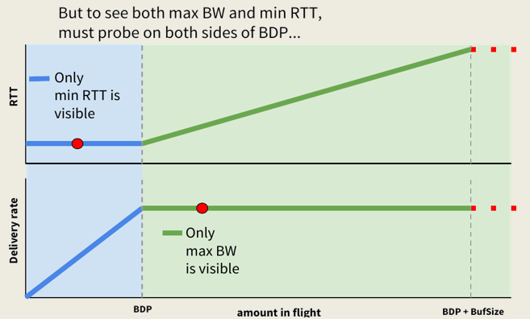

##### Sol. 近似检测

1. 启动阶段：当连接建立时，类似TCP的慢启动，指数增加发送速率，尽可能快地占满管道。若经过三次发现投递率不再增长，说明已达到BtlBw，瓶颈链路处分组已开始排队。

   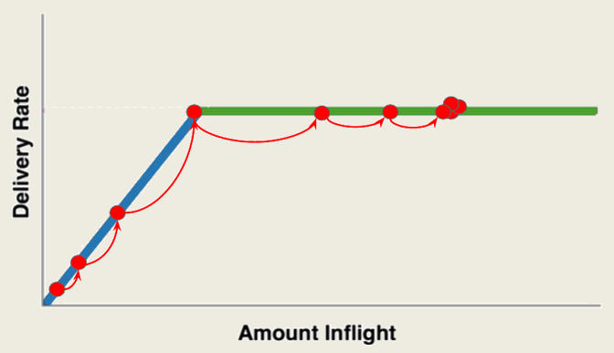

2. 排空阶段：指数降低发送速率（相当于是startup的逆过程），将多占的数据慢慢排空。

   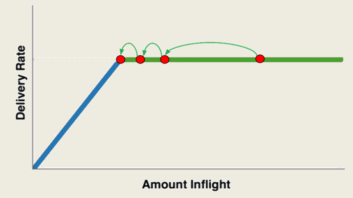

3. 瓶颈带宽探测：进入稳定状态后, 以8个RTT为一个周期。第1个RTT内增加发送速率，探测最大带宽。如果RTT增大（发生排队），第2个RTT再减小发送速率，排空前一个RTT多发出来的包。后面6个RTT使用更新后的估计带宽发送。

   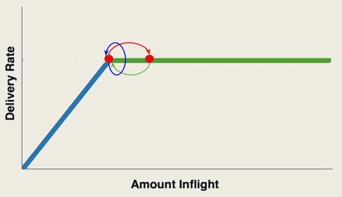

4. 时延探测：每过10秒，若RTT未更新，就进入RTprop探测阶段：cwnd固定为4个包，测得的RTprop作为基准，在瓶颈带宽探测阶段判断是否发生排队。（只占用2%时间，可以接受）

##### 争议

- 2016年，V1版本发布

- 2017年研究指出BBR对基于丢包的拥塞控制算法存在“霸凌”行为：(1) 大量探测报文过度消耗网络设备缓冲区 (2) 过度攫取带宽资源

- 2019年：V2版本发布，声称解决“霸凌”现象：更温和的探测策略、更友好的共享带宽

- 但后续研究表明：BBR与其他拥塞控制算法共存时，仍存在大量不公平现象

  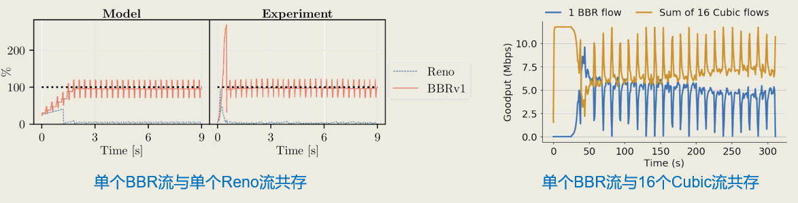

  原因：遇到拥塞时，loss-based拥塞控制时选择退让，但BBR尽量攫取空出来的带宽。


#### DCTCP

面向数据中心。

##### 数据中心的性能问题

> 数据可以分为时延敏感的短流（50KB-1MB）和吞吐敏感的长流（1MB-50MB）。
>
> 还存在大量突发流量（时间<1s，大小<2KB）。

1. Incast：在一个很短的时间内，大量流量同时到达交换机的一个端口，导致缓冲区被占满，最终导致丢包。（在Partition/Aggregate通信模式中，所有Worker几乎会在同一时间向Aggregator返回执行结果，产生很高的突发流量）

   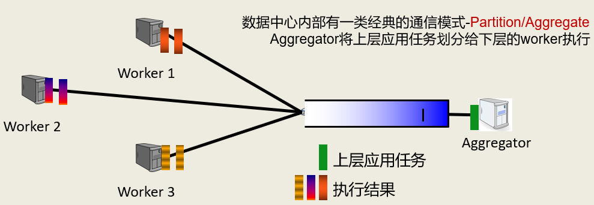

2. Queue Buildup：长流和短流同时通过交换机的同一个端口时，由于长流占用较多的缓冲区空间，导致短流延迟增大，甚至丢包。

3. Buffer Pressure：（在之前，）交换机的不同端口通常共享同一块缓冲区，即使长流和短流通过不同的端口，短流通过的端口也会出现缓冲区不足的问题

发现将缓冲区队列长度维持在一个较低的水平即可。

##### DCTCP核心思想

- 根据网络拥塞程度精细地减小发送窗口：

  一旦发现拥塞，发送窗口减至原窗口的（1-α/2），α∈[0, 1] 反映了拥塞程度（传统TCP中α总为1）

- 拥塞程度的衡量：ECN标记（explicit congestion notification）*交换机直接和主机沟通*

  当交换机队列的瞬时长度超过某个阈值时，交换机在报文头设置ECN标记，该标记通过报文传递给receiver，receiver收到后在ACK中echo这个标记，从而sender收到ACK后调整窗口大小。

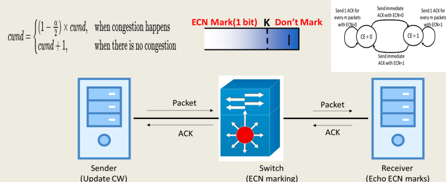

##### 具体实现

- 交换机：当队列长度超过K时，给随后到来的包标记ECN

- 接收端：平常采取Delay ACK的策略，当ECN报文出现或消失时立即发送ACK。

- 发送端：每个RTT更新一次发送窗口

  α←(1-g)α+gF，其中 g 为加权，F = 过去带有ECN的ACK数量 / 总的ACK数量

  Cwnd←(1-α/2)∗Cwnd

*十分简单，只需30行左右的代码改动，所以应用得很快。*


> [!NOTE]
>
> 一张年鉴表作为新型拥塞控制总结
>
> - TCP Tahoe（1986年进入BSD Unix，1988年论文发表） 
> - TCP Reno（1986年进入BSD Unix，1990年论文发表）
> - 慢启动优化（TCP Tahoe -> Linux 2.6 -> Linux 3.0，2010年论文发表）
> - TCP New Reno（1995年）
> - SACK（1996年RFC) 
> - TCP Vegas（1995年论文）
> - TCP Westwood（2001年论文）
> - TCP BIC（2004年论文）
> - TCP CUBIC（2006年进入Linux 2.6.19，2008年论文发表）
> - TCP BBR（2016年论文）
> - DCTCP（2010年论文发表，2012年前后进入Linux 3.18）


## 六、新型传输层协议

UDP和TCP太极端了，折中一下。

#### DCCP

> UDP没有拥塞控制：拥塞发生时，UDP既感知不到拥塞，也不会降低其发送速率，从而影响应用性能。且对TCP协议极不友好，损害网络公平性（TCP让出的带宽都被UDP占了）。

DCCP：UDP + 拥塞控制。（并没有真正被部署）

是位于传输层的协议，和TCP、UDP位置相同。

##### DCCP 连接

全双工，但由两个半连接组成。`两个半连接的配置可以不一样`

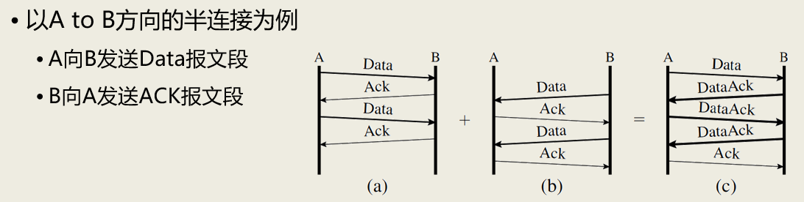

同一方向的ACK段和Data段可以合并成DataAck报文段

建立连接过程和TCP一致，唯一不同是只有服务器端可以结束链接。*仅由服务端控制连接终止，可让服务端更高效地管理资源，避免因客户端的随意操作引发状态管理消耗。*

##### 报文格式


只要知道其有常规序号(48位)和短序号(24位)两种序号格式可供选择即可。

##### 拥塞控制

- TCP-like Congestion Control（[CCID][拥塞控制策略选择的头部标识]2）

  发送方维持一个发送窗口，允许连续地发包，直到没有可用的发送窗口

  接收方对收到的包回复ACK报文，包括一段时间内收到的所有包的序号（用于支持SACK机制）

  丢包或者ECN标记表示出现拥塞，此时发送端需要将发送窗口减半

  收到正常ACK，则发送窗口线性增长

- TCP-Friendly Rate Control（CCID3）

  接收方计算丢包率，报告给发送方

  发送方根据丢包率计算发送速率，并根据发送速率发包

  *可以只反馈丢包率不反馈收到的序号，反正发送方也不管，这只是作为一个拥塞控制*

- 相比而言，CCID3可以更平滑地调节发包速率


#### MPTCP

>传统TCP协议仅支持单路径传输，即只能利用终端主机上的一个网络接口传输数据，但移动网络和数据中心网络中的网络设备天然拥有多个网络接口，希望可以多路径传输（又用流量又用WiFi）。

多路径TCP协议（MPTCP）：将单一数流切分为若干TCP子流，同时利用多条路径进行传输。这样既可以提高带宽，又可以防止单条路径突然恶化。*eg. 在同时支持蜂窝和WiFi网络的iOS设备中，优先以 WiFi 建立 MPTCP 连接，蜂窝移动接口建立备用连接。如果 WiFi 不可用或不可靠，MPTCP 立即在后台切换到蜂窝移动数据网络*

位于应用层socket和单路TCP中间：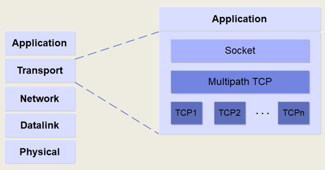

##### 具体操作

> MP_CAPABLE：建立MPTCP连接
>
> MP_JOIN：附加新的子流到已有连接
>
> ADD_ADDR：新增可用路径
>
> REMOVE_ADDR：删除路径
>
> MP_FASTCLOSE：关闭所有子流

1. 三次握手建立一条MPTCP连接（在SYN报文中启用MP_CAPABLE字段）

2. 将MPTCP的其它子流附加到已经存在的MPTCP连接上：

   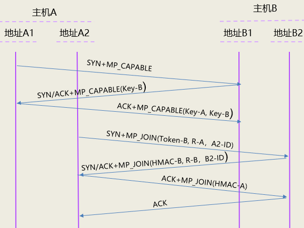

   （R为随机数，HMAC为认证信息）

3. 新增路径：只新增路径而不附加子流，使用ADD_ADDR字段（现实中不常用）`主机A发送启用了ADD_ADDR字段的报文段，包含新的IP地址/端口对（IP#-A3)和对应的IP地址编号(IP#A3-ID)、认证信息（HMAC-A3），ECHO指示当前报文段是“发出”。主机B验证HMAC-A3，无误后将路径信息记录下来，向主机A发送响应报文段，ECHO标注为“响应”，其它信息原样发回`

4. 删除路径：主机A发送启用了REMOVE_ADDR字段的报文段，指定要删除的路径地址。

5. 关闭单个子流：和TCP一致。

6. 关闭所有子流：主机A发送启用了MP_FASTCLOSE字段的报文段，其中附加了主机B的密钥用以身份认证，主机B收到后，选择恰当时机关闭所有连接，并向主机A发出确认。

7. 对安全性要求很高，但了解即可。

##### 数据调度

要考虑到不同路径的传输速率不同，会导致顺序问题。

MPTCP：根据拥塞窗口大小及路径延迟，将数据按比例分配给各个子流，尽力保证数据包按序到达接收端，降低数据乱序到达对网络性能产生的不利影响。

##### 拥塞控制

要考虑到公平性：多个子流的带宽应该和单个TCP连接差不多，不能过多地侵占其它单路径TCP连接的带宽。

MPTCP：窗口的总和加起来不超过单路径TCP连接


#### QUIC

> - TCP 实现在操作系统内核中，应用无法对TCP进行修改，但操作系统的更新往往跟不上应用的需求和节奏。
> - TCP体系握手时延大。互联网上的大趋势：低时延需求越来越强烈；加密流量占比越来越大。而TLS(传输层安全性协议)+TCP的体系握手时延很大，传输前需要3个RTT进行握手。
> - TCP多流复用存在队头阻塞(排头阻塞)问题：比如要传输一个页面上多张图片，为每个数据建立一个TCP连接很低效（尤其对于小流，单独建立连接成本高昂），因此出现了多流复用（多个数据流使用一个TCP连接）。但因为TCP传输需要保持有序性，所以第一张图片丢包的话，第二张图片也无法显示。就像有一辆直行的车停在前面，右转的车就都走不了。

QUIC：UDP + TCP/TLS/HTTP特性。一个QUIC连接可以用于传输多个字节流，丢包只影响相关的流。

##### 建立连接

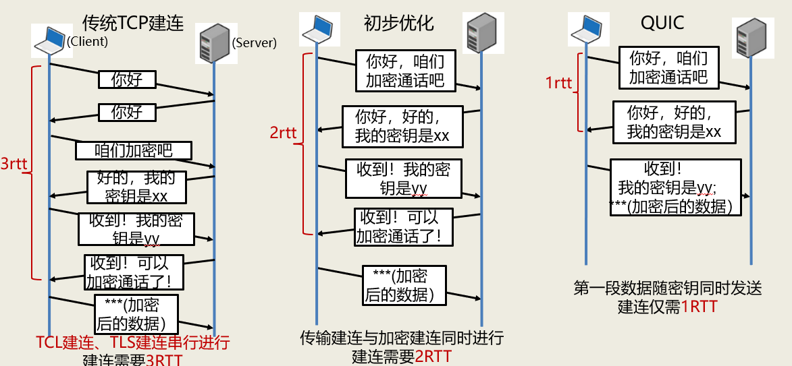

##### 报文

QUIC包作为UDP的数据载荷。在结构中的位置： 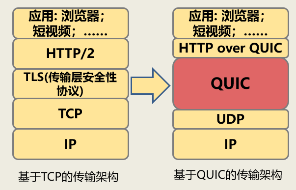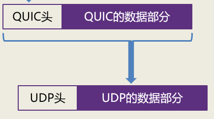

##### 多数据流

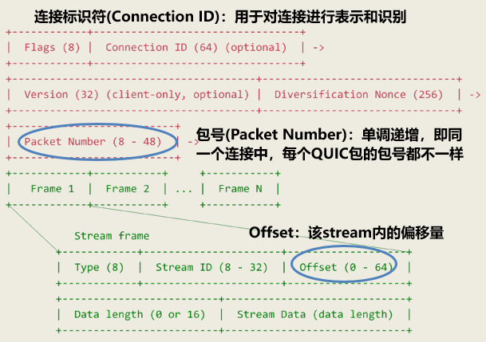

- 交付数据：有streamID来确认传的是哪一流的数据，offset来表示该流内的序号，从而实现多数据流各管各交付，一个流丢包不影响其他流数据交付。
- 接收packet：用ACK确认序号，序号单调递增，对于重传包也会递增packet number，从而解决了seqNum歧义问题，方便计算RTT。

##### 支持IP/端口切换

> IP地址/端口发生变化时，TCP连接会断开。此时，需要应用层进行处理。

QUIC：支持IP/端口切换，使用Connection ID来表示每个连接，使IP地址或端口的变化不影响对原有连接的识别。则客户IP地址或端口发生变化时，QUIC可以快速恢复。

---


# Lecture 4. 网络层

## 一、基本概念

网络层负责多跳传输。

##### Internet

无连接；尽力而为（不提供可靠传输）；数据报可能沿不同的路径传输（但尽量沿同一条路径发，以避免乱序调整的开销）

##### 网络层关键功能

- 转发：收到了一个端口传来的数据，决定从哪个端口输出。

  - 数据平面：和转发有关的一切。

- 路由：规划好从源端到到目的端的路径

  - 控制平面：和路由有关的一切。因为需要全网计算，所以涉及多个路由器。

    两种实现算法：

    1. 传统路由算法: 多个路由器分布式协作计算，算完后更新路由表

    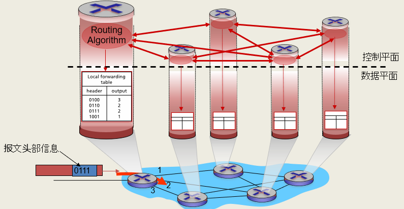

    2. 软件定义网络(SDN): 由中心化控制器负责计算后，通知各个路由器


## 二、路由器

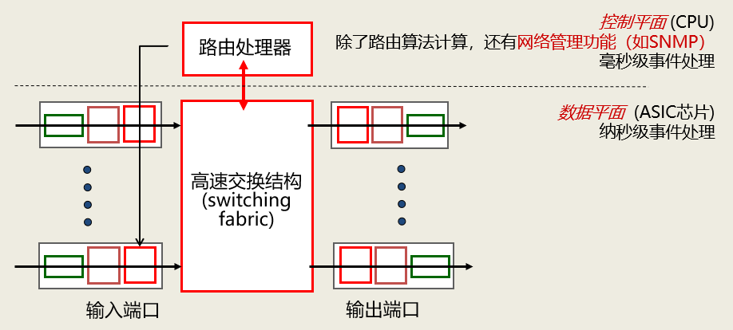

### 路由器控制平面

- 路由器可同时运行多个路由协议
- 路由器也可不运行任何路由协议，只使用[静态路由][由网络管理员手动配置、固定不变的路由条目，明确指定目标网络和下一跳设备]和[直连路由][只有一条路]
- 路由管理根据路由优先级，选择最佳路由，形成核心路由表
  - 一般直连>静态>eBGP>OSPF>RIP>iBGP
- 控制层将核心路由表下发到数据层，形成转发表（FIB）


### 路由器数据平面

#### 主要功能

1. 链路层解封装，IP头部校验
2. 获取报文目的IP地址
3. 用目的IP地址，基于最长前缀匹配规则查询转发表
4. 若查询失败，丢弃报文
5. 若查询成功，IP头部“TTL”字段值减1，重新计算IP头部“校验和”，获取转发出接口和下一跳链路层地址，重新进行链路层封装，发送报文。*普通IP报文转发过程中，路由器不查看传输层及以上层协议的内容*


#### 输入端口

每个端口独立并行工作。

##### 转发策略

1. 基于目的地址的转发：只根据目的IP地址，传统交换机中常用（受限于芯片计算能力）

   **最长前缀匹配**：在转发表中查找匹配的最长地址前缀。

   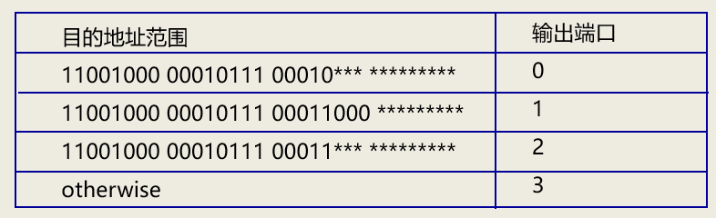

   > 使用最长前缀匹配是因为存储区间效率太低，而现代网络的性能要求极高，需要在纳秒级时间内完成查找。
   >
   > 现代路由器的转发表实现基于[ternary][三元] content addressable memories (TCAMs)
   >
   > - 可以对所有地址并行匹配：匹配多个转发表项目只消耗1个时钟周期
   > - 每个bit支持3类匹配值：0，1，dont care
   > - TCAM支持百万级表项

2. 通用转发：可以根据数据报文中任意字段的组合，现代软件定义网络中使用

##### 缓冲队列

从输入端口搬运到输出端口的过程中，因为交换核心或输出端口速度低于多个输入端口到达速率之和，所以在输入端口处排队，导致延迟乃至丢包。（*排头阻塞）

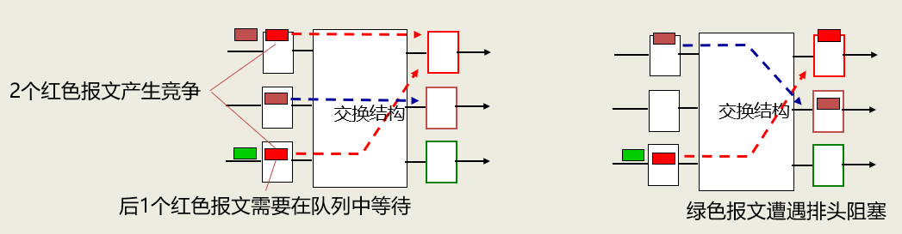

- 交换速率：所有输入端口到输出端口的总速率。若有N个输入端口，则期望的交换速率为N倍线速。

- 交换结构：将报文从输入端口的缓冲队列传输到正确的输出端口的方式

  1. 共享内存*【最初的交换机实现】*：交换结构内没有专用芯片，只有一块内存，由控制平面的路由处理器控制（所以路由处理器不仅负责路由功能，还负责转发功能）

     - 报文到达输入端口时，产生中断信号通知路由处理器
     - 路由处理器将报文复制到内存中，查询对应输出端口，再将报文复制到输出端口

     性能瓶颈：内存拷贝

     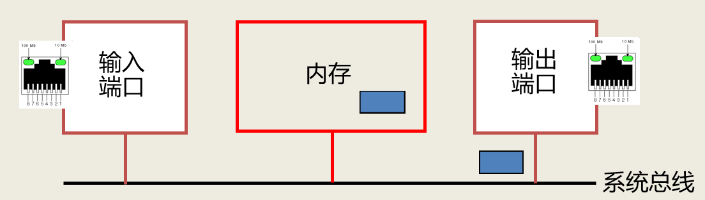

  2. 共享总线：数据包从输入端口直接到达输出端口，无需处理器干预

     - 输入端口通过转发表后，给报文附加上“标签”，表明输出端口
     - 带标签的报文通过总线广播至所有输出端口
     - 每个输出端口通过标签判断报文是不是属于自己的，不属于则忽略

     性能：总线1次只能广播1个报文，交换速率受总线带宽制约 `Cisco 5600交换机：32Gbps交换速率`

  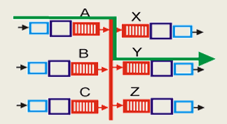

  3. 纵横式 Crossbar：使用2N条总线连接N个输入端口与N个输出端口，可以并行工作。

  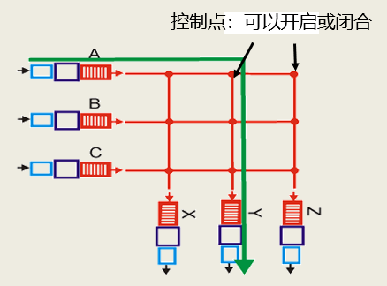

  4. 更复杂的交换结构：多级，分布式...（有多条路径）

     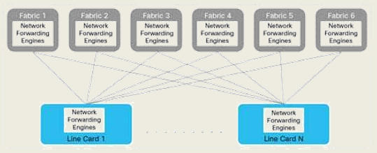

  

#### 输出端口

不一定遵循FIFO，会进行队列调度。

##### 缓冲区大小

RFC 3439 建议：“典型”RTT (250 ms) 乘以链路带宽 C。若C = 10 Gpbs，缓冲区大小2.5 Gbit。

但这太多了，所以实际上建议：$\frac{RTT \times C}{\sqrt n}$ ，其中n指流的数量，相同网络地址的报文构成1个[流][二元组流：源IP地址+目的IP地址; 五元组流：源IP地址+目的IP地址 + 源端口号 + 目的端口号 + 传输层类型（TCP or UDP)[]。（*$\sqrt n$ 完全是经验值，因为取n就太小了，所以折中一点*）

##### 调度机制

1. FIFO制度：根据入队顺序发送，当缓冲区溢出时：

   - Tail drop：丢弃新来的报文

   - Priority drop：根据优先级丢弃报文

   - Random drop：随机丢弃

2. 基于优先级调度：将数据报文分为不同优先级（根据IP地址，端口号，安全或者性能因素等等考虑）

   实现：多个队列对应不同优先级（为简化芯片设计，不采用复杂数据结构（如二叉堆）），总是先发送高优先级报文。

   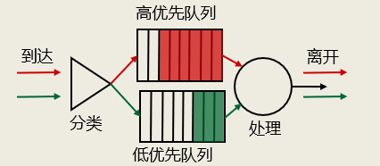

3. 轮询调度 round robin scheduling：将报文分类，进入多个队列。在队列间轮询，若队列中存在报文，则发送。

4. 加权公平队列 WFQ weighted fair queueing：结合优先级和轮询。每个队列拥有权重值，权重高的队伍轮询到的次数更多。*【如今使用较多】*


## 三、协议

### IPv4 协议

无连接协议，执行两个基本功能：寻址、分片 (fragmentation)

#### IPv4 数据报格式

ipv4头部最多也是60字节，固定头也是20字节，所以选项部分也最多40字节。

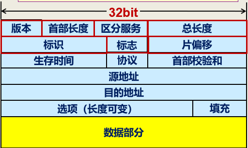

> 版本：4bit，表示采用的IP协议版本
>
> 区分服务：原本用来指定优先级，现在一般不用。（有时候会用来塞点别的信息）
>
> 总长度：用16bit表示整个IP报文的长度，能表示的最大字节为2^16-1=65535字节，这和MSS矛盾呀！因为指的是逻辑上的长度，实际上会进行分片，分片传输
>
> 标识：用来标识同一片分片。16bit，IP软件通过计数器自动产生，每产生1个数据报计数器加1
>
> 标志：3bit，目前只有两位有意义，均用于分片；
> 	MF，置1表示后面还有分片，置0表示这是数据报片的最后1个；
> 	DF，置1表示禁止分片，置0时表示允许分片
>
> 片偏移：13bit，表示IP分片后，相应的IP片在总的IP片的相对位置
>
> 生存时间TTL(Time To Live) ：8bit，表示数据报在网络中的生命周期，每经过一个路由器会减1
>
> 协议：8bit，标识上层协议（TCP/UDP/ICMP…）。理论上底层不需要知道上层，这里只是历史遗留问题，因为之前tcp-ip并没有分得那么开
>
> 源地址：标识IP片的发送源IP地址
>
> 目的地址：标识IP片的目的地IP地址
>
> 填充：用全0的填充字段补齐为4字节的整数倍


#### 数据报分片

##### 分片

数据报大小受链路限制，MTU maximum transmission unit: 最大传输单元

- 允许途中分片：根据下一跳链路的MTU实施分片
- 不允许途中分片：根据整个路径上最小的MTU实施分片

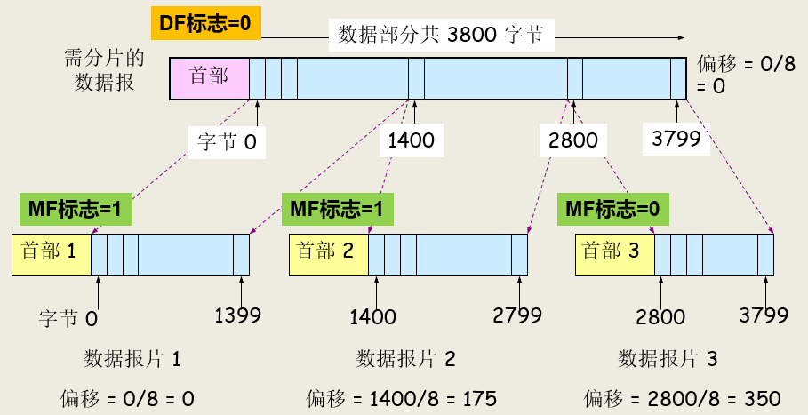

##### 重组

途中重组难度太大，路由器计算能力不够，所以都在到达目标主机后进行重组。

重组需要信息：原始数据报编号、分片偏移量、是否收集所有分片


#### IP地址

##### 网络接口

接口：连接主机/路由器与物理链路之间的模块（路由器有多个接口，每个主机通常有1-2个接口），接口之间通过链路层技术相互连接。

**IP地址按接口分配**，每个接口获得一个唯一的32位标识符。

##### IP地址

网络号（网络前缀）+主机号 

网络前缀一致的接口们称为子网，可以直接通过链路层进行传输（不需要通过网络层进行传输）。子网由接口（IP地址）组成，和设备无关。*子网掩码：网络前缀部分为1，主机号部分为0*

##### 特殊IP地址

- 全0网络地址：只在系统启动时有效，用于启动时临时通信，又叫主机地址
- 全0主机地址：用于指定网络本身，称之为网络地址或者网络号
- 全1主机地址：用于子网内广播，也称定向广播
- 255.255.255.255：用于本地广播，也称有限/受限广播，无须知道本地网络地址
- 网络127.0.0.0/8：指本地节点(一般为127.0.0.1)，用于测试网卡及TCP/IP软件。/8指网络号有8位，即127.0.0.0-127.255.255.255都被用于本地环回测试，所以浪费了约1700万个地址。

所以对于一个子网，可分配的IP地址有 2^n^-2 个（n为主机号位数，-2减去了全0与全1主机地址）

##### 地址长度

1. 无类域间路由（任意长度）：CIDR Classless Inter-Domain Routing。*表示：在IP地址后加上"/{网络前缀所占位数}"，eg. 127.0.0.0/8*

2. 分类编址（固定长度）：因为粒度太大，资源利用效率低，所以现代网络不再使用。（了解即可）

   A、B、C类地址为单播地址。`单播地址：一对一通信。除了单播之外还有广播、组播、环回。`

   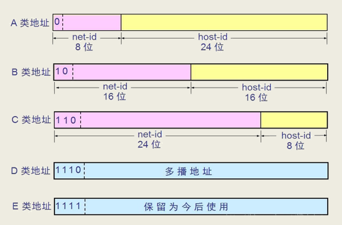

##### CIDR地址聚合

CIDR子网内的地址，可以进一步划分为多个子网，对外只暴露1个CIDR网络地址。称为地址聚合（address aggregation）或路由聚合（route aggregation）。

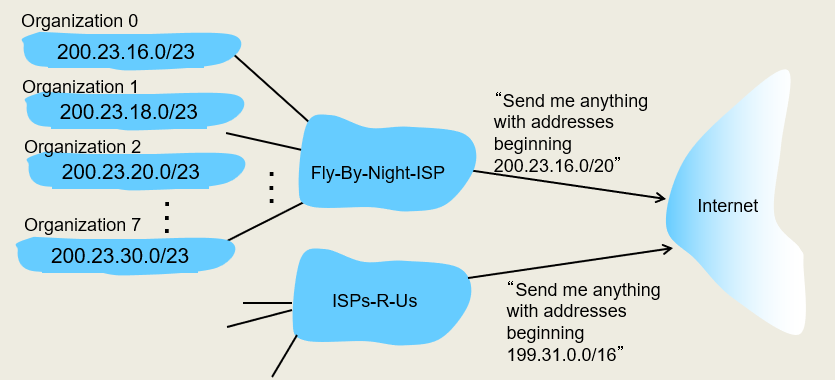

当Organization1要迁移到昌平时，就可以不用改ip地址，在昌平的子网那里加一个足够长的子网地址即可。

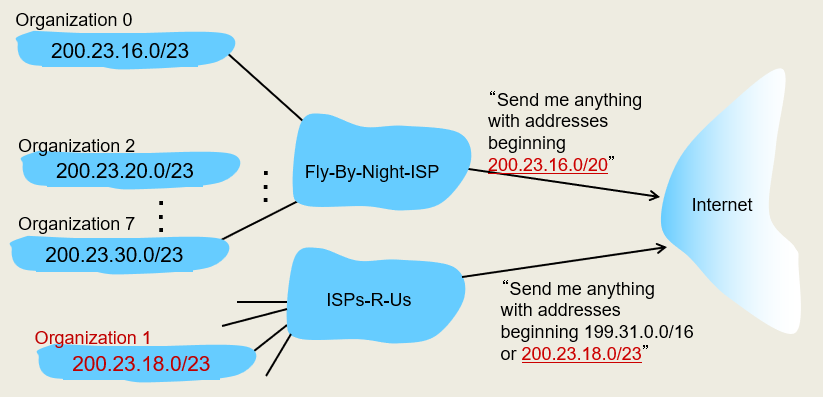

##### IP包转发

- 方法1：子网内仍然对目的IP地址进行最长前缀匹配，转发到正确主机。设备：网络层路由器
- 方法2（常用）：子网内根据目的MAC地址（通过ARP协议获得），转发到正确主机。设备：链路层交换机。成本低，管理简单，规模有限。


### ARP

每个接口除了IP地址，还有硬件地址，即MAC地址。MAC地址只支持直接连接，每一跳都需要重新封装链路层。

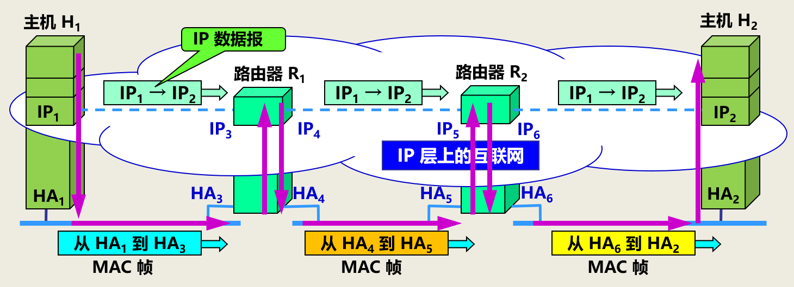

给定IP地址，如何获得MAC地址？

#### ARP 地址解析

Address Resolution Protocol

A已知B的IP地址，需要获得B的MAC地址（物理地址）

- 如果A的ARP表中缓存有B的IP地址与MAC地址的映射关系，则直接从ARP表获取
- 如果A的ARP表中未缓存有B的IP地址与MAC地址的映射关系，则A广播包含B的IP地址的ARP query分组。在局域网上的所有节点都可以接收到ARP query。
- B接收到ARP query分组后，将自己的MAC地址发送给A
- A在ARP表中缓存B的IP地址和MAC地址的映射关系（超时时删除）

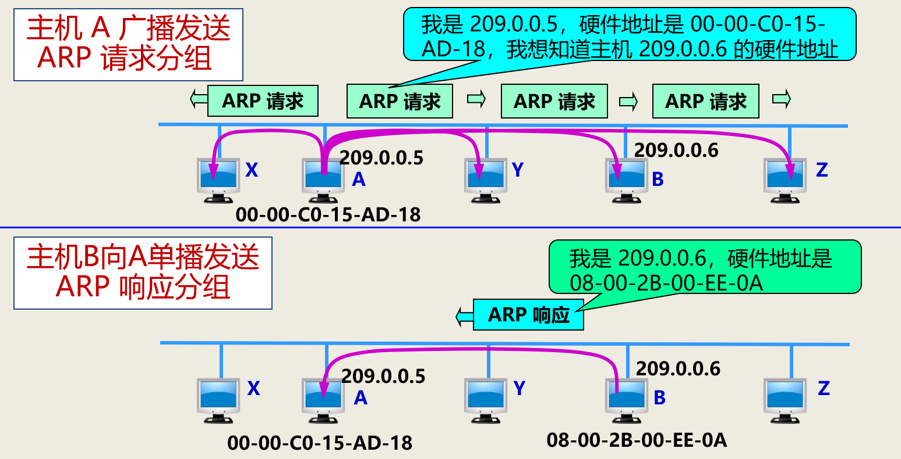


#### 跨子网传输步骤

从A到E：

1. A创建IP数据包
2. 在源主机A的路由表中找到路由器R（A的子网网关）的IP地址223.1.1.4
3. A根据R的IP地址223.1.1.4，使用ARP协议获得R的MAC地址
4. A创建数据帧（目的地址为R的MAC地址），数据帧中封装A到E的IP数据包
5. A发送数据帧，R接收数据帧
6. R查找转发表，修改目的MAC地址（也许ARP查询），转发

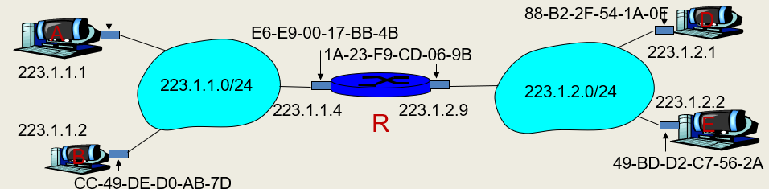


#### ARP 安全问题

**ARP Spoofing 攻击**：

- 攻击者随意地发送ARP请求或ARP响应（可以使用任意源IP地址与MAC地址）
- ARP协议是无状态的：即使受害者之前没发过ARP请求，收到一个ARP响应时，也会更新ARP表
- 受害者后续数据将被发往攻击者提供的MAC地址


### DHCP

#### 获取IPv4地址

1. 静态设定：申请固定IP地址，手工设定，如路由器、服务器

2. 动态获取：使用DHCP协议或其他动态配置协议。当主机加入IP网络，允许主机从DHCP服务器动态申请IP地址。可以有效利用IP地址，方便移动主机的地址获取，也可以申请延长IP地址的占用。

   

#### DHCP 架构

Dynamic Host Configuration Protocol

工作模式：C/S（客户端/服务器），UDP实现，服务器运行在 67 号端口，客户端运行在 68号端口。

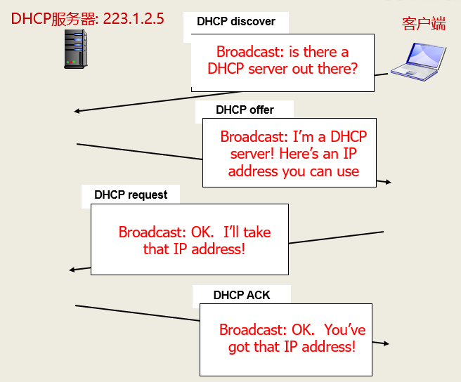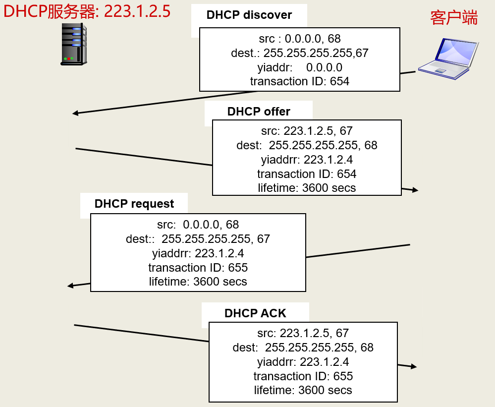

*yiaddr：your ip address*

DHCP服务不只返回客户机所需的IP地址，还包括缺省路由器IP地址、DNS服务器IP地址、网络掩码。


#### DHCP安全问题

1. DHCP耗竭攻击（DHCP Starvation Attack）：攻击者短时间内发送大量DHCP请求，将子网内可用IP地址全部占用，则后续主机无法获取新IP地址
2. 流氓DHCP（Rogue DHCP attack）：（通常在DHCP耗竭攻击之后）攻击者启动自己的DHCP服务，给网络中的其他主机提供虚假的配置，包括DNS服务器IP与网关IP


### NAT

IPv4地址不够用，所以在子网内使用内部网络，通过子网网关一个ip地址与外部交互。

NAT：network address translation 网络地址转换，将内网地址和全局地址相互转换。

#### NAT 工作机制

维护一个 (私有IP地址, port #)到(全局NAT IP地址, 新port #) 的对应表。

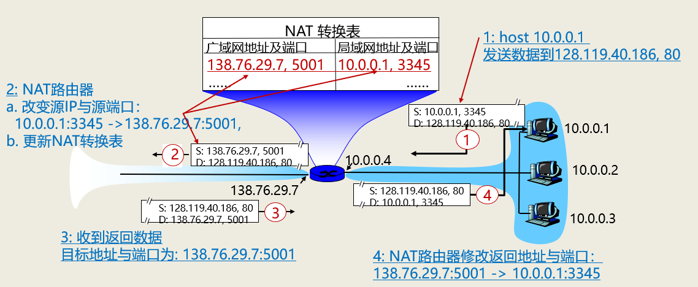

*子网网关的全局地址为138.76.29.7，NAT将内网的ip地址都转为138.76.29.7的不同端口号。传输层TCP/UDP拥有16-bit端口号字段，所以一个网关地址可支持60,000+个并行连接*


#### 缺点

1. 违反了IP的分层模型：需要知道传输层的port信息，违反传输层端到端模型。
2. 不能处理IP报头加密
3. 公用一个IP地址容易受到他人的影响。


### ICMP

负责差错报告、查询。

#### 差错报告报文

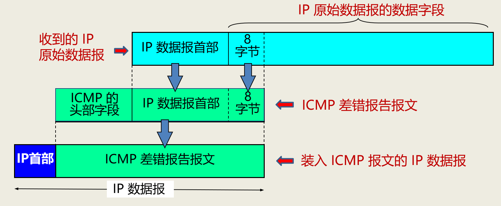

ICMP头部包括：类型、代码、检验和

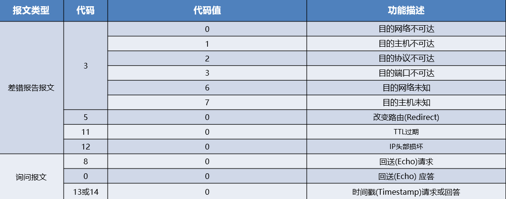


#### 查询报文

##### PING

Packet InterNet Groper，测试两个主机连通性。

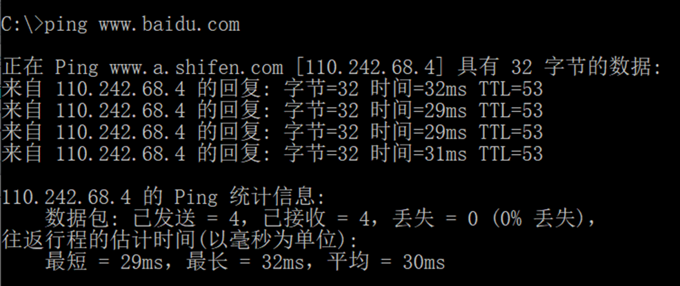

> [!NOTE]
>
> 可以利用Ping命令返回的TTL值(报文剩余跳数)来判断对方主机操作系统的类型：
>
> - Linux/Unix：TTL = 64
> - Windows：TTL = 128
> - Solaris/AIX：TTL = 254
>
> 一般跳数不会太多，所以百度的服务器大概率使用的是Linux服务器。


##### Traceroute

如何知道整个路径上路由器的地址和RTT？

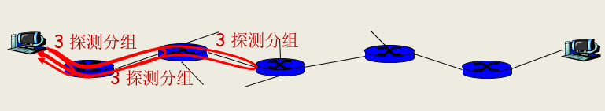

- 源向目的地发送一系列UDP包(不可能的端口号)，设置第一组探测的 TTL =1，第二组 TTL=2, ...每一组发送三次，则会在第1，2， ...个节点返回TTL过期差错报告。
- 最终达到目的地主机后，目的地返回ICMP “端口不可达”报文 (类型3, 编码3)，当源得到该ICMP，停止。

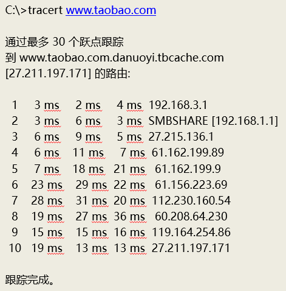

[*IPv6的ICMP](#icmp改进)


## 四、 路由技术

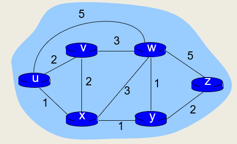


路径代价的通常取值方法：

1. 总是1

2. 带宽的倒数

3. 拥塞相关的数值（时延、队列长度…）


所有的源节点到一个指定目标节点的最优路径的集合构成一棵以目标节点为根的树，称为汇集树（sink tree）

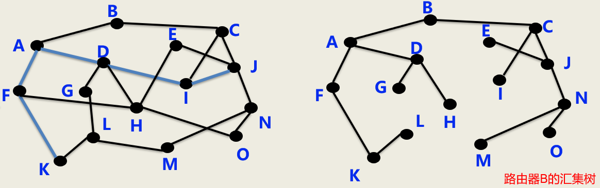

经典的最短路径算法：Dijkstra算法，Bellman-Ford算法（后面会讲）

应用经典算法时，还需要考虑现实情形：

- 简单性：每台路由器计算与存储资源有限

- 异步性：各个路由器独立、异步工作

- 鲁棒性：网络状态不断变化（从教室走到宿舍），甚至可能发生结点与链路故障

- 公平性：每条路径不会过多消耗带宽等资源

  

### 路由算法

- 全局：每个路由器都有完整的网络拓扑与链路开销等信息-->链路状态算法（基于Dijkstra算法）
- 局部： 每个路由器只知道邻居结点，以及到邻居结点的链路开销，需要结点与邻居不断交换信息，并反复迭代更新-->距离向量算法（基于Bellman-Ford算法）

#### 距离向量算法 DV

##### Bellman-Ford算法

d~x~(y) = min{ c(x,v) + d~v~(y) }

理解：x通过邻居再到y，是否更近。

现在要从单机的bellman ford到分布式bellman ford。

##### 数据的分布式

每个节点x维护信息：1. 到达每个邻居节点v的开销。2. 到达网络中其他节点y的最小代价估计值。

##### 计算的分布式

每个节点不断重复动作：

1. 接收：当节点x接收到来自邻居y的新DV估计，更新所保存的y的DV信息。
2. 发送：如果节点更新了自己的DV信息，向邻居发送之。

> 一个示例
>
> 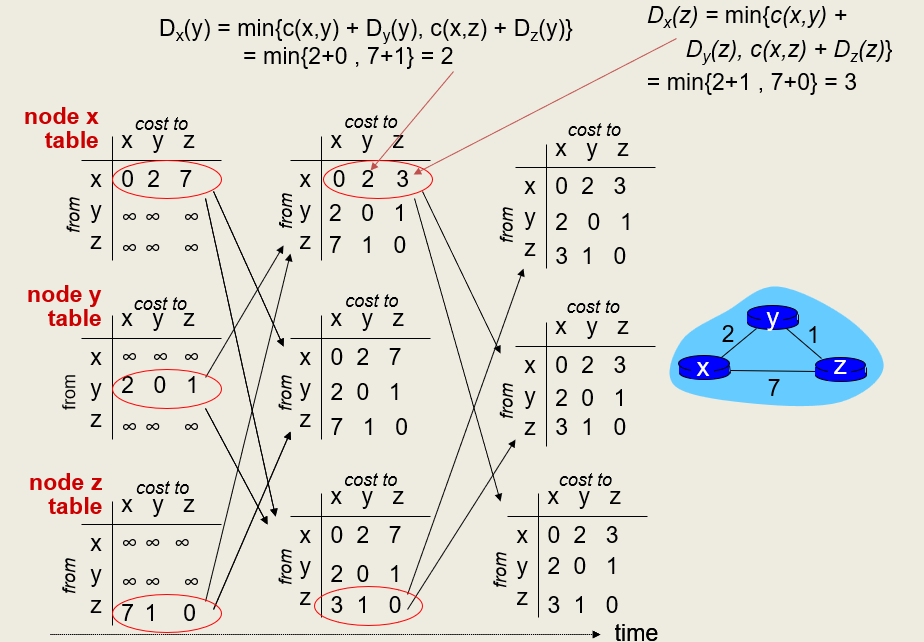

##### 动态更新

网络状态变化时，检测到代价变化的人更新自身DV，并通知邻居。

- 如果是网络状态变好，则可以马上更新完成。*好消息快速传播。*

- 如果是网络状态变坏，则需要迭代很多很多次。*坏消息传播慢。*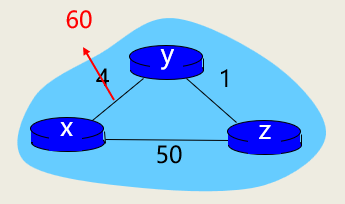

  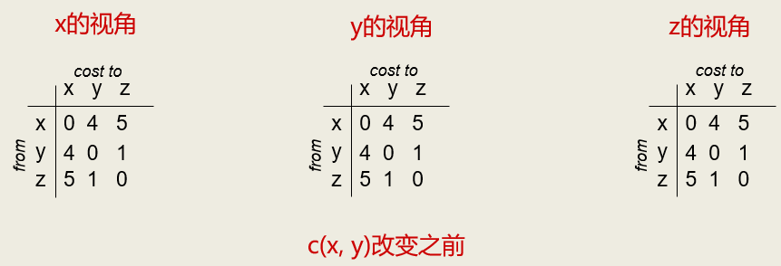

  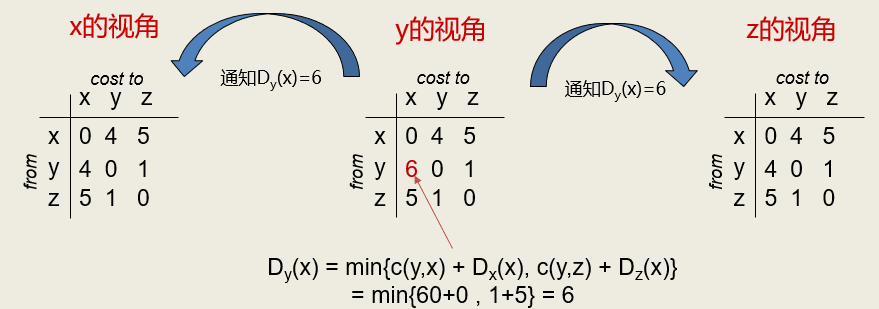

  

  *原因：使用了虚假信息（途径曾经的好路）*

  又称“无穷计数”问题。
  
  Sol. 毒性逆转。如果结点a到达c的下一跳为b，则a将通知b：“Da(c) = ∞”（在所有情况下所有节点都这么通知）
  
  可以理解为：我从你这儿走啊，你不能从我这儿走了。
  
  - 但毒性逆转也不是万能的。*期末考试喜欢出这种题！！！！*
  
    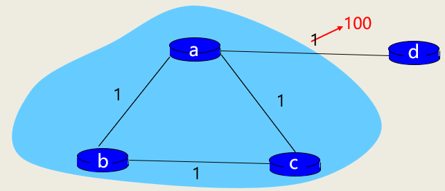 有多条路径，互相以为对方走得通。


#### 链路状态算法 LS

##### Dijkstra 算法

单源最短路。

```python
1  #Initialization:
2  N = {u} #N为已确定路径最短的点集
3  for all nodes v:
4    if v adjacent to u:
5        D(v) = c(u,v) #c(u,v)为路径cost
6    else: D(v) = ∞ 
7 
8   Loop:
9     find w not in N such that D(w) is a minimum 
10    add w to N 
11    update D(v) for all v adjacent to w and not in N : 
12       D(v) = min( D(v), D(w) + c(w,v) ) 
13     #new cost to v is either old cost to v or known 
14     #shortest path cost to w plus cost from w to v
15  until all nodes in N
```

##### 存储内容

需要存储整个网络。


#### 距离向量DV和链路状态LS比较

- 消息数量
  - LS: n个结点, E条链路, 一共发送O(nE)条消息
  - DV: 取决于收敛速度。链路代价不变时，收敛需要最多O(nE)条消息
- 收敛速度
  - LS: 消息传播完毕，每个结点O(n^2^) 或 O(nlogn)时间完成计算
  - DV: 不确定(可能无穷计数问题)
- 可靠性: 路由器或链路故障处
  - LS: 影响小，传播链路开销，每个结点独立计算
  - DV: 影响大，传播计算后的结果，取决于邻居的计算结果


### 路由协议

#### 层次路由

使用子网结构，对同一路由器的多个主机只维护一个条目（只看路由器层面传输）。

自治系统（**AS**，Autonomous System）：一个管理机构控制之下的网络

- 一个AS内部通常使用相同的路由算法/路由协议 Interior Gateway Protocols (IGP)，使用统一的路由度量（跳数、带宽、时延 …）。

  不同的AS可以使用不同的路由算法/路由协议，典型IGP协议：OSPF，RIP，IS-IS，IGRP，EIGRP……

- 每个AS有一个全球唯一的ID号：AS ID

- 自治系统内的还可以进一步划分层次

- 自治系统之间之间使用外部网关路由协议，Exterior Gateway Protocols (EGP)

  各自治系统域之间的路由需统一，典型EGP协议：BGP（只有这个实际使用）


#### AS内路由协议

对链路状态与距离向量进行协议封装。

> - RIP: Routing Information Protocol [RFC 1723]
>
>   最经典距离向量: 每30秒交换路由（距离向量）
>
>   以跳数作为距离度量，不再使用
>
> - EIGRP: Enhanced Interior Gateway Routing Protocol
>
>   基于DV
>
>   思科内部专有协议 (2013开放 [RFC 7868])
>
> - OSPF: Open Shortest Path First [RFC 2328] 链路状态
>
> - IS-IS：与OSPF本质一样，区别在于是ISO标准, 而OSPF是RFC标准

##### OSPF

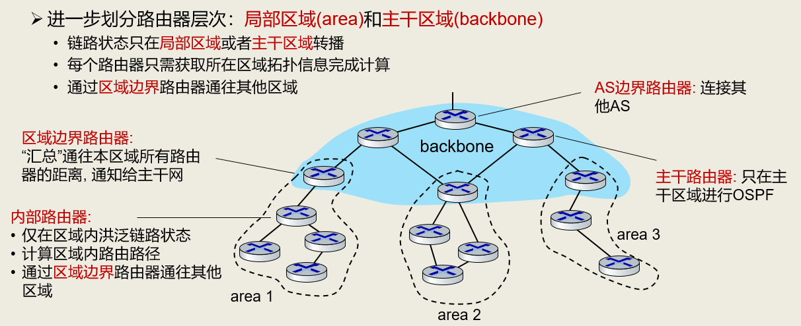

各个路由器维护一个链路状态数据库（LSDB），存储整个区域结点与链路信息

数据库里每一个条目称为LSA， Link State Advertisement

OSPF定义了5种报文用于数据库同步：

1. Hello：发现邻居
2. 数据库描述（Database Description, DD）：用于描述自己的LSDB（每一条LSA的标识）
3. 链路状态请求（LSA Request, LSR）：请求缺少的LSA
4. 链路状态更新（LSA Update, LSU）：向对端路由器发送所需要的LSA
5. 链路状态确认（Link State Acknowledgment, LSACK）：对接收到的LSU 报文进行确认

##### AS之间路由的问题

1. 规模问题：全球AS数量5万+，AS路由器百万级别，无法实现全量建图的存储、计算、维护。
2. 策略问题：各个AS认可的链路代价不一致；每个AS不仅决定将流量发往何处，还需考虑哪些流量可以发到自身（然后转发）*（不一定使用最短路，可能走最便宜的）*


#### AS间路由协议-BGP

边界网关协议BGP (Border Gateway Protocol)：目前互联网中唯一实际运行的自治域间的路由协议

- eBGP：从相邻的AS获得网络可达信息
- iBGP： 将网络可达信息传播给AS内的路由器
- 基于网络可达信息和策略决定到其他网络的“最优”路由

AS边界的路由器，通常同时运行eBGP、iBGP、IGP（内部网关协议）三类路由协议

##### BGP报文

- Open报文：用于建立BGP对等体（peer）之间的会话连接，协商BGP参数（该过程需要认证）

- Update报文：通告/撤销路径

- Keepalive报文：用于保持BGP会话连接

- Notification报文：用于差错报告和关闭BGP连接

##### 路径通告

BGP路由器之间建立TCP连接，交换BGP报文

路径通告：AS3的路由器3a可以选择向AS2的路由器2c通告路径“AS3, X” ，意味着“AS3向AS2承诺会转发通往X的数据包”

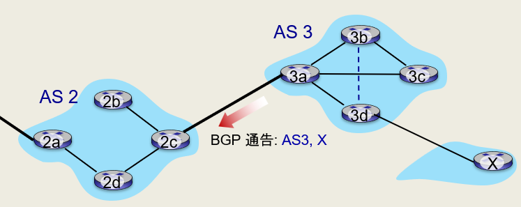

BGP路径：路径前缀（目的网络）+属性

- 两个重要属性
  - AS路径（AS-PATH）：想要到达某个目的网络，需要经过的所有AS号，如：AS 67, AS 17 
  - 下一跳（NEXT-HOP）：想要使用这条路径，对应的下一跳IP地址

网关路由器接收到路由通告时，通过既定策略采纳或拒绝(accept/ decline)

> eg. 一个路径通告过程
>
> 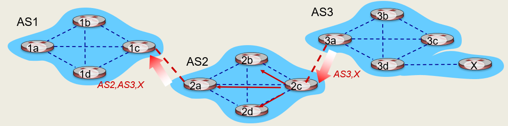
>
> AS2的路由器2c从AS3的路由器3a接收到路径“AS3, X”
>
> 根据AS2的策略，AS2的路由器2c可以选择接受路径AS3, X，通过iBGP传播给AS2的所有路由器，会记录：X可达，发到3a即可。
>
> 根据AS2的策略，AS2的路由器2a可以选择通过eBGP向AS1的路由器1c通告从AS3接收到路径“AS2, AS3, X”
>
> *AS1到AS3可能会收到多条路径，则选择一条用iBGP在AS内广播*

一个路径通告信息经过的结点数是自治系统数的量级（可以理解为每个AS有一个BGP代表作为发言人与外界交互，这样可以大幅减少路径通告的转发环节）

一个AS在BGP刚刚运行时，向相邻AS获取整个BGP路由表，后续只在发生变化时更新有变化的部分。


##### BGP路由策略

如何选择要不要接受这条路径呢？

1. AS间策略

   eg. 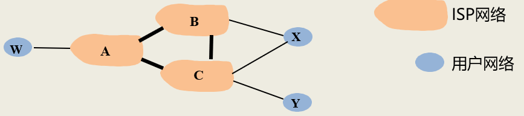

   - X连接到两个供应商网络。X为用户网络，X不希望从B到C的数据包经过X，所以X不向B通告到C的路由。

   - A向B通告路径AW，B向X通告到目的W的路径为BAW

     B是否向C通告路径BAW?

     由于W和C都不是B的用户，所以B要迫使C通过A路由到W，所以不会通告。B只路由来自于或到达其用户的数据包。

2. AS内策略

   常用：热土豆策略 (Hot Potato)：选择最近的BGP出口，即最小化报文在本AS停留时间。*应该翻译成烫手山芋策略！*

> [!NOTE]
>
> 一则有趣史实：21年Facebook宕机事件
>
> 在例行维护期间，他们运行一条命令来测试全球骨干网（连接各个数据中心）的带宽容量，但该命令意外地切断了Facebook骨干网中的所有连接，而Facebook DNS的设计目的是：在无法连接到(某个)数据中心时，撤销（到该数据中心的）BGP通告，于是大量BGP路径通告发送，撤销了路径，于是外界所有到Facebook数据中心的流量都找不到路径。
>
> 而正值疫情居家办公（有可能居住在以前素未谋面的心灵故乡），没有BGP路径了又没法远程访问，所以修复了七个小时。


#### 广播路由

eg. 服务器希望将视频广播给3个网络中的所有30个用户，有哪些办法？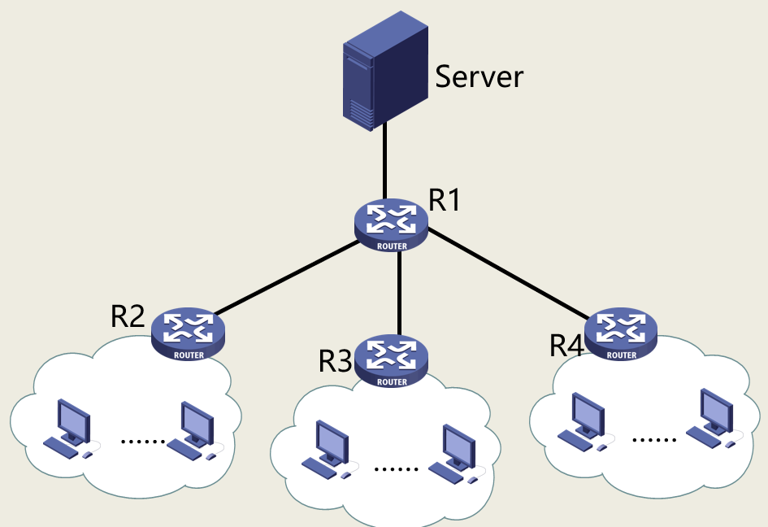

- 方法1. 给每个主机单独发送一个数据包

  问题：效率低、浪费带宽；Server需要知道每个目的地址

- 方法2. 多目标路由（multi-destination routing）

  发送1份给R1，R1复制三份转发给R234，R234再复制转发...

  问题：Server依然需要知道所有的目的地址

- 方法3. 泛洪 (flooding)，是实际使用的方法：将每个进入数据包发送到除了进入线路外的每条出去线路。

  - 问题：环路可能导致广播风暴 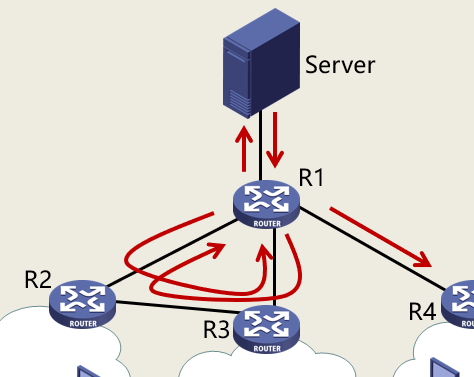

    即使用TTL来限制，也会出现成倍爆炸。

  - sol. 受控制的泛洪

    - 序号控制泛洪（sequence-number-controlled flooding）

      1. 广播数据包X从接口1到达路由器R

      2. R查看数据包来源S和广播序号n，比对R的序号表

      3. 序号表中有该数据包的记录吗？

         是，那么曾经已经收到并转发过，丢弃！

         否，在序号表中记录，并在其他接口转发。

      问题：因为广播报文多，所以内存消耗大。

    - 逆向路径转发（reverse path forwarding, RPF）

      假设R的路由表中表示了到达各网络的最优路径

      1. 广播数据包X从接口1到达路由器R

      2. R查看数据包来源S，比对R的路由表

      3. X的来源是N1吗？

         是 -> X是从最佳路径来的，向其他接口转发

         否 -> X是重复包，丢弃

      问题：不能完全避免重复转发。*互联网路由是动态的。当链路故障、AS 间路由策略调整时，部分路由器的路由表会先更新，而其他路由器可能还保留旧路由。此时，同一分组可能通过不同路径（新旧路由）到达同一目标，后续路由器的 RPF 验证会因路由表不一致，误判两条路径都是 “合法逆向路径”，从而让重复分组通过。另外，为了网络可靠性，很多场景会设计冗余链路或等价路由，则无法区分是否是重复包。还有其他很多情况...*

  - 方法4. 生成树：按生成树的路径转发。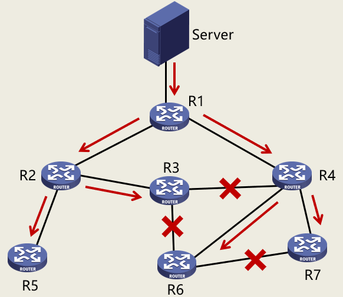（具体看下面）

    

#### 组播路由

应用场景：音频/视频会议，共享电子白板，直播，股票行情，游戏，...

eg. 服务器希望将体育直播视频发送给某些网络中的个别用户，怎么办？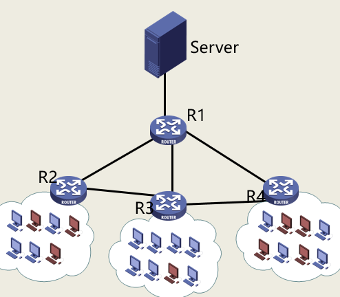

组播路由算法：为每个组建立转发树（到达该组所有成员的路径树），每个组成员应当只收到组播分组的一个拷贝，非本组成员不应收到组播分组。从源节点到每一个组成员节点的路径应当是最佳的（最短路径）。

- 步骤1. 确定要发给谁。

  IGMP (Internet Group Management Protocol）：每个组播组有一个公开的**组播IP地址**，主机可以向路由器报告想要加入或者退出组播组，路由器可以发送查询该子网的组播组成员的报文。

- 步骤2. 生成树

  组播源（如某服务器）将流量以组播 IP 为目的地址发送到网络中，路由器自己取用，构建生成树向有成员的子网转发流量。

  - 源点树：为每个组播源分别计算生成树

    问题：路由器需生成多颗棵树，工作量和存储需求巨大

  - 核心树：多个组播源共享组成共享树

    选择一部分结点作为核心，所有流量先汇聚到核心，再进行分发。其他一些链路就不用了。

    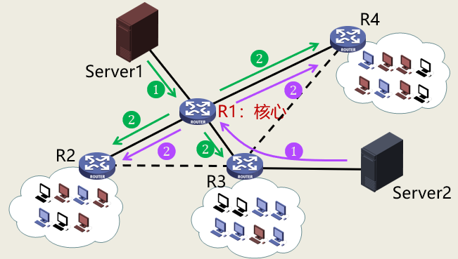

    问题：无法达到最优（如果只有一个组播源，将发送者作为核心是最优的）

> 有些网络不支持多播，则使用隧道。
>
> 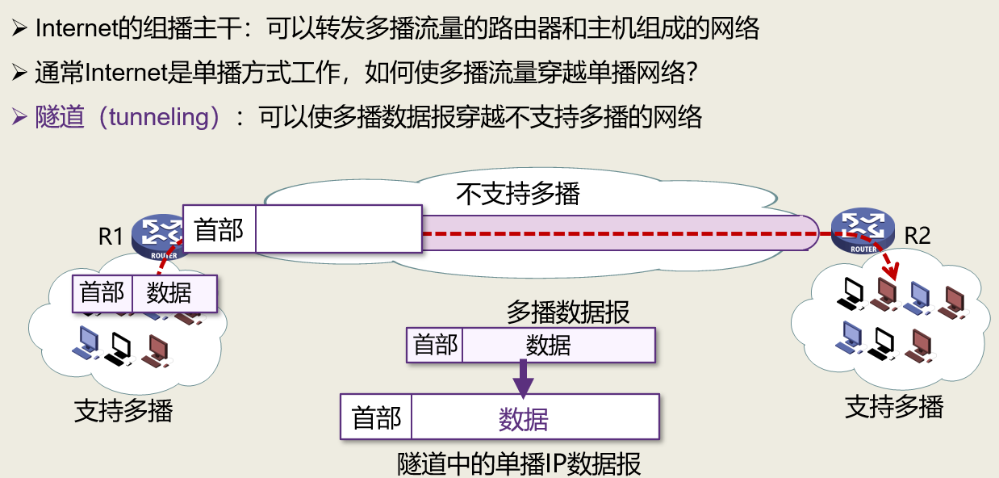


#### 选播路由

将数据包传送给最近的一个组成员（在有多个服务器的情况下，用户希望快速获得正确信息，而不在乎从哪个服务器获得）

典型应用：DNS

在没有指定DNS服务器的情况下，用户将始终连接到“最接近”(从路由协议角度来看) 的服务器

优点：减少延迟，并提供一定程度的负载平衡


## 五、软件定义网络SDN

#### 传统网络控制平面的问题

##### 无法编程

传统网络设备（如路由器、交换机）的设计是 “数据平面硬件 + 操作系统 + 网络应用” 三者紧密绑定，形成一个封闭的 “黑盒”，别人的设备无法对接。

因为硬件功能固定、软件架构封闭，所以传统网络是 “不可编程” 的：比如你想让数据平面实现一种新的转发策略（如基于数据包内容的分流），但硬件不支持、软件接口也不开放，根本没法改。最终结果就是网络只能按固定逻辑转发，没法根据业务需求灵活调整，这在云计算、大规模数据中心等场景下尤为受限。

##### 路由计算问题

路由器以接力棒的形式不断向邻居结点传播消息：效率低

- 距离向量（DV）算法：收敛时间长，甚至可能遇到无穷计数问题
- 链路状态（LS）算法：链路信息传播时间长

现代网络设备数量不断增加，划分自治系统（AS）与区域无法从根本上解决问题。

##### 流量工程问题

1. 不能所有人都用最短路，通常需要线性规划、网络流算法。
2. 只有一个路由表的话，同一起点同一终点的流量无法分流。
3. 服务器w无法区别对待红色与绿色两组流量 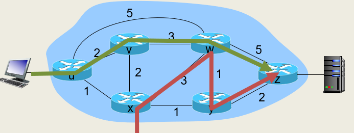


#### SDN简介

不是一种具体的技术，更像一种思想或理念。

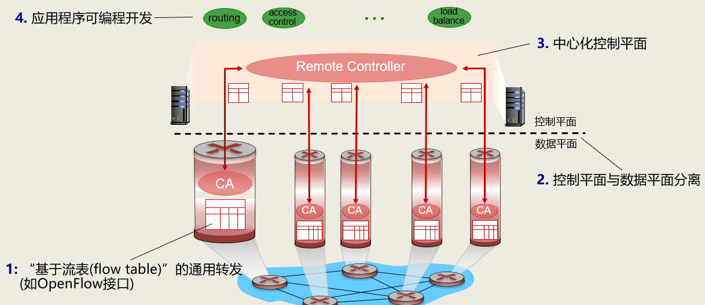

SDN的优势：方便编程、全局网络视角

> - 数据平面：OpenFlow、P4、OpenVSwitch
>- 控制平面：OpenDayLight、OpenStack、网络功能虚拟化
> 
> - 狭义SDN：Openflow
>- 广义SDN：所有控制与转发分离、可以对数据平面进行编程的网络技术
> 
>挑战：
> 
> - 高校、标准组织ONF的市场影响力和工程背景都太弱
>
> - 牵涉到太多利益关系传统厂商不买账
>
>   > 华为：蓝军负责研究这些对公司不利的技术，红军负责消灭它们！参加SDN会议，其实想方设法抵制、塞私货、搞破坏！


### SDN数据平面

每个路由器维护一张流表（flow table），流表由控制器计算后写入每个路由器。每个流表项通常包含3个部分：头部（用于匹配报文）、计数器（表项统计信息）、动作（匹配成功后执行的操作）

*Flow：由报文头部若干字段定义，字段值相同的报文会经过一样的处理过程，所以称为组成一条flow。*


#### OpenFlow协议

最早的SDN技术。

OpenFlow的流表项由4部分组成：

- 模式：报文头中的匹配值

- 动作：对于成功匹配的报文所进行的操作，包括：（可以执行多个动作）

  1. Forward packet to port(s)

  2. Encapsulate and forward to SDN controller：

     *①未知流量的处理：当网络中出现新的、未被流表定义的流量时，交换机将其转发给控制器，由控制器进行集中式的决策（如计算转发路径、生成新的流表项），再将决策下发给交换机。*

     *②特殊策略的触发：例如需要对特定流量进行深度检测、认证、计费等复杂逻辑时，控制器作为 “大脑” 接收报文后执行这些策略，再指导交换机后续处理。*

  3. Drop packet

  4. Send to processing pipeline

  5. Modify Fields 修改字段 *按照流表中定义的规则修改其数据包的头部字段（如 MAC 地址、IP 地址、端口号、VLAN 标签、TTL 值等）*

- 优先级：当一个报文有多个匹配成功项时，定义优先顺序

- 计数器：报文数、字节数 *负责网络监控与流量分析、计费与运营管理等*

>[!NOTE] 
>
>动作示例：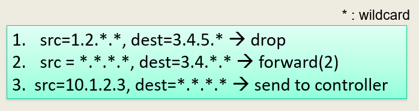
>
>​		*表示这个字段随意。
>
>这样即可实现很多功能，比如：
>
>- 网络层路由器：匹配最长目的IP地址前缀，转发到输出端口
>- 链路层交换机：匹配:目的MAC地址，转发到输出端口或者复制到所有端口
>- 防火墙：匹配特点IP地址或端口取值，允许通过或丢弃
>- NAT（局部地址全局地址转换）：匹配IP地址与端口，修改IP地址与端口，并转发。
>
>运用示例：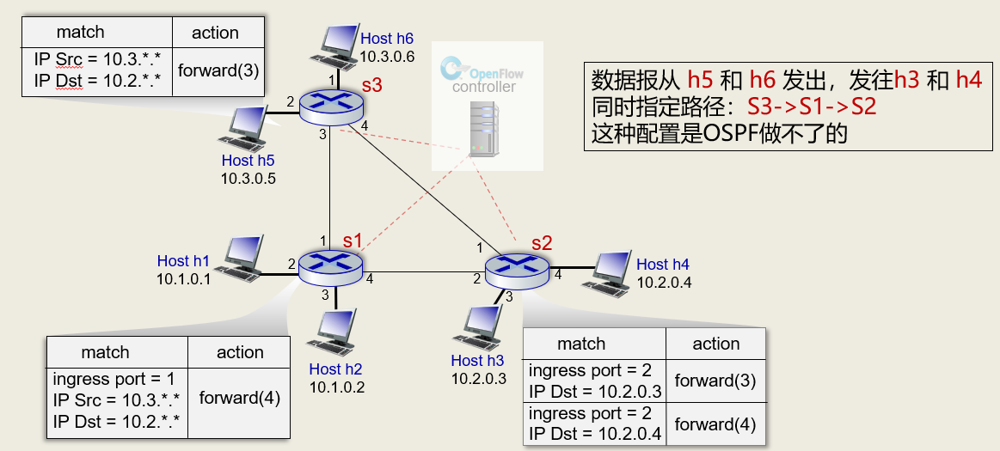
>
>这样即可指定路径。


##### OpenVSwitch

基于OpenFlow的visual switch（虚拟交换机），即没有物理实体的实现交换机功能的软件，通常应用在云计算/虚拟化场景。


#### P4网络编程

比如当某个IP地址在一段时间内发送过多流量，想进行限流限速，openflow就没法进行“限速”功能，只能全部通过或全部丢弃。

P4：Programming Protocol-Independent Packet Processors，也是action-based，但支持自定义parser和deparser、自定义pipeline计算。

- parser：开发者可以自定义需要识别的字段，无论是标准协议字段（如以太网、IP）还是完全自定义的私有字段（如物联网设备 ID、工业协议指令码），都可以通过programmable parser实现。
- 计算pipeline：支持常见运算、内存访问，但受限于硬件（*数据平面需要在微秒级延迟内处理数据包，这要求流水线的每个步骤都必须 “可预测” 且 “执行时间固定”*），每个流水线步有计算和访存上限，不支持循环，分支也只能两路。是不完备的图灵机。`正在进步中，hq老师组新论文实现了完备图灵机👍`
- Deparser：自定义数据包的封装格式，决定最终发送到网络的数据包结构。

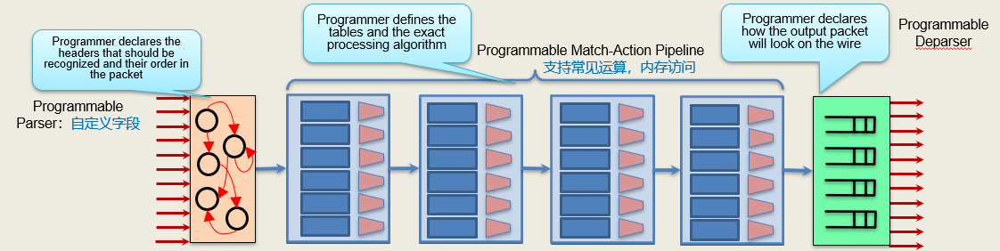


### SDN控制平面

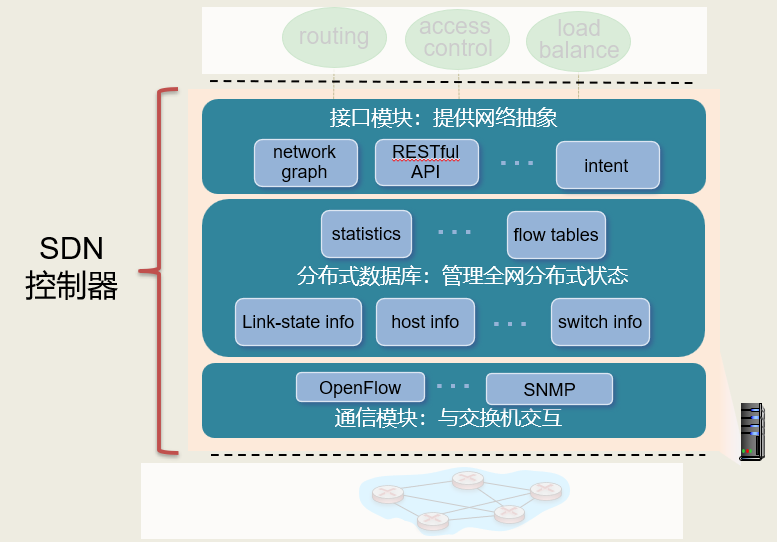

#### OpenFlow协议

用于控制器与交换机交互，使用TCP传输消息

##### 控制器-->交换机

- 读状态: 控制器查询交换机状态或数据，交换机需回复
- 配置: 控制器设置交换机相关参数 *比如速率（如 1Gbps/10Gbps）、端口使能 / 禁用、双工模式（全双工 / 半双工）、OpenFlow 版本与参数、消息重传次数、数据包处理策略*
- 修改状态: 添加、删除、修改交换机流表项

- Packet-out: 控制器通过交换机某个接口，发送数据报，即流量注入（可以用来debug）

##### 交换机-->控制器

- 流删除：通知流表项已经删除

- 流表项删除由控制器触发，或者超过存活周期

- 端口状态: 上报交换机某个状态或统计信息

- Packet-in: 将报文发送给控制器（通常用于匹配失败的报文：“我处理不了啦 给你”）

##### eg. 处理链路故障

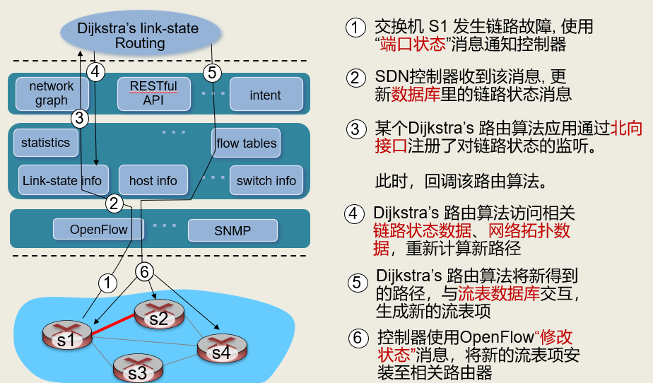

比较距离向量算法，可以发现效率高了很多。


#### 控制器实例

> [!NOTE]
>
> - OpenDaylight(ODL) 控制器：服务抽象层（SAL）作为核心中间层，负责内部组件、外部应用之间的互联，屏蔽底层协议差异，提供统一的服务接口。
>
>   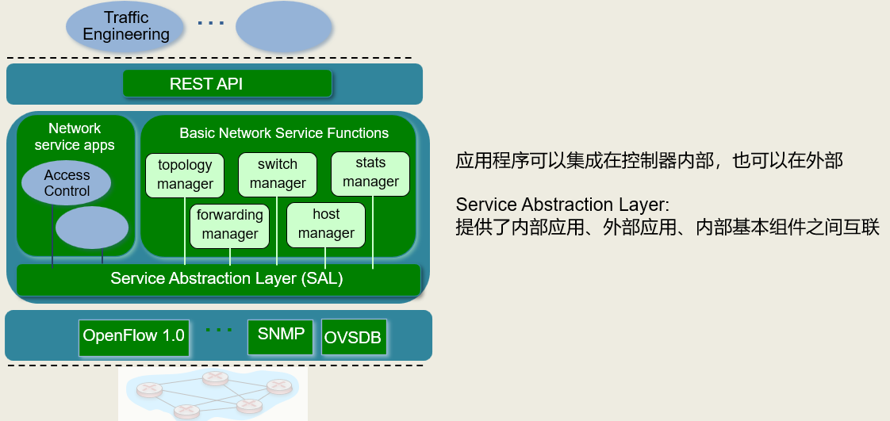
>
> - ONOS控制器：主要贡献是封装了intent
>
>   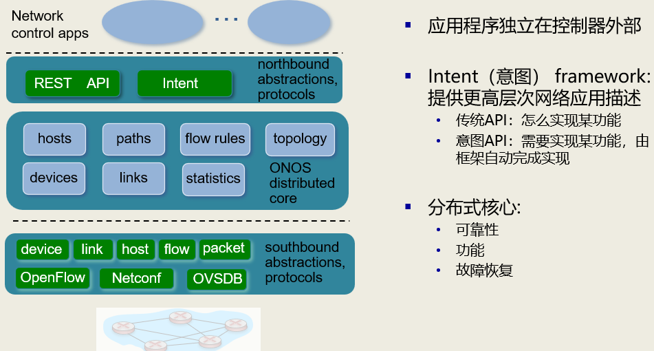


## 六、增强

### IPv6协议

- 初始动机：IPv4地址不够
- 后续动机：简化头部，加快处理与转发；提升服务质量。

#### IPv6 地址

长度为128bit（约为3*10^38^个），使用冒分十六进制

> 简化方法：可把连续的值为0的x表示为“::”, 且“::”只能出现1次
>
> eg. 简化前地址，2001:0DA8:0000:0000:200C:0000:0000:00A5
>
> ​    简化后地址，2001:DA8:0000:0000:200C::A5

> [!NOTE]
>
> 地址分类：
>
> - 未指定地址（::/128），不能分配给任何节点
>
> - 回环地址（::1/128），表示节点自己，不分配，类似IPv4中的127.0.0.1
>
> - 组播地址（FF00::/8）
>
> - 链路本地地址（FE80::/10），也称为Link-local地址，仅在本地链路上使用，网络设备根据接口MAC地址自动生成
>
> - 全局单播地址，其它地址，...

申请IPv6地址：通过DHCPv6协议（微改，原理类似）


#### IPv6 报文

固定头部长度40字节；不允许传输途中分片（在源点一次性分片，简化路由器处理、减少被攻击风险）

##### 报头

> 版本：4bit，协议版本号，值为6
>
> 流量类型：8bit，区分数据包的服务类别或优先级
>
> 流标签：20bit，标识同一个数据流
>
> 有效载荷长度：16bit ，IPv6报头之后载荷的字节数（含扩展头），最大值64K
>
> 下一个首部：8bit ，IPv6报头后的协议类型，可能是TCP/UDP/ICMP等，也可能是扩展头
>
> 跳数限制：8bit ，类似IPv4的TTL，每次转发跳数减1，值为0时包将会被丢

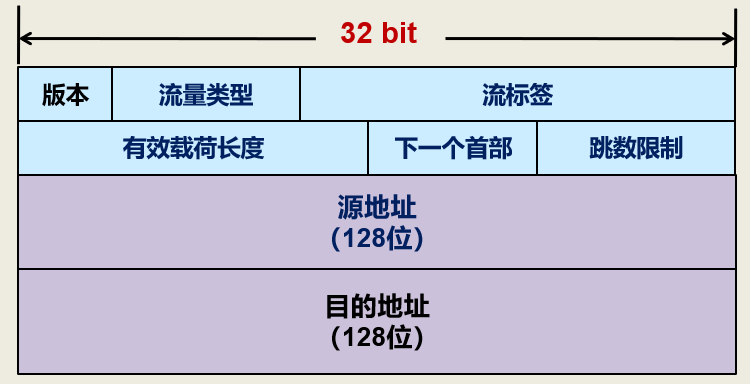

与IPv4头部的比较:

- 去除“首部长度”（首部长度固定为40字节）
- 去除“首部校验和”，提升转发速度（每个TTL都要重新计算太浪费资源，且上下层都有误差检测）
- 去除分片字段：“标识”“标志”“片偏移”，移至扩展头

##### 扩展头

通过next header实现链式结构，不一定都有，有顺序要求。

1. 逐跳选项头：转发路径上每个节点都需阅读该扩展头的信息
2. 路由头：指明转发路径
3. 分段头：包含类似IPv4分片处理信息，片偏移、“更多段”标志、标识符
4. 目的地选项头：目的端系统需要阅读的信息
5. ...


#### ICMP改进

[回忆IPv4的ICMP](#ICMP)

IPv6提供新版本ICMP协议，提供新功能

- 消息类型1：邻居请求(Neighbor Solicitation，NS）类似于IPv4中的ARP请求报文，获取邻居的链路层地址，验证邻居可达，重复地址检测 [回忆IPv4的ARP](#ARP)
- 消息类型2 ：邻居通告(Neighbor Advertisement，NA) 类似于IPv4中的ARP应答报文，对NS消息进行响应
- 消息类型3 ：路由器请求(Router Solicitation，RS) 请求地址前缀和其他信息，用于节点的自动配置
- 消息类型4 ：路由器通告(Router Advertisement，RA) 返回地址前缀（IPv6地址自动配置）和其他配置信息
- 消息类型5 ：重定向(Redirect) 通知主机重新选择正确的下一跳地址（针对某个目的IPv6地址）


#### IPv4到IPv6迁移

IPv4协议和IPv6协议并不兼容，迁移可能经历很长时间

##### 隧道技术

在外面包一层IPv4协议

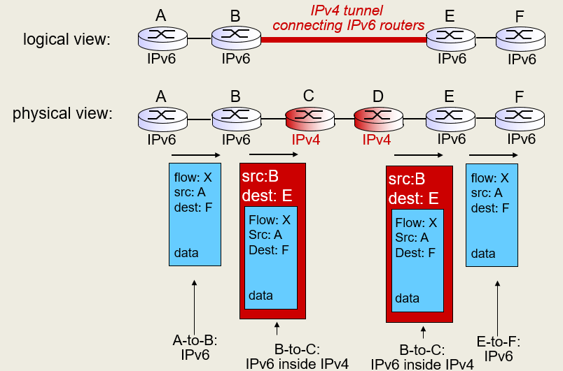

- 问题：报文长度增大了，可能导致需要分片，途中分片与重组对传输性能影响较大。

  Sol：提前分片（需要Path MTU发现这件事）

##### 翻译技术

翻译。对应各字段。

- 传输层需重新计算校验和
- 负责翻译的路由器要存IPv4和IPv6地址的映射
- 所以在现实中较难实施


### 面向连接的增强

#### 虚电路

类比电路交换：通信之间先建立物理连接，可以预留网络资源。

网络层都是一跳一跳，但虚电路试图建立通道的概念。

##### 转发方式

分组标签，按照标签决定往哪里转发。

1. 建立连接：发送探测报文，标签先空着，看下个路由器喜欢什么标签，之后就改写为那个标签。

   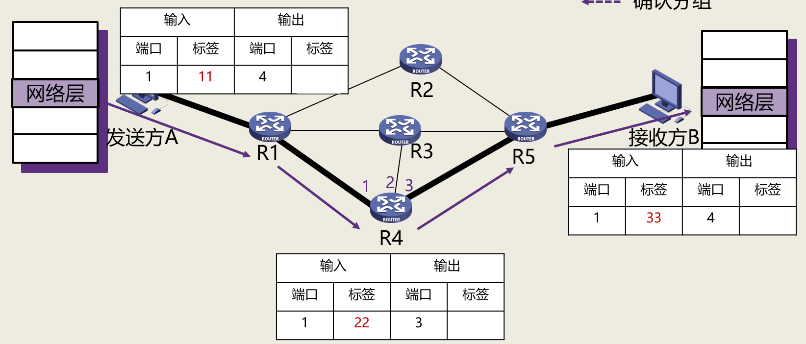

2. 发送数据：每个路由器按照标签决定往哪里转发，转发时修改标签为下个路由器喜欢的标签。每个分组都按照建立好的路由发送，而不像之前独立选择路由。

3. 释放连接：A到B发送一个拆除分组的信号，B到A回复确认。

##### 优劣

- 优点：方便进行拥塞控制；按序到达
- 缺点：不适应突发流量；如果一个路由器突然失效就死了。

所以现在用的不多，只有企业内部


#### MPLS

MultiProtocol Label Switching 多协议标签转换，是虚电路的实际运用。

处在链路层和网络层间，所以被称为2.5层协议。

在链路层的帧首部和IP数据报的首部之间插入一个 4 字节的 MPLS 首部，写标签和TTL

##### 组件

- 标签交换路由器LSR：支持MPLS的路由器
- MPLS域：所有相邻的支持MPLS技术的路由器构成的区域
- 标签分配协议LDP：用来在LSR之间建立会话并传播Label映射信息，类似IP路由协议

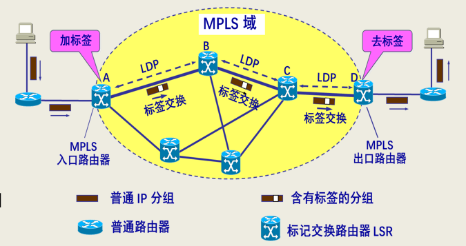

##### MPLS转发等价类

如果一组报文在网络上被以同样的方式处理，则构成一个转发等价类FEC，通常对一个FEC分配唯一的标签

FEC有多种定义方式：

- 属于某特定组的组播报文 *到达某个子网之前的传播策略都是一样的*
- 目的IP地址匹配了一个特定前缀的报文
- 有相同[QoS策略][Quality of Service，服务质量，下面会讲]的报文
- 属于同一个VPN的报文
- 报文的目的IP地址属于BGP学习到的路由，并且下一跳相同
- 等等

##### 应用

- VPN：打上不同标签就可以走不同路径

- 流量工程：打上不同标签就可以走不同路径

  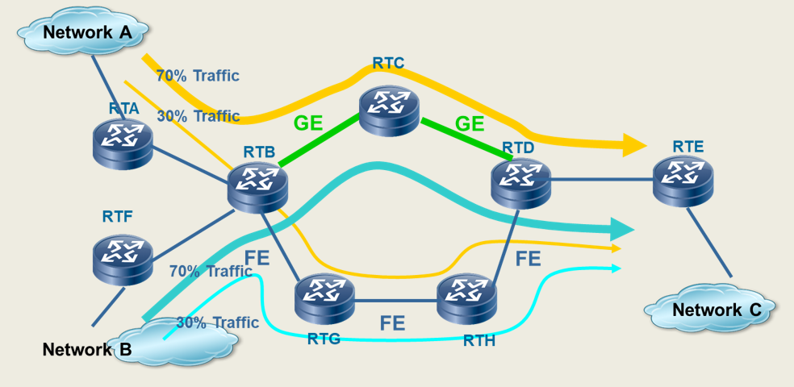


#### VPN

Private Network：希望有一个公司内部使用的私有网络。

Virtual Private Network：公司有多个分部，物理上铺设专有网络代价太大，所以物理上经过公网节点，但通过隧道技术在公共网络上模拟出一条点到点的逻辑专线，从而达到安全数据传输的目的。

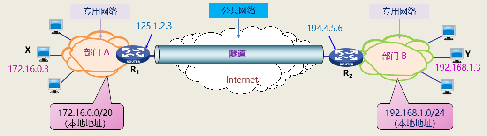

安全性保障：加密了之后防火墙就不知道里面内容是什么；Hash信息摘要保证是可信来源发送。

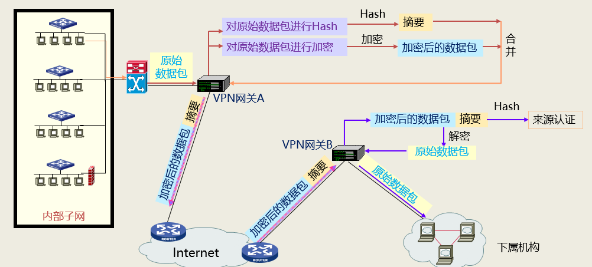


### 服务质量的增强

QoS：Quality of Service，是网络在传输数据流时要满足一系列服务请求，具体可以量化为带宽、时延、抖动、丢包率等性能指标。*所以保障时延低于多少多少就是一种服务质量增强*

#### 数据包调度

路由器输出端口决定：把缓冲区中的哪些数据包发送到输出链路上

*先来先服务FCFS（First-Come First-Serve）；公平队列算法（Fair Queueing）；加权公平队列算法（Weighted Fair Queueing）；优先级调度（Priority Scheduling）......*


#### 流量工程

根据对传输流量的预测，规划流量的传输路径。

- 通常使用线性规划、网络流算法（线性规划方法更为常用，网络流难以适应多种优化目标）
- 需要其他技术（如MPLS或者SDN）配合，进行流量区分

1. 路径选择：k-最短路，链路互不相交最短路，Oblivious Routing...
2. 流量分配：线性规划

##### 流量分配-线性规划


- 输入：网络Graph、流量需求矩阵 `从一个点到另一个点需要传输的流量`、可选路径 `由第一阶段“路径选择”得到的可选路径集合`
- 输出：路径权重 `从一个点到另一个点的流量有多少走这条路、有多少走那条路`
- 约束条件：不超过每条边的容量、为每组s&t分配的总比例≤1 `小于1指传不了那么多`
- 优化目标：
  1. 最小化最大链路利用率：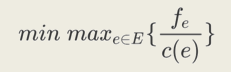 c为链路容量
  2. 最大化总吞吐：
  3. 最大化满足“源-目的”传输需求：

局限性：输入流量很难预测，依赖经验（如：历史数据）；多个目标难以兼容；线性规划计算量大，难以支持大型网络。


#### 流量整形

限制流出某一网络的某一连接的流量与突发，使这类报文以比较均匀的速度向外发送。

##### 漏桶算法

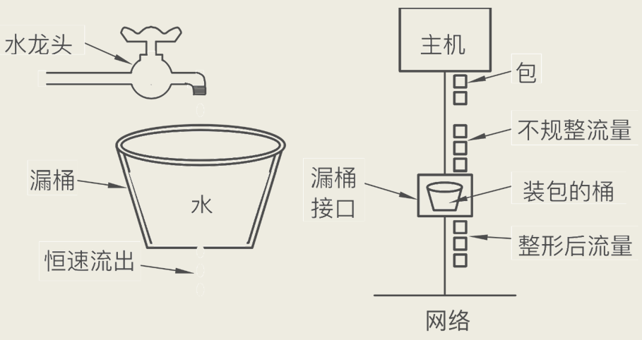

##### 令牌桶算法

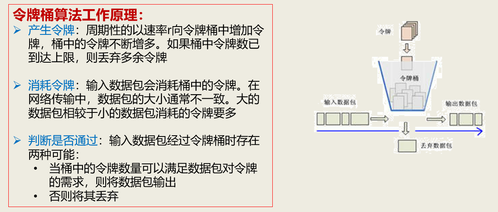


#### 综合服务

综合服务 IntServ：Integrated Services

- 面向连接：依赖 “资源预留协议（RSVP）”，在通信前要在源端、中间路由器、目的端之间建立一条 “传输流的连接”；
- 会逐节点预留资源：每个路由器都要记录这个流的状态（比如带宽、缓存），并根据 QoS 需求选择路由，确保流能获得足够资源。

实施要求：需要网络中所有路由器都支持 IntServ—— 每个路由器都得处理每个流的 RSVP 消息、维护流的状态、执行流的分类 / 调度，成本很高。所以难以实际实现。


#### 区分服务

区分服务 DiffServ：Differentiated services

- 在IP报头的8位区分服务字段（DS字段）中使用6位区分服务码点（DSCP）进行分组分类，指明分组的类型
- 路由节点在转发这种包的时候，只需根据不同的DSCP选择相应的调度和转发服务即可

即制定报文优先级（前面已讨论多次 `公地悲剧：共享资源因个体理性与集体理性的冲突，最终被过度使用、耗尽或破坏`）


### Segment Routing 与 SRv6

> Segment Routing的出现背景：
>
> 主流技术没法同时满足 “路径规划、负载分担、配置简单” 等需求
>
> - IP：优点是 “逐跳查表、配置简单”，但缺点是 “缺乏路径规划能力”（只能靠路由协议选路，没法手动指定路径）；
> - LDP：优点是 “标签转发”（转发效率高），但缺点是 “缺乏负载分担能力、配置复杂”；
> - RSVP-TE：优点是 “带宽预留、路径规划”，但缺点是 “规模部署难、分布式计算导致资源不最优”。
> - 经典SDN：
>   - 扩展性差：交换机的流表太复杂、数量太多；
>   - 可靠性差：控制器是单点故障；
>   - 性能差：网络故障时要更新海量流表，效率低。


#### 原理：源路由技术

通信的源节点在数据包里提前压入一个有序的 Segment 列表（Segment 本质是 “指令”，告诉数据包 “去哪、怎么去”），中间路由器不用查复杂的路由表，只需按 Segment 列表执行指令即可。


根据底层数据平面的不同，SR分为SR MPLS和SRv6两种。

#### SRv6

作为IPv6的一个扩展头：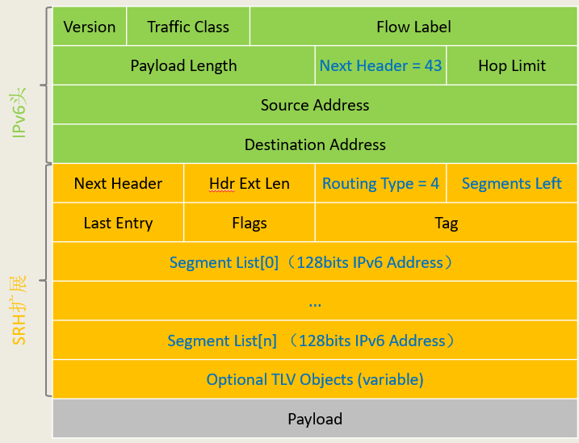

- SRH (段路由头) 的重要字段：
  - Segments Left: 剩余的路由段数，即在到达最终目的地之前仍需访问的显式列出的中间节点的数目，从而知道下一跳要执行什么指令（作为seg list的下标）
  - Segment List[n]:  表示路径列表中第n段的128位segment，从路径的最后一段开始编码。例如，Segment List [0] 包含路径的最后一段。

##### segment

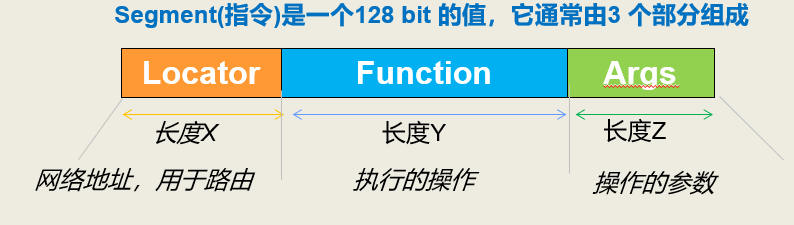


#### SDN+SR 优势

1. 扩展性提升：流表数量锐减。SR 将 “转发路径” 封装为有序的 Segment 列表，而非传统 SDN 的 “逐流匹配”。例如，从北京到上海的 1000 个业务流，传统 SDN 需要 1000 条流表；而 SDN+SR 只需在源节点压入 “北京→郑州→武汉→上海” 的 Segment 列表。SR 的中间路由器不需要维护路径状态，只需识别 Segment 对应的本地转发指令，而传统 SDN 的交换机需要存储所有流的转发规则。
2. 可靠性增强：经典 SDN 的 “单点控制器故障” 会导致网络瘫痪，而 SDN+SR 通过 “集中控制规划路径，分布式设备自主转发” 实现了可靠性冗余：①集中式控制负责 “路径规划”：SDN 控制器从全局拓扑视角计算最优路径，并将路径编码为 Segment 列表下发给源节点。②分布式设备负责 “无状态转发”：中间路由器只需按 Segment 指令转发。即使控制器故障，已下发的 Segment 路径仍能正常转发，网络不会中断。
3. 高性能：当修改策略时，控制器只需更新 “源节点” 的 Segment 列表（例如将 “北京→郑州→武汉” 改为 “北京→石家庄→武汉”），中间节点无需任何配置变更 —— 这比传统 SDN “更新所有交换机流表” 的收敛速度快 1~2 个数量级。

---


# Lecture 5. 链路层

## 一、基本概念

#### 链路层位置

数据链路层的作用是在物理相连的两个结点间进行数据传输。

- 向下：利用物理层提供的位流服务
- 向上：向网络层提供明确的 (well-defined) 服务接口

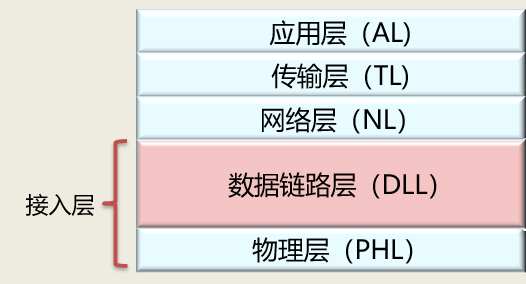

把数据包封装成帧。


#### 链路层特点

- 不同链路上采用不同协议
- 不同的链路层协议提供不同的服务（可靠/不可靠）


#### 链路层实现

- 硬件与固件：链路层主要功能在“网络适配器”（又称网络接口卡Network Interface Card，NIC）
- NIC通过数据总线(buses)接入系统，与链路层软件部分交互 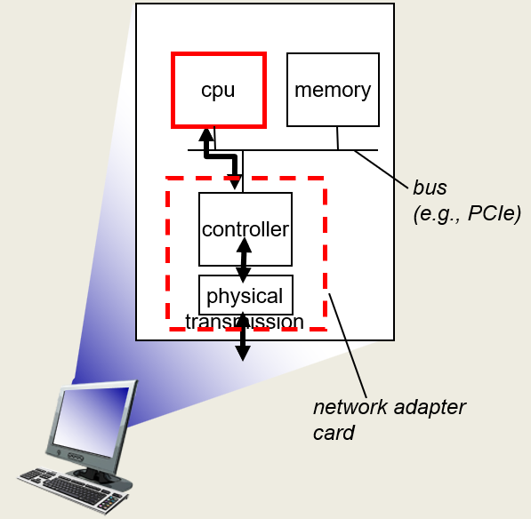
- 软件：给网络层提供接口、中断处理等


#### 链路层提供的服务

- 成帧 （Framing）：将比特流划分成“帧”的主要目的是为了检测和纠正物理层在比特传输中可能出现的错误。
- 差错控制 （Error Control）
- 流量控制 （Flow Control）：确保发送方的发送速率，不大于接收方的处理速率，避免接收缓冲区溢出

1. 无确认 无连接 服务（ Unacknowledged connectionless ）

   接收方不对收到的帧进行确认

   适用场景：误码率低的可靠信道；实时通信；

   网络实例：以太网（出错率和丢包率很低）

2. 有确认 无连接 服务（ Acknowledged connectionless ）

   每一帧都得到单独的确认

   适用场景：不可靠的信道（无线信道）

   网络实例：802.11 (wifi：电磁信号很容易被干扰)

3. 有确认 有连接 服务（ Acknowledged connection-oriented ）

   适用场景：长延迟的不可靠信道


## 二、一些通用技术

### 成帧 Framing

成帧关注的问题：如何感知帧边界？

这个问题被称为**帧同步**或**帧定界**。

##### 字节计数法

适用于无差错传输的情形。

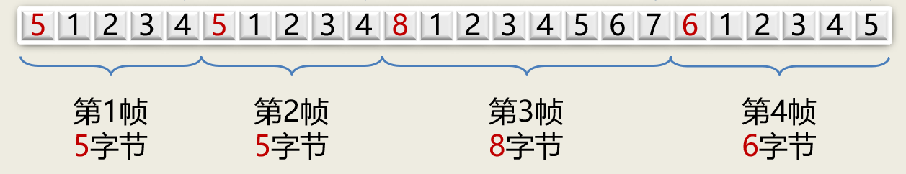

显然，如果有差错，就一连串都错了。

##### 带字节填充的定界符法

定界符（FLAG）：一个特殊的字节，比如 01111110，即 0x7E，用于区分前后两个不同的帧


- 如果载荷里有FLAG字节，则在前面加一个转义字节ESC作为标识

  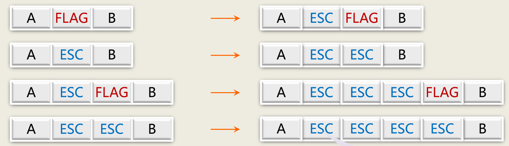

##### 带比特填充的定界符法

还是使用01111110作为定界符。考虑比特流，想要防止比特流中出现定界符的模式 以及 减少填充。

：若在有效载荷中出现连续5个1比特，则直接插入1个0比特

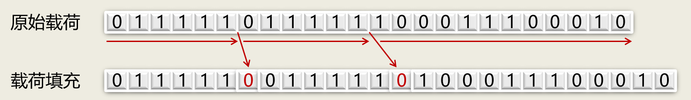


##### 物理编码违例

核心思想：选择的定界符不会在数据部分出现

 - 4B/5B编码方案

   4比特数据映射成5比特编码，剩余的一半码字（16个码字）未使用，可以用做帧定界符

   例如： 00110组合不包含在4B/5B编码中，可做帧定界符
>
> - 前导码
>
>   存在很长的 前导码（preamble），可以用作定界符。例如：传统以太网、802.11
>
> - 曼切斯特编码 / 差分曼切斯特编码
>
>   正常的信号在周期中间有跳变，持续的高电平（或低电平）为违例码，可以用作定界符
>
>   例如：802.5令牌环网


### 差错控制

蓝牙：重要的事情说三遍~~（每个比特传三份，取多数的那个结果）

但是这冗余信息太多了！希望减少冗余信息量。

两种主要策略：

- 检错码（error-detecting code）适合误码率较低、传输速度快的光纤链路（再发一遍就完了）
- 纠错码（error-correcting code）适合误码率较高的无线链路（再发一遍还是很容易错啊qaq）


#### 典型检错码

- **奇偶检验** (Parity Check)：1位校验位，可以检查出奇数个错误。

  > 偶校验：保证1的个数为偶数个 (异或每一位)
  >
  > 奇校验：保证1的个数为奇数个 (异或每一位再异或1)

- 二维奇偶校验：每行每列都有奇偶校验，可以纠单个比特错误。

  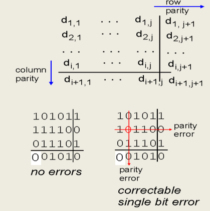

- **校验和** (Checksum)：主要用于TCP/IP体系中的网络层和传输层

  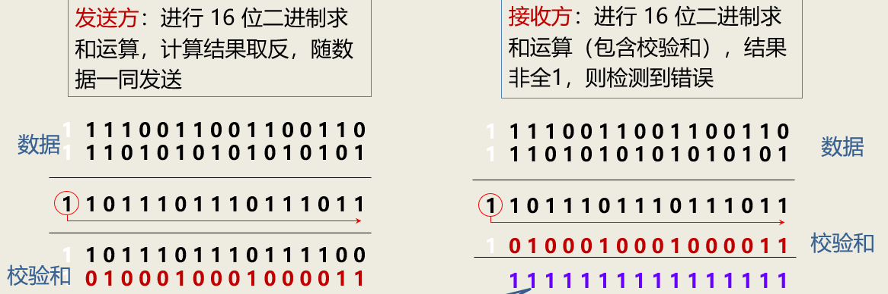

- 循环冗余校验 (Cyclic Redundancy Check，**CRC**)：数据链路层广泛使用的校验方法，需要先商定G（r+1位），称为生成多项式。加上校验码后，传输数据可以被G整除。

  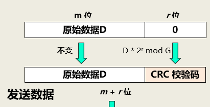

  *取余数是模2除法，即不进位不借位。

  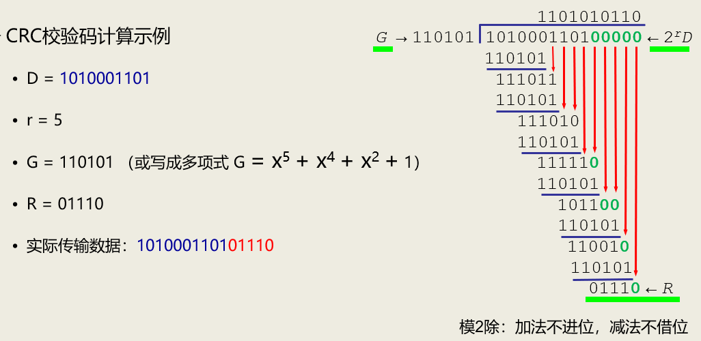

  > 四个国际标准生成多项式: 
  >
  > CRC-12 = x12+x11+x3+x2+x+1
  >
  > CRC-16 = x16+x15+x2+1
  >
  > CRC-CCITT = x16+x12+x5+1
  >
  > CRC-32 = x32+x26+x23+x22+x16+x12+x11+x10+x8+x7+x5+x4+x2+x+1 常用，能力强


#### 典型纠错码

##### 理论分析

试图用一套编码来达成纠错效果，即哪怕传输错了一些也能知道表达的是哪个字。

- 码字 (code word)：一个包含m个数据位（信息位）和r个校验位的n位单元，描述为 (n, m) 码，n=m+r

- 码率 (code rate)：码字中不含冗余部分所占的比例，可以用m/n表示

- 海明距离：两个码字之间不同对应比特的数目 *eg. 0000000000 与0000011111的海明距离为5*
  - 如果两个码字的海明距离为d，则需要d个单比特错就可以把一个码字转换成另一个码字
  - 如果可能有d个比特发送错误，则使用海明距离为 d+1 的编码就可以发现错误。
  - 如果想要纠正d个比特的错误，需要使用海明距离为 2d+1 的编码。

- 纠正单比特错误的最低要求：

  n个比特一共可以有2^n^个码字，包含有效码字与无效码字

  每个m位有效信息，除了本身的n位有效码字，与该有效码字距离为1的n个码字必须无效 *否则，当单比特错误发生时，无法判断是否出错*

  同时，任何两个有效码字，它们距离为1的无效码字没有重叠 *否则，无法判断错误的码字离哪个有效码字更近*

  因此，每个m位有效信息实际上消耗至少 n+1 个码字，即：(n+1) * 2^m^ ≤ 2^n^

  因为 n = m + r，得到 (m + r + 1) ≤ 2^r^

  在给定m的情况下，利用该式可以得出r的下界


##### 海明码

*期末要考*

以奇偶校验为基础，找到出错位置，提供1位纠错能力。

典型：(15, 11) 海明码：对于第 k 个数据位，将 k 分解为2的次幂之和，得到的每个2的次幂，都参与对第 k 位的校验。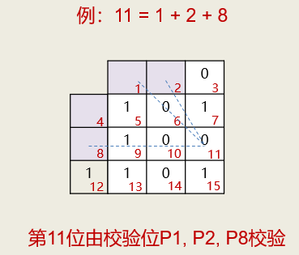 （可以通过枚举发现可以提供一位纠错能力）


##### Reed-Solomon Code

*不考计算*

以有限域运算为基础，提供多位纠错能力

RS会将需要编码的01流数据重新划分为以**符号**(Symbol)为单位的**数据块**

- 对于一个(n, k) RS编码，k为原始数据符号数，n-k为校验符号数
- 则校验符号数/2（即 (n-k)/2 ）表示能够纠正的错误数

本质：校验符号由数据符号线性运算得到。（G称为生成矩阵）（加、乘、除运算都在GF(2^m^)上进行，m为symbol的位数，本质上是一个伽罗华域 Galois Field arithmatic (又称有限域 finite field arithmetic)）

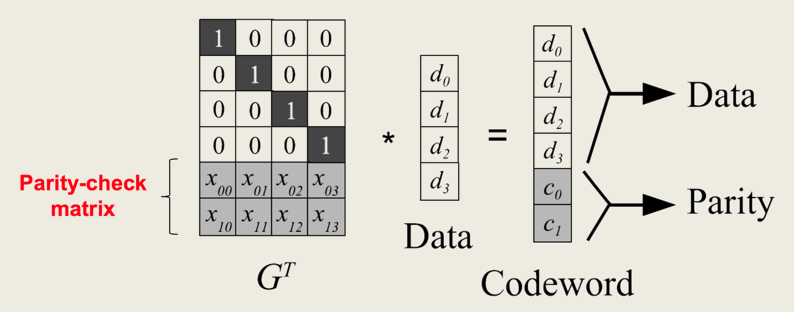

构造Parity的多种方法（了解即可）：（需要任意n-k列线性无关）

1. 使用生成多项式

   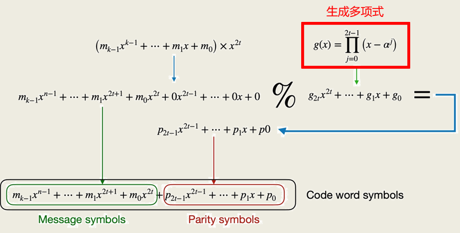

   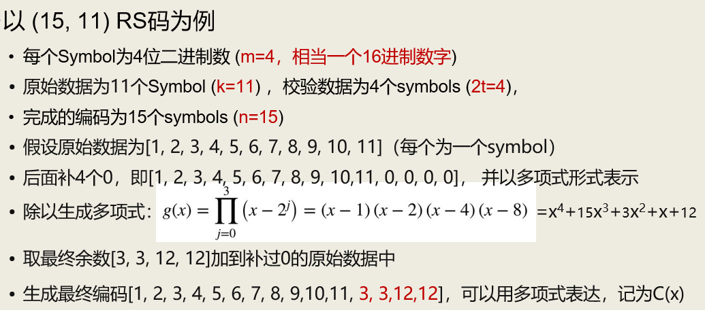

2. 使用范德蒙德矩阵 `1的次幂、2的次幂、4的次幂、...`

   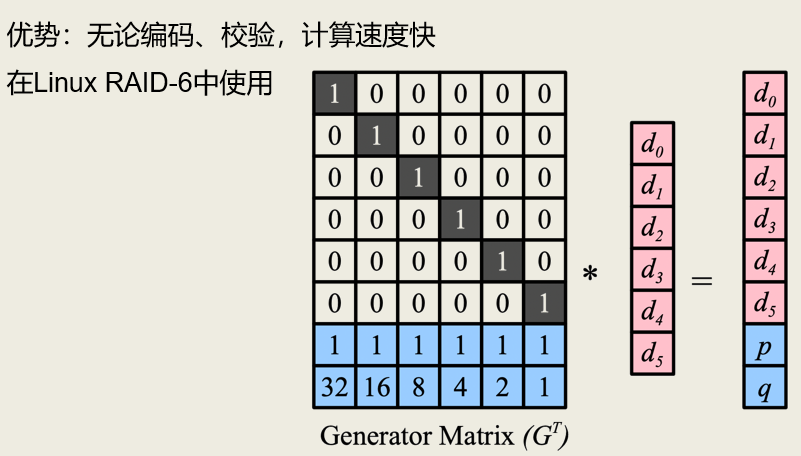

3. 使用柯西矩阵

   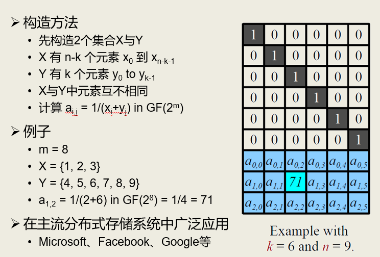


### 访问控制

##### 为什么要访问控制

当共享信道时，现在两个人都要用，谁来用？（电磁波会相互干扰）


##### 理想的多路访问控制

已知：广播信道速率 R bps

目标：

- 性能：当只有一个结点需要传输时，能够以速率R进行发送
- 公平：当M个结点需要传输时，每个结点发送速率R/M
- 去中心化：不需要结点协调传输；不需要全局时钟或者其他全局信息 `因为传递全局信息本身也要占用信道`
- 简单、易实现


方法有：信道划分（channel partitioning）、随机接入（random access）、轮流协议（taking turns）


#### 信道划分

##### 静态划分-TDMA: time division multiple access

划分出等长时间片，依次分给各个站点，未使用的时间片处于空闲

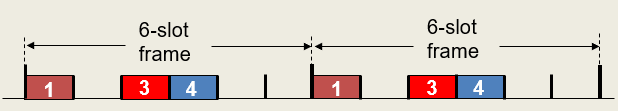

##### 静态划分-FDMA: frequency division multiple access

将信道分为多个频段，每个站点分配得到1个固定的频段，每个频段带宽相同（相当于原带宽*1/n），未使用的频段处于空闲

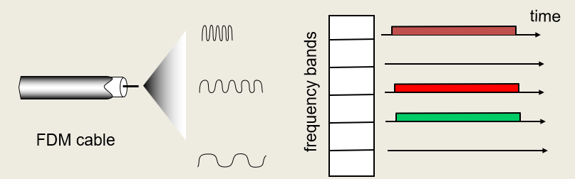

##### 静态划分效率

按照排队论，可以证明多信道排队时长 = n * 单信道排队时长

- eg. 单信道：服务率 = 100 帧/秒，输入率 = 50 帧/秒 → 差值 = 50 → 延迟 = 1/50=0.02 秒；
- 2 个子信道：每个子信道服务率 = 50 帧/秒，输入率 = 25 帧/秒 → 差值 = 25 → 延迟 = 1/25=0.04 秒（是单信道的 2 倍）。

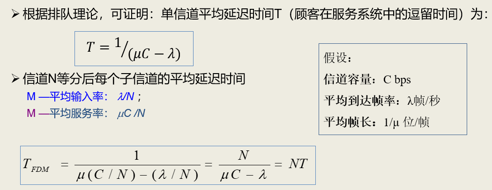

##### 动态划分-CDMA：Code Division Multiple Access

为每个站点分配一种编码，即使冲突发生，接收方也能进行解码。主要用于无线通信

（后续无线部分会讲到）


#### 随机访问-ALOHA

当任意站点有数据要发送时，以信道带宽R全速发送，不需要事先协调。产生冲突后再恢复。

##### 纯ALOHA协议

想发就发！不管了！反正TCP会重传的！ 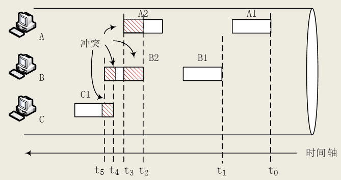

效率计算：

法I.
$$
P(某个站点传输成功概率) = P(该站点在t_0开始传输) * \\P(其他站点在 [t_0-1,t_0] 未发生传输) * P(其他站点在 [t_0, t_0+1] 未发生传输) \\
= p * (1-p)^{(N-1)} * (1-p)^{(N-1)} \\
= p * (1-p)^{2(N-1)} \\

信道传输成功概率 = Np(1-p)^{2(N-1)} \\

选取最优的 p 并使得 N \to \infty 
= 1/(2e) = 0.184
$$
法II.
$$
定义帧时：发送一个标准长的帧所需的时间 \\
一个帧时内用户产生新帧：均值N个（服从泊松分布）\\
一个帧时内信道中产生的帧（包括重传）：均值G个（服从泊松分布）\\
那么一个帧时内信道中产生k个帧的概率 Pr[k] = \frac{G^ke^{-G}}{k!} \\
特别的，一个帧时内信道中产生0帧的概率 Pr[k=0] = e^{-G} \\
那么，想要一个帧可以完整发完，由火车过山洞问题可知需要两个帧时内无其他帧\\
概率为P_0=Pr[k=0]\times Pr[k=0] = e^{-2G}\\
则有吞吐率S = GP_0 = G \times e^{-2G}\\
取G的最优值有S=0.184
$$


##### 分隙ALOHA

时间划分为等长的时间槽，每个时间槽刚好可以传输1个帧，站点只能在时间槽开始时发起传输，所有站点的时钟是同步的。如果发生冲突，以概率p在下一时间槽重传。

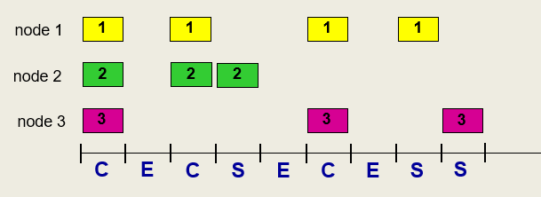

实际问题：时钟同步较为困难；并没有冲突检测。

效率计算：

法I.
$$
P(某个站点传输成功概率) = P(该站点在t0开始传输) \times P(其他站点在t0 未发生传输)= p.(1-p)^{N-1}\\
信道传输成功概率 = Np(1-p)^{N-1} \\
选取最优的 p 并使得 N \to \infty 
= 1/e = 0.368
$$
法II.
$$
P_0=Pr[k=0]= e^{-G}\\
则有吞吐率S = GP_0 = G \times e^{-G}\\
取G的最优值有S=0.368
$$
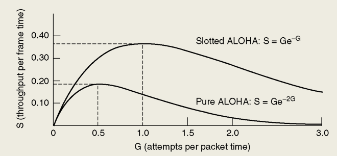


#### 随机访问-CSMA

CSMA：Carrier Sense Multiple Access 载波侦听多路访问协议

特点：“先听后发”，如果信道空闲，则发送，如果信道忙，则推迟发送。

##### 非持续式CSMA

经侦听，如果介质空闲，开始发送；如果介质忙，则等待一个随机分布的时间，然后重新侦听。

- 好处：等待一个随机时间可以减少再次碰撞冲突的可能性
- 缺点：等待时间内介质上如果没有数据传送，这段时间是浪费的

##### 1-持续式CSMA

如果介质忙，持续侦听，一旦空闲，开始发送。

- 缺点：如果两个以上的站等待发送，一旦介质空闲就一定会发生冲突

##### p-持续式CSMA

如果介质空闲，以 p 的概率立刻发送，以 (1–p) 的概率推迟一个时间单元再进行处理。

- 缺点：仍然无法避免两个站点同时传输

- 以及冲突并不一定能被立即检测到（传输有时延）

  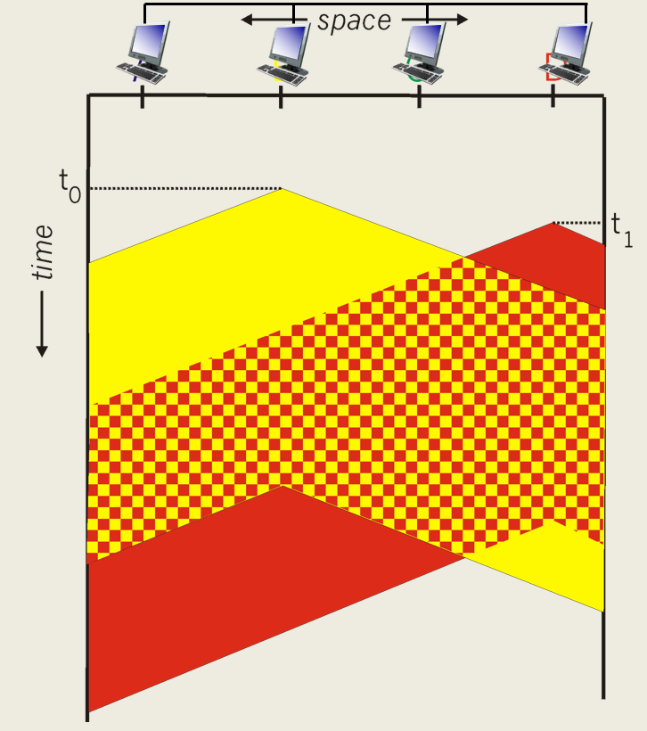

##### 冲突检测

发送时持续侦听信道，一旦传输过程中监听到冲突，立刻中止传输，减少信道浪费

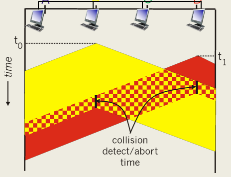

##### CSMA/CD = 1-持续式+冲突检测

CD: collision detection 冲突检测 *(c.f. CA: collision avoidance 冲突避免)*

1. 经侦听，如介质空闲，则发送
2. 如介质忙，持续侦听，一旦空闲立即发送
3. 发送过程中，进行冲突检测
4. 如果发生冲突，立即中止发送
5. *等待一个随机分布的时间*再重复步骤1

##### 中止传输

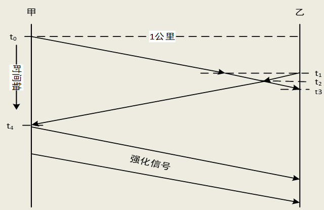

如果仅靠冲突的信号本身，可能因为信号较弱，导致远处的站点无法检测到冲突；而 Jam 信号是一段固定长度的强信号，能确保所有站点都感知到 “信道已冲突”，同时让所有站点都明确 “冲突发生的时刻”，避免部分站点误以为冲突已结束而重新发送数据，进一步加剧冲突。

CSMA/CD中：

- 发生冲突，中止之后，基于**二进制回退**决定随机等待时间：

  第n次发生碰撞，从{0,1,2, …, 2^n-1^}随机选择一个数K，等待 512*K 比特数据所需的发送时间

- 优点：冲突次数多的人（之前随机到的时间短的人）下一次会期望随机到更晚的时间，使得先前随机到的时间长的人会先尝试。


#### 随机访问分析

##### 如何边发边听

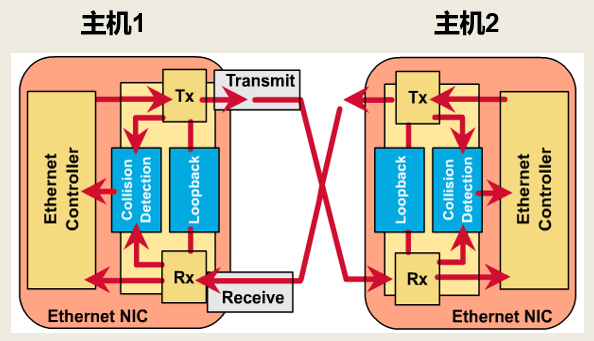

Tx：发送3份信号。1份真正对外发送，1份发往冲突检测模块，1份发往回环Loopback（模拟“收到了自己发出的信号”，不然自己收不到自己发出的信号）

Rx：收到2路信号，1路来自外部，1路来自回环。将2路信号综合后，发往冲突检测模块以及上层。

冲突检测模块比较来自Tx的信号与来自Rx信号，不同则有冲突

*在有线信道中容易实现，无线信道较难（无线信道尽量一开始就避免冲突，即CSMA/CA 后面会讲）*

##### 载波侦听时长


要确认自己的信号完整地发完了，不能一发完就停止侦听，因为可能干扰信号你还没收到。

- **冲突窗口**：从发出帧到发现冲突所需要的最长时间，意味着发出后需要侦听一个冲突窗口才能知道有没有冲突

  数值上：等于最远两站传播时间的两倍，即1个来回传播延迟RTT

##### CSMA/CD的效率

这公式到底在说啥 没懂 *没关系 不考~*
$$
efficiency=\frac{1}{1+\frac{t_{prop}}{t_{trans}}}
$$


##### 总比较

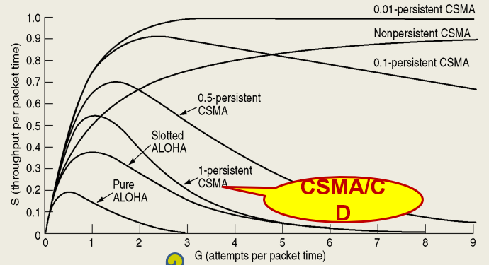

硬件实现方面，实现随机数p需要浮点数运算，较贵。所以1-持续CSMA较为常用。


#### 轮流协议

希望结合信道划分和随机访问的优势。

##### 轮询协议

在站点间选择一个主节，主节点给其他站点分配信道使用权。通常轮流通知每个站点，可以传输多少帧；传输完成后，通知下一个站点。

- 缺点：轮询本身占用带宽；通知引入延迟；单点故障

##### 令牌传递

令牌：发送权限，只有获得令牌的站点可以发送数据，令牌通过特殊的令牌消息进行传递。

一个站点获取到令牌后，就可以发送帧，然后把令牌交给下一个站点（可以组织成一个环形结构）；如果没有帧要发，直接传递令牌。

- 缺点：令牌的维护代价；令牌本身的可靠性*（传着传着就丢了）*

##### 位图协议（预留协议）

- 竞争期：在自己的时槽内发送竞争比特*（举手示意资源预留）*
- 传输期：按序发送
- 明确的使用权，避免了冲突。

利用率分析：

- 假设有N个站点，每帧d比特，k个站点需要实际发送数据

  信道利用率：kd / (kd + N) *在低负荷条件下（k << N）利用率越低，在高负荷条件下（k ≈ N）：d/(d+1)，接近100%，还是比较优秀的*

- 缺点：对时钟同步要求高，需要N个时隙发送表决比特；位图协议无法考虑优先级

##### 二进制倒计数协议

给站点编号，每次预约时就报自己号码，编号大的永远先发。

*小优化：一位一位比，比着比着发现自己小了就不用再发了*

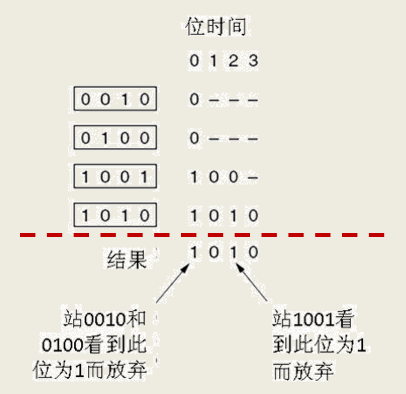


#### 有限竞争协议

利用竞争协议和无冲突协议的优势

- 在低负荷时：使用竞争法，以减少延迟时间
- 在高负荷时：使用无冲突法，以获得高的信道效率。

实现方法之一：自适应树搜索

- 在一次成功传输后的第一个竞争时隙，所有站点同时竞争
- 如果只有一个站点申请，则获得信道
- 否则在下一竞争时隙，有一半站点参与竞争（递归），下一时隙由另一半站点参与竞争。如果有冲突，再分一半一半，直到只有一个站点申请。（所有站点构成一棵完全二叉树）


#### 访问控制的应用

- 信道划分：电缆等
- 随机访问：*冲突检测：有线信道中较为容易，无线信道中较为困难*
  - 以太网：CSMA/CD
  - 802.11 WiFi：CSMA/CA

- 轮流协议：蓝牙, 光纤

> [!NOTE]
>
> 访问控制案例：电缆接入网
>
> 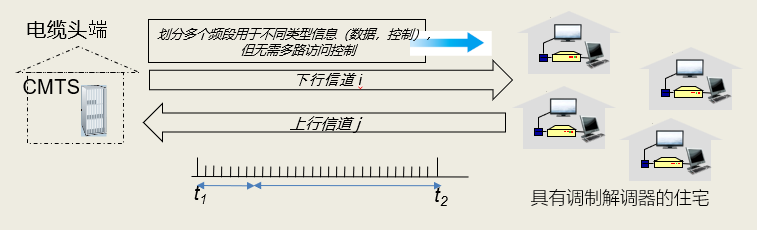
>
> 上行、下行信道先按频段进行划分（FDMA）
>
> 上行信道：每个频段按时间划分（TDMA），一些时间槽由CMTS(总网关)分配（轮流协议），一些时间槽由随机访问进行竞争（随机接入）。


## 三、有线局域网

局域网 `不需要网络层技术，就可以传输数据的网络` = 子网 `有相同网络地址的接口组成的网络`

[回顾跨子网传输步骤](#跨子网传输步骤)

- MAC地址：身份证号，出厂设定，不会改变。
- IP地址：通信地址，会改变，包含地理位置信息。

接下来讨论的问题：局域网内部，如何根据MAC地址传输数据？

### 以太网

当前最主流的有线局域网技术，也是第一个广泛使用的有线局域网技术

主要特点：简单、成本低廉、易于扩展、高速

#### 以太网帧


- preamble（前同步码）：8个字节，属于物理层

  > 前7个字节值均为10101010：用于同步发送方与接收方的时钟频率
  >
  > 以太网有多种频率：10Mbps、100Mbps、1Gbps、10Gbps，频率可能会发生偏移
  >
  > 第8个字节值为10101011，为定界符（字节填充ver.的定界符）
  >
  > 物理层交付链路层时，8字节的前同步码不需要保留，也不计入帧头长度

- 目的地址、源地址：各6字节

  当目的地址与自身地址相同，或者目的地址为一个广播地址，才将帧的data交付给网络层；否则丢弃帧。

  *特殊情况：网卡开启混杂模式，可以接收目的MAC地址不是本网络接口的帧*

- 类型：2字节，上层（网络层）的报文类型 *大部分情况下为0x0800，表示网络层为IP协议*

- CRC：校验，检查出的无效 MAC 帧就简单地丢弃，以太网不负责重传丢弃的帧。

- data：46 ~ 1500字节。*所以 最小帧长 = 46+18 = 64B；最大帧长 = 1500+18 = 1518B （MTU：1500B）*

  如果数据字段不足46字节，需要填充整数字节（Padding）至46字节，以保证以太网MAC帧不小于64字节。*让帧发送的时间够长，使站点在发送完一帧之前，必须能检测到是否发生冲突。*所以收到少于64字节的帧都视为无效帧（因为有冲突而中断传输）。

  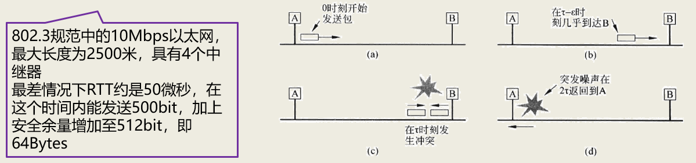


#### 以太网提供的服务

- 无连接：两个NICs之间无需建立连接即可通信
- 不可靠：接收方不发送ACK或者NACK，依赖上层协议（如TCP）进行丢失数据恢复
- 多路访问控制：CSMA/CD（回退时，基于二进制回退决定随机等待时间）


#### 经典以太网

##### 物理层

- 最高速率10Mbps
- 设备通过收发器挂接入同轴电缆
- 使用中继器连接多段同轴电缆
  - 细以太网成本低、性能差。


> 5-4-3原则
>
> 任意两个收发器之间距离不得超过2.5km
>
> 任意两个收发器之间经过的中继器不能超过4个（5段电缆）
>
> 使用最多3种不同的以太网技术（10base2、10base5和10base-FP）
>
> *不然超过早期收发器的处理能力*

##### 帧

两种格式：DIX Ethernet V2 标准，IEEE 的 802.3 标准

因为大家都已经用了DIX了，所以不想理IEEE，滚雪球滚下去大家就都用DIX了

*DIX格式就是上面讲了的“以太网帧”，IEEE就只是把“类型”字段改成了“Length”*

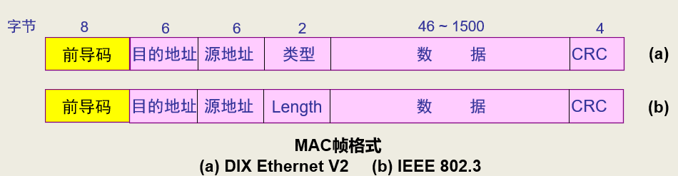

##### 多路访问控制

使用上面讲了的CSMA/CD，1-持续，冲突检测，二进制指数后退


#### 快速以太网

Fast Ethernet( IEEE 802.3u, 1995 )

- 带宽 10Mbps --> 100Mbps
- 比特时间 100ns --> 10ns `传输一个比特所需的时间`
- 自动协商（autonegotiation）：根据另一端速度与双工模式，自动选择最高速度
- 线缆类型：初步轻微使用光纤  


#### 千兆以太网

Gigabit Ethernet( IEEE 802.3ab, 1998 )

- 带宽 100Mbps --> 1000Mbps( 1Gbps )

- 在半双工方式下使用 CSMA/CD （为了向后兼容），增加载波扩充和帧突发

  全双工方式不需要使用CSMA/CD（缺省方式）*上下行隔离，不同站点也隔离（交换机解决访问控制），所以可以随便发*

- 流量控制: Pause帧，收到就暂停发送，等下个通知

- 巨型帧：9000字节 *抗干扰能力增强，所以可以发更大的帧*


#### 万兆以太网

10-Gigabit Ethernet( IEEE 802.3ae, 2002 )

- 1Gbps --> 10Gbps
- 只支持全双工，不再使用CSMA/CD
- 重点：大规模使用光纤，超高速的物理层。


#### 40G-100G以太网

40 Gigabit Ethernet (40GbE) and 100 Gigabit Ethernet (100GbE), 2010

- 10Gbps --> 40Gbps & 100Gbps

- 联网设备可以通过可插拔模块支持不同的物理层类型

- 使用多根10G线路进行并行传输

  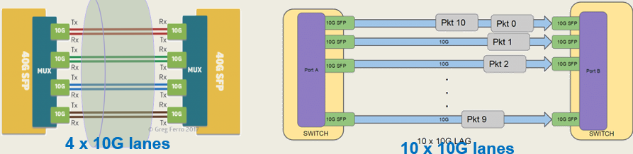

25/50G 和 第二代100G以太网

- 25G以太网标准（IEEE 802.3by）是由IEEE和IEEE-SA于2014年发布，该标准弥补了10G以太网的低带宽和40G以太网的高成本缺陷
- 25G以太网采用了25Gb/s单通道物理层技术，可基于4个25Gbps光纤通道实现100G传输


### 数据链路层交换

#### 以太网的搭建

##### 集线器

集线器会把收到的数据广播给所有其他端口，所以在这个网络的所有机器如果有一个发送数据，其他就不能发送。

这就有很大的性能问题和安全问题。

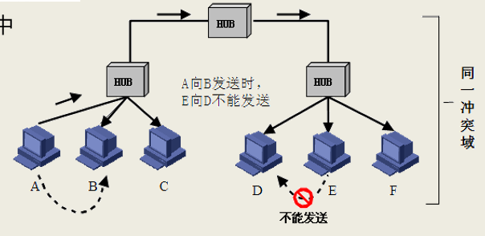

##### 交换机

可以并行传输。内部通过**高速背板**连接所有端口，所以每个端口都有独立的冲突域。不需要CSMA/CD。

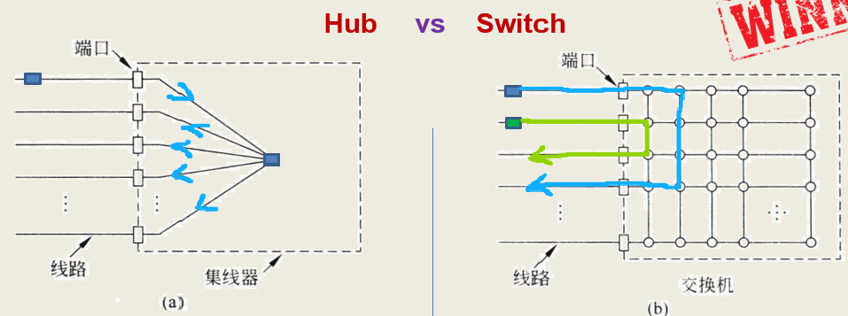


#### 数据链路层交换原理

##### 逆向学习

MAC地址表：MAC地址--->端口。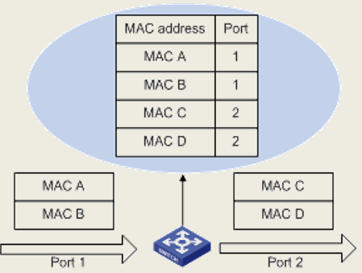

逆向学习：收到数据后就根据帧里写的源地址记录这个MAC地址是从哪个端口来的。*有老化时间，默认300秒，如果再次收到消息就重新计时*

*路由器设计多跳网络，涉及全局计算，交换机自己就能构建一个表，不关心其他交换机。*

##### 数据帧处理

- Forwarding 转发
- Filtering 过滤：同一个集线器域内互相发送，交换机发现入端口=出端口时，知道集线器肯定已经发过了！直接丢弃即可
- Flooding 泛洪：MAC地址表不完善时，不知道要往哪里传，那就全发（除了入端口）

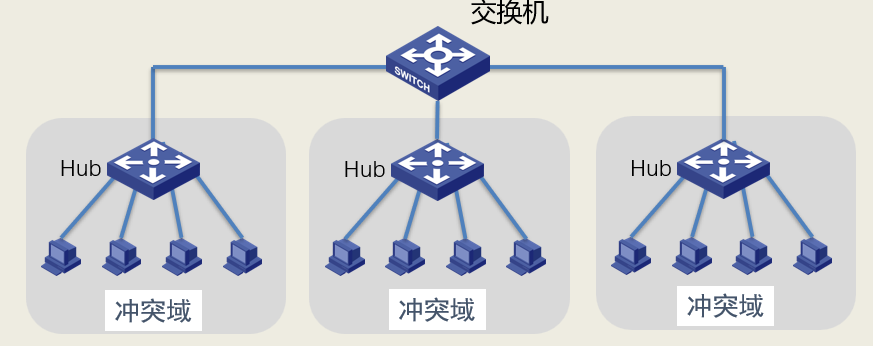

*现在已经全部换成交换机了，因为交换机性能好于集线器。*


### 虚拟局域网 VLAN

- 动机：希望广播的信息控制在一个范围内；希望有逻辑上的隔离性，使跨VLAN无法进行二层通信，需通过三层设备通信；将不同的业务规划到不同VLAN便于管理。
- 类型：基于端口、基于MAC地址、基于协议、基于子网

#### 类型1：基于端口

用的最多。

将端口分为不同组，每一组如同一个独立的交换机，即一个VLAN。

假戏真做：2个虚拟局域网之间通过网络层路由。*现代路由器&交换机一般是同一个设备，所以会从链路层进入网络层处理模块进行路由，再回到链路层。*

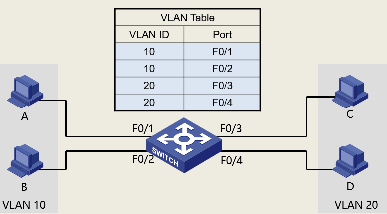

优点：流量隔离（发往端口1-8 的帧，最终只能到达端口1-8）；可以动态变更端口属于哪个VLAN


#### 类型2：基于MAC地址

直接记录MAC地址属于哪个VLAN。

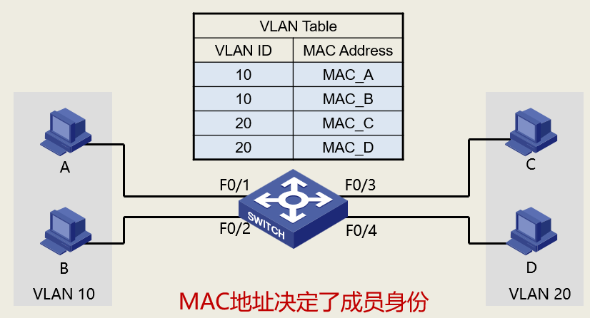

缺点：不是很灵活。如果B换卡了（MAC地址改变了），就需要改表里的信息。


#### 类型3：基于协议

比如VLAN10使用IP，VLAN20使用IPX。

缺点：破坏了网络分层的界限；还需要这个虚拟局域网内的所有主机都用指定的网络层协议。


#### 类型4：基于子网

更加的粗暴，一个子网就是一个VLAN。


#### 跨多交换机的VLAN

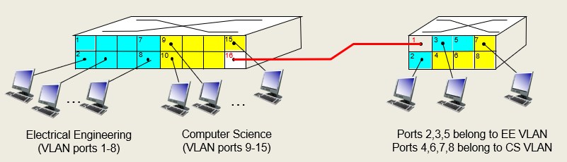

需要保留一个端口作为**trunk port**来跨交换机传输。传输时需要在帧头部添加额外标签，识别所属的VLAN（使用802.1Q协议）

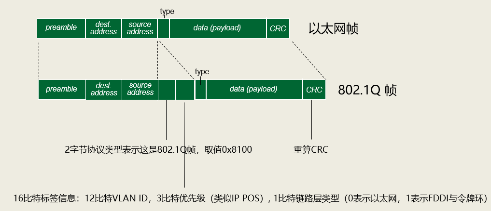


### 生成树协议

因为防止故障断点，所以有冗余路径，因此有环路，引发问题：

1. 广播风暴：无休止的泛洪广播流量，无限循环。
2. 重复帧：走两条路，都到了。
3. MAC地址表不稳定：当一个帧的多个副本到达不同端口时，交换机会不断修改同一MAC地址对应的端口。

生成树协议 (STP): 打破物理环，维护一个逻辑无环树，如果广播信息从非根端口、非指定端口传来，就不转发。*简单理解即可。*

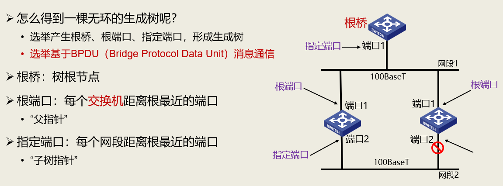


### PPP协议

实现面向连接的服务。最典型的应用场景：拨号上网。

主要功能：封装上层数据包 (eg. IP包)，负责检错不负责纠错，负责验证接入设备的合法性，建立连接后会通过 PPP 协议封装在点到点的拨号链路上传输。原理简单，提供良好的访问控制和计费功能。

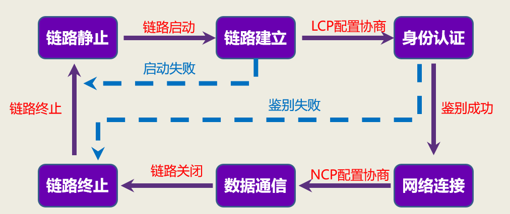


### PPPoE协议

在以太网上实现PPP协议。

使用Client/Server模型，一般直接集成在光猫里了，每个主机都是 PPPoE Client，每个主机有一个帐号，方便运营商对用户进行计费和控制。


## 四、无线链路

### Intro

#### 构成部分

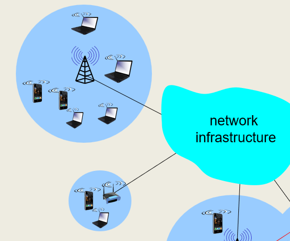

- 基站
   - 通常与有线网络连接
   
   - 主要功能：中继（relay），在有线网络与无线主机之间互相传输报文
   
   - 有覆盖范围限制
   
   - 例：无线信号塔，WiFi接入点
   
     

#### 分类

1. 基于基础设施的无线网络：使用基站连向更大的网络 

   - 切换（handoff）问题: 设备移动，导致所连接的基站发生变化

2. 自组织网络 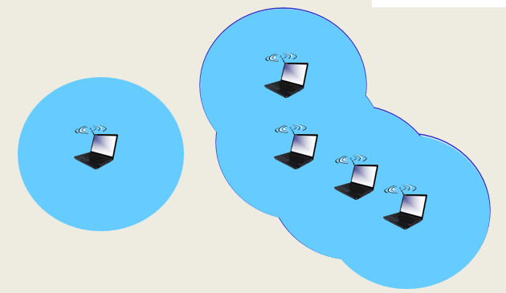

   没有基站，节点自我组织成一个网络，相互路由、交换

1. 单跳无线链路：
   - 基于基础设施：主机通过基站连向更大的网络（蜂窝网、WiFi）
   - 无基站：源-目的直连 (蓝牙)
2. 多跳无线链路：
   - 基于基础设施：主机通过多个无线节点进行中继，连接到更大网络（无线网状网络 wireless mesh networks）
   - 无基站多跳目前还不多用，但可能未来在太空中使用


#### 核心问题

1. 无线（wireless)：如何通过无线链路进行数据传输

   - 数据链路层技术

   - 需要根据无线链路物理特性，考虑差错控制、多路访问控制等功能

2. 移动（mobility）：处理主机所连基站发生的变动


### 无线链路传输

#### 无线链路特征

- 递减的信号强度：信号穿过物体时，强度将减弱；即使自由空间中，随着距离增加也会衰减（称为路径损耗 path loss）。

- 其他信号源的干扰 *eg. 2.4GHz 无线LAN与2.4GHz 无线电话*

- 多路径传播：电磁波反射后，通过不同路径到达接收端

  

#### 衡量指标

- 信噪比（signal-to-noise ratio，SNR）：收到信息强度与噪声强度的相对值（单位：分贝）
- 比特差错率（BER）：接收方收到的错误比特的比例

给定物理层：增加传输功率 -> 增加SNR -> 降低BER  *噪声强度是固定的，所以功率越强信号越清晰*

给定信噪比：增加传输速率 -> 增加BER  *想要更快，得携带更多的信息，区分区间就更小*

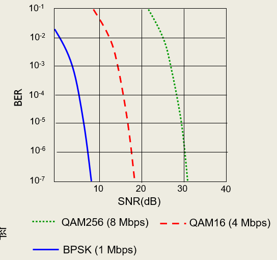
$$
三种不同的物理层调制技术
$$


### 无线链路多路访问

#### 多路访问问题

- 问题1：隐藏终端 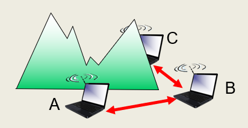

  B与A可以互相听到，B与C可以互相听到，A与C之间存在障碍，无法听到对方存在，所以无法知道双方在B处互相干扰。

- 问题2：信号衰减 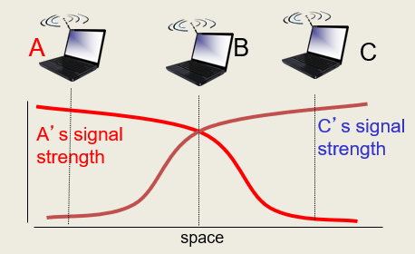

  B与A可以互相听到，B与C可以互相听到，A与C之间收到的对方信号极为微弱，无法知道双方在B处互相干扰。

因此没法用CSMA/CD。


#### 多路访问解决方案

回忆讲信道划分时提到过↓

##### CDMA：Code Division Multiple Access

码分编码：每个对话拥有一个编码（不同会话间相互正交）

- 传输：将要发的信息点乘编码发送。（要发的信息，即01比特，作为-1,1点乘）

- 接收：将收到的消息（也许有多个信息同时传输导致线性叠加）点乘对话编码，再除以信息长度，即可得到想知道的信息。

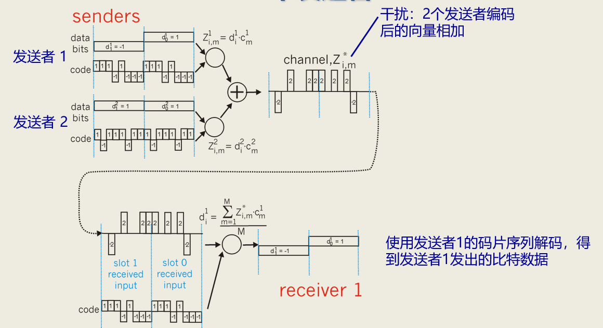

$$
假设编码a，b，编码了信息m1，m2 \\
  则接收到 am1+bm2，假设想知道m1，则点乘a得到 aam1 + abm2 \\
  由正交性得ab = 0，又aa=|a|^2=信息长度，所以除以信息长度即可得到m1
$$

> [!NOTE]
>
> CDMA属于扩频(spread spectrum)通信中的一种
>
> 扩频通信通常有两大类：
>
> 1. 一种是直接序列扩频DSSS (Direct Sequence Spread Spectrum)，如CDMA使用码片序列
> 1. 另一种是跳频扩频FHSS (Frequency Hopping Spread Spectrum)，在蓝牙802.15中使用
>
> *扩频技术发明于二战，最初目的是避开敌方监听信息，由一位好莱坞影星发明。*


## 五、无线局域网（WiFi）

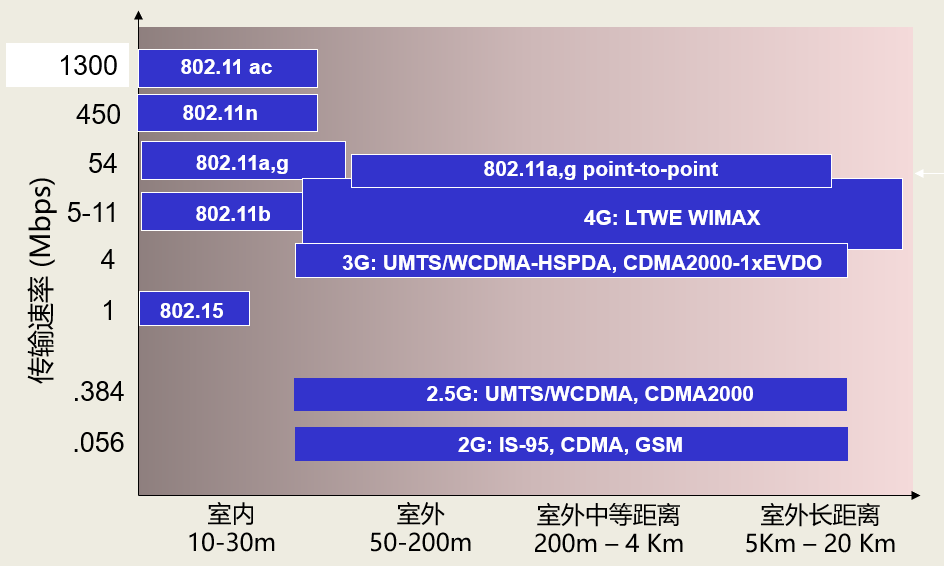

WiFi：802.11，所有都使用 CSMA/CA（见下面）进行多路访问控制，所有都支持基础设施模式与自组网模式。

> 1. 802：指 IEEE 802 系列标准。IEEE 802 是一个专门制定局域网（LAN）和城域网（MAN）技术标准的工作组，该系列标准涵盖了局域网的物理层、数据链路层等核心技术规范。除了无线局域网的 802.11 子系列，还有以太网的 802.3、令牌环网的 802.5、虚拟局域网的 802.1Q 等分支。
> 2. 11：指 IEEE 802.11 子标准。这是 802 系列中专门针对 无线局域网（WLAN） 的技术规范。它定义了无线局域网的物理层（PHY）和媒体访问控制层（MAC）的核心规则，比如载波监听多路访问 / 冲突避免（CSMA/CA）协议、工作频段等，后续所有的无线局域网标准都是在 802.11 基础上的扩展。
> 3. 后面的字母指 802.11 标准的不同扩展版本。802.11 基础标准发布后，为了提升传输速率、优化性能，IEEE 陆续推出了多个扩展版本：
>    - 最早的扩展版本是 802.11a（工作在 5GHz 频段，最高速率 54Mbps）；
>    - 紧接着的 802.11b（工作在 2.4GHz 频段，最高速率 11Mbps），也是早期普及度很高的无线标准；（穿墙效果好，成本低，但频段有很多其他设备共用）
>    - 后续还有 802.11g、802.11n、802.11ac、802.11ax（即 Wi-Fi 6）等版本，不断提升速率、降低延迟、扩大覆盖范围。


#### 无线局域网架构

网络由基本服务集（Basic Service Set, BSS) 组成：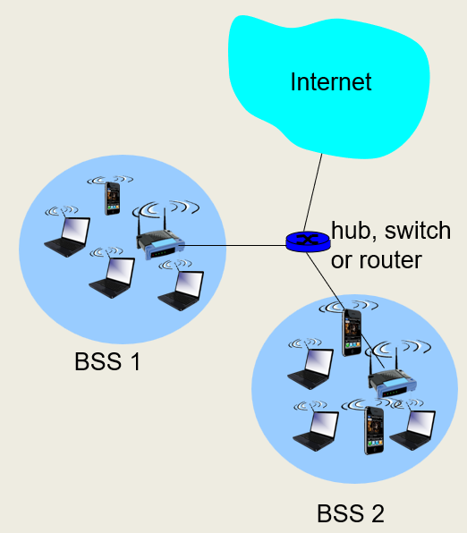

##### 接入点 AP

接入点（access point, AP): 基站的角色，主机间通过AP进行通信。（自组织模式下没有接入点）

每个无线主机在能够发送或接收网络层数据之前，必须与一个AP关联（association)

- AP的部署（802.11b为例）
   - 管理员为每个AP配置一个服务集标识符（SSID）
   - 802.11b频段范围 2.4GHz-2.485GHz spectrum，被划分为11个信道，管理员为AP选择一个信道。
- 主机关联AP的过程
   - 被动扫描
      1. AP周期性发送信标帧（beacon frame），包含AP的SSID与MAC地址
      2. 主机扫描信道，监听信标帧
      3. 收到多个AP的信标帧时，选择1个进行关联，发送关联请求。
      4. 关联时，需要身份验证（可选）、分配IP（通常用DHCP）
      5. AP回复关联响应帧。
   - 主动扫描
      1. 主机广播探测请求帧
      2. AP返回探测响应帧
      3. 主机向选择的AP发送关联请求帧
      4. 被选择的AP向H1回复关联响应帧


#### 多路访问控制

##### CSMA/CA

- 发送方

  1. 如果发送前信道空闲时间达到 **DIFS **(Distributed Interframe Space)，则发送整个帧，发送时不进行冲突检测。

  2. 如果发送前检测到信道忙，则选择一个随机值作为计时器。

     信道空闲时，计时器递减；信道忙时，计时器不变。

  3. 计时器减为0时，发送，并等待ACK

  4. 收到ACK后，若马上有下一帧发送，进入步骤2

     若未收到ACK，进入步骤2准备重传，并且使用更大的随机值

- 接收方

  如果收到1个正确的帧，等到 **SIFS** (Short Interframe Space)时间后，发送ACK (由于隐藏终端，ACK是必要的) 

> [!NOTE]
>
> CSMA/CD：一旦空闲，立刻发送
>
> CSMA/CA：一旦空闲，递减计时器。防止某个帧传输结束时，多个发送者马上发送冲突。


##### 预约机制

核心思想：允许发送者“预约保留”信道，而不是随机访问，避免大帧传输的冲突。

1. 发送者先使用CSMA/CA发送一个小报文RTS（request-to-send）给基站
2. 基站广播CTS（clear-to-send）消息，作为对RTS的回复
3. 所有站点都会收到CTS，发送者开始传输，其他站点推迟传输。
4. 其他站点在传输完成后也能收到ACK，随即开始倒计时、传输。


#### 802.11 帧

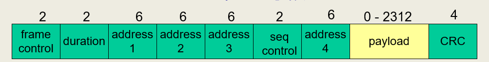

- 四个地址字段

  1. 接收方MAC地址
  2. 发送方MAC地址
  3. 路由器接口MAC地址
  4. 只在自组织模式下使用

- duration：预约的传输时间

- seq：需要ACK回复所以必须要seq。

- frame control：2字节中包括↓

  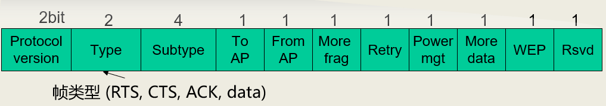


#### 同一子网下的移动

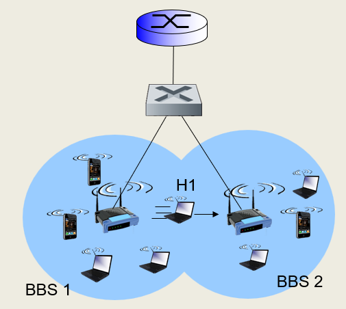

当H1从基本服务集 BSS1 移动到基本服务集 BSS2 时，

- BSS1 与 BSS2 属于同一子网，其AP连到同一交换机不同端口
- 移动后，H1仍在同一子网内，IP地址不变
- 交换机：通过逆向学习，知道H1连向哪个端口
  - 所以如果没有往外发数据，交换机不知道，仍然把数据发回原来的地方，那就收不到，就会产生轻微卡顿。


#### 802.11 其他功能

##### 自适应传输速率

根据无线主机的移动，信噪比SNR发生变化

基站与无线主机都将动态调整传输速率（通过改变物理层的调制技术）

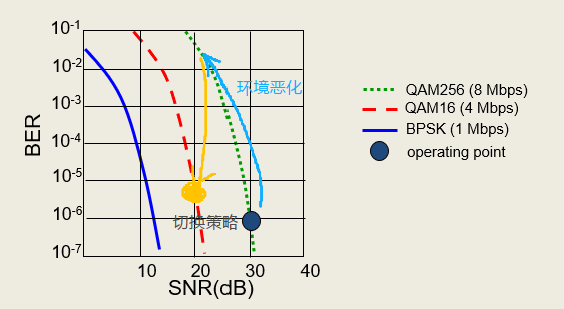

##### 功率管理

无线主机在睡眠/唤醒两种状态间切换，睡眠状态下节省能耗

- 主机 -> AP：通知将进入睡眠状态，直到下一个信标帧到来 *(在802.11帧首部将功率管理比特置1) (信标帧每隔100ms发送一次)*

- AP：在下一个信标帧之前，不再给该主机发送帧，而是进行缓存

- 主机收到信标帧，which 列出了有帧缓存的无线主机

  如果有帧缓存：主机进入唤醒状态，接收帧 *只需要250μs就能唤醒*

  如果没有帧缓存：继续睡眠


### 802.15 个人域无线网（蓝牙）

传播直径小于10米，自组织模式。

> 主从模式（master-slave）
>
> - Slave节点请求发送权限
> - Master节点授权传输
>
> 802.15：从蓝牙技术演化而来
>
> - 工作在2.4 GHz波段
> - 最高速度 721kbps
> - 信道访问控制：划分为长度625μs的时间片、79个频段
> - 每个时间片使用1个频段，并且以伪随机方式跳到下一个频段（跳频扩展频谱FHSS）


### 蜂窝网

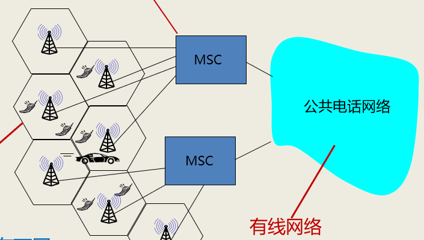

- 每个六边形覆盖域称为小区 (cell)
- MSC: 一跳无线后连到有线网络。负责处理移动等。

#### 第一跳：空中接口

第一跳：空中接口（air interface）：将无线设备连接到基站

- 2G：组合使用FDMA与TDMA *将信道划分为频段，每个频段划分为时间片*

- 3G：CDMA

  - 有各种标准：W-CDMA（欧洲）、CDMA-2000（美国）、TD-SCDMA（中国）
  - 中国三大运营商各用一种↑

- 4G：正交频分复用 *不考*

- 5G：非正交频分复用 + MIMO *不考*

  

#### 网络架构

- 2G：使用电话网络   *网关MSC左边的部分可以视作一个子网*

  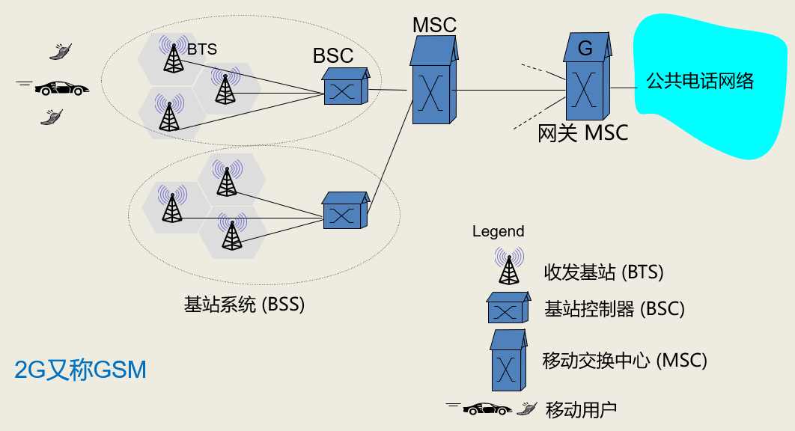

- 3G：语音网络核心架构不变，单独的数据网络并行运作（为数据传输做优化）

  *SGSN和MSC类似，对移动性进行管理*

  *GGSN和网关MSC类似，将子网接入大网*

  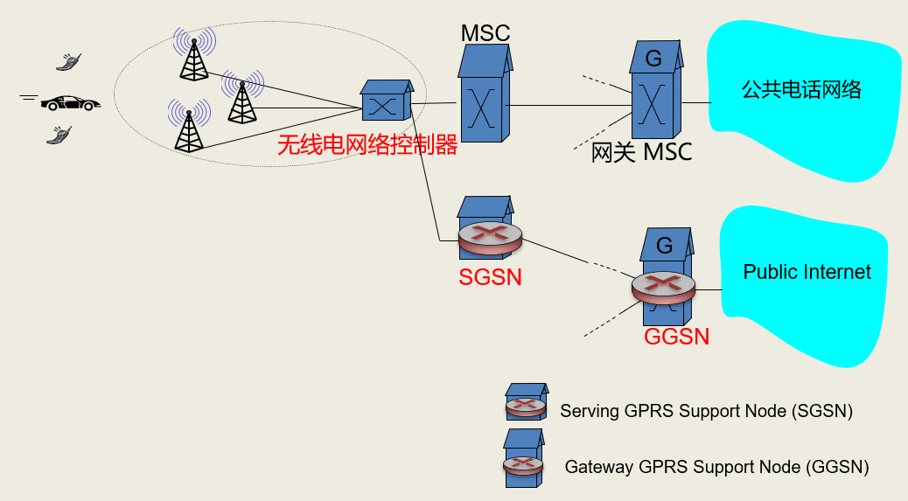

- 4G LTE网络架构：统一的全IP架构（语音、数据都封装在IP报文中，在基站-网关间传输，不再有语音网络）；控制平面与数据平面分离

  *MME & HSS：控制平面*    *S-GW & P-GW：数据平面*

  *MME：管理用户状态。HSS：存储用户相关信息。S-GW：管移动性锚点。P-GW：QoS控制，收费记账。*

  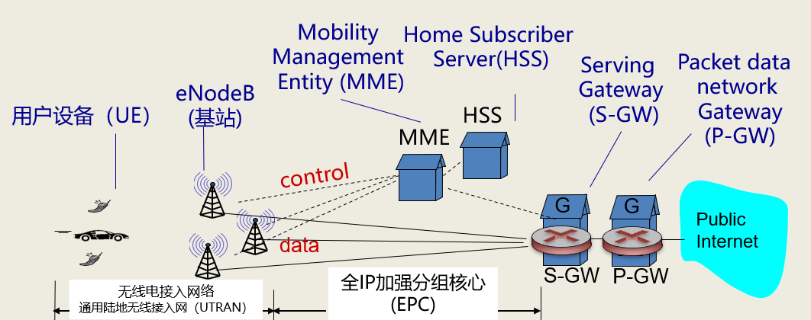

  
  >
  >LTE的QoS：
  >
  >QoS 的保障是在基站（eNodeB）到服务网关（S-GW）这段链路上生效的，具体保障的指标包括：最小 / 最大传输速率、丢包率、延迟
  >
  >QCI 的 “资源类型” 分为两类，是区分业务优先级的核心：
  >
  >- GBR（保证比特率）：必须保障固定的传输速率，适用于对速率 / 延迟敏感的实时业务（比如语音、直播视频），对应 QCI 1-4；
  >- Non-GBR（非保证比特率）：不保障固定速率，按网络负载动态分配资源，适用于非实时业务（比如网页、邮件），对应 QCI 5-9。
  >
  >不同 QCI 对应不同业务的质量指标，比如：
  >
  >- QCI 1（GBR）：语音通话（延迟要求 100ms 内、丢包率 10⁻²）；
  >- QCI 4（GBR）：实时游戏（延迟仅 50ms，优先级高）；
  >- QCI 8（Non-GBR）：网页 / 邮件（延迟 300ms 即可，优先级低）。
  
  

#### 数据封装与传输

因为有较为稳定的线路所以可以使用UDP。

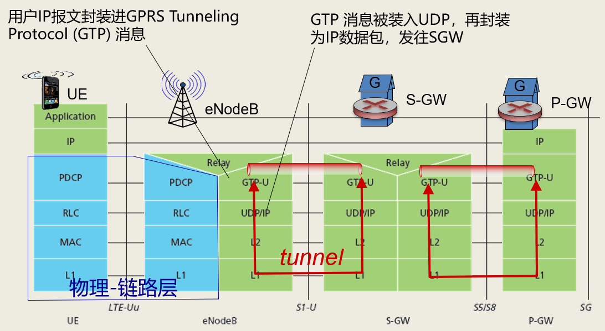


#### 用户状态

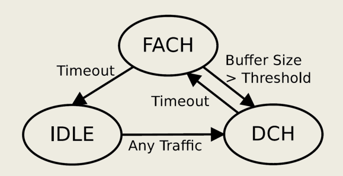

- IDLE：没有数据发送
- DCH：终端拥有单独信道，高速传输（能耗大）
- FACH：终端与其他终端共享信道，低速传输（能耗小）
- Timeout：一段时间没有数据发送
- Buffer Size > Threshold: 发得太慢了缓冲区可能溢出，就需要加速


### 管理移动性的一般方法

#### 移动性概要

- 移动性类别：无移动性、高移动性

  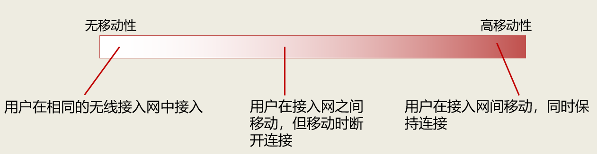

- 归属网络: 每个移动设备有个长期的归属网络，一般不更换（如：128.119.40/24）*可以视作籍贯*

- 永久地址: 移动设备在归属网络中的地址，可以总是访问到该移动设备（如：128.119.40.186）*可以视作户籍地址*

- 归属代理: 归属网络中，代表移动设备执行移动性功能的实体

- 转交地址care-of-address（COA）: 移动设备在被访网络内的地址 (e.g., 79,129.13.2) *可以视作现居地址*

- 被访网络（或外部网络）: 移动设备当前所在的网络 (e.g., 79.129.13/24) *现居城市*

- 外部代理: 外部网络中，代表移动设备执行移动性功能的实体 *外部代理通知归属代理：该设备属于自己的网络，以及拥有的COA*

#### 移动性流程

##### 设备注册

1. 移动设备进入访问网络时，连接外部代理，申请转交地址
2. 外部代理通知归属代理：该设备属于自己的访问网络&该设备的转交地址（有时候，也可以由设备自身通知归属代理）

##### 通信

方案1. 通过路由解决：网络中路由器为移动设备的永久地址创建路由表项，路由器收到移动消息后，会在自己的路由表中新增一条表项：“目标地址 = 移动设备的永久地址，下一跳 = 现居外部网络的入口”。

- *这个方案不行，路由表更新慢&无法处理海量移动设备*

方案2. 通过代理解决：

- 间接路由：通信者 <--> 归属代理 <--> 外部代理 <--> 移动设备

  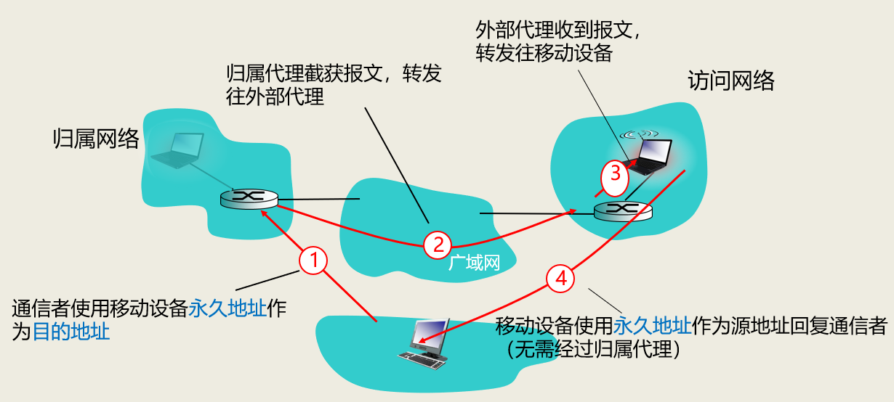

  优点：对于通信者而言，设备移动、访问网络改变、转交地址改变是透明的。*因为双方通信的源地址和目的地址都没有改变，所以设备与通信者的连接在移动中仍然可以保持*

  缺点：三角路由问题：效率低下，特别当通信者与移动设备在同一访问网络时

- 直接路由：通信者 <--> 外部代理 <--> 移动设备

  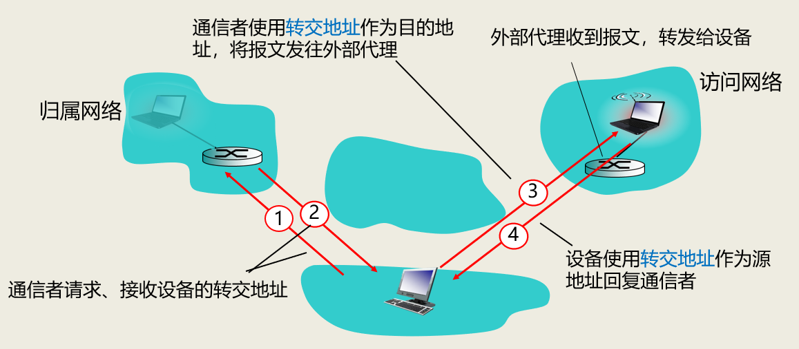

  问题：对通信者不透明（通信者必须知道并发往转交地址），那么如果设备再次移动，就发不到了。

  Sol. 锚外部代理（anchor foreign agent）：第一个访问网络中的外部代理
  
  - 通信者数据始终发往锚外部代理，由锚外部代理转发到当前访问网络
  - 当设备到达新的访问网络时（步骤2），向新的外部代理注册（步骤3）
  - 新的外部代理向锚外部代理提供新的转交地址（步骤4）
  
  *不直接更新转交地址是因为希望避免频繁断联重联*
  
  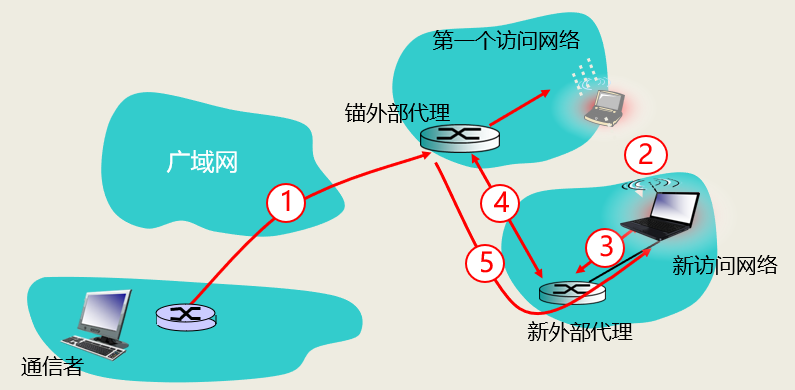


### 移动IP的移动性管理

（最终并没有被部署起来）

由三部分组成：

1. 报文间接路由

2. 代理发现：

   - 代理通告 – 外部代理/归属代理广播ICMP报告，通告代理服务的存在
   - 代理请求 – 设备收到后发送代理请求报文（ICMP）

3. 代理注册

   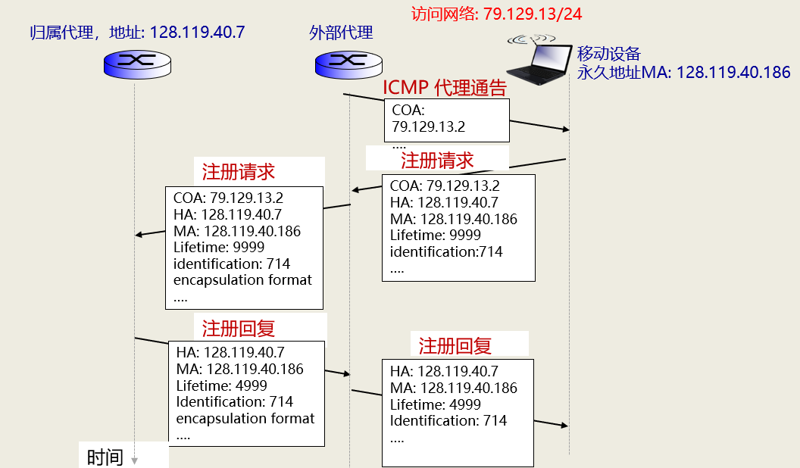


### 蜂窝网的移动性管理

#### 切换基站

类似WiFi中切换AP：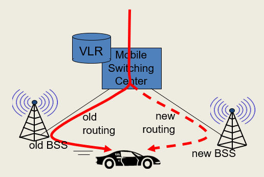

> 1.旧基站通知被访MSC（mobile switching center）即将发起切换，并提供包含至少1个新基站的列表
>
> 2.MSC选择新基站，设置到新基站的路径，分配相应路由资源，通知新基站
>
> 3.新基站分配无线信道给该设备
>
> 4.新基站通知MSC与旧基站，并提供与设备的关联信息
>
> 5.旧基站告诉无线设备，即将进行切换
>
> 6.移动设备与新基站交换信息，激活信道
>
> 7.移动用户通知新基站与MSC，完成激活。MSC中后续呼叫讲路由到新基站
>
> 8.MSC通知旧基站释放资源

#### 切换MSC

设备向新MSC注册时，新MSC通知锚MSC设备位置信息

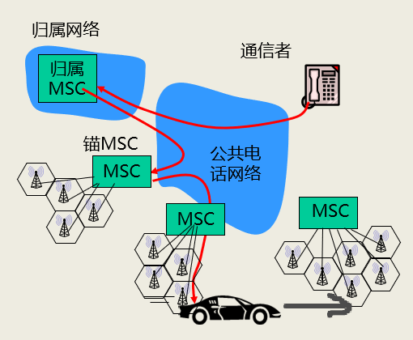


#### LTE(4G)中的移动管理

4G：设备可能处于休眠状态。休眠状态下，从一个基站移动到另一个基站，网络无法获知位置移动。

Sol. 寻呼（paging），基站定期广播报文，确认设备仍然存在。移动后的切换与2G 3G类似。


> [!NOTE]
>
> 无线传输对网络高层的影响：
>
> 逻辑上没什么影响，Internet网络层仍然尽力而为服务，TCP与UDP可以建立在各类物理层+链路层技术上。
>
> 实际上无线传输会影响TCP拥塞控制：TCP 的拥塞控制机制会把无线链路的问题误判为网络拥塞，导致拥塞窗口不必要地被减小。

---


# Lecture 6. 新型

这章不考了所以没有整理qaq


## 一、无线网络

### 5G 核心技术

了不起！广泛关注！把有线网络技术在无线网络中进行实现！

【表格】

用户体验速率：没有差别那么大，因为手机处理数据消耗太多资源，软件无法支持这么高的传输速率。

#### 关键技术1：全双工的新物理层

互不干扰的互相传输。

#### 关键技术2：新网络架构

##### 网络切片

有独立的设计目标、优化方法

##### 网络功能虚拟化

核心网干净了很多，全部变成了通用服务器。

##### 控制平面、数据平面分离

根据不同需要划分不同切片

##### 边缘计算

通用服务器带着计算资源和存储资源，可以拿来用。（eg. 王者荣耀可以购买核心网内的服务器资源，直接在核心网里进行计算，以降低时延）


#### 5G 应用

- 无人吊车
- 矿井开采
- 铁路行业


### 优化无线网络

#### 1. 代理MPTCP

因为有些祖传代码不支持MP-TCP，不方便修改，所以使用代理。

代理部署在运营商内部（反正有资源）

#### 2. TACK

ACK发的太多、等得太久了。

设计思想：对原来的ACK类型进行扩展，携带更多的信息

每隔一段时间对之前的一大组数据进行反馈——周期ACK。自适应网络情况来决定周期时间。


## 二、广域网

### QUIC

把音频和视频分开来传输

### SD-WAN：软件定义广域网

### 算力网络与网算融合

- 算力网络：通过网络连接计算资源，重点是连接计算资源。
- 网算融合：网络和计算资源深度融合，网络内部参与计算。

#### 算力网络案例：Regionless云计算

希望可以直接丢一个AI上去训，不需要知道占用了多少GPU、用的哪里的GPU。


## 三、数据中心网络

### 分层架构

ToR：柜子顶层的交换机

core router下面都是局域网。


### ECMP

重排序，大流小流分流


### 新型网络软件系统


网络和内存已经速度差不多了。

#### 用户态I/O：Intel DPDK

给了一个用户态的库，还封装了各种数据处理，软件可以直接调用来访问网卡数据（？）

有超快的哈希表！


架构1：有操作系统让大家排队。

架构2：容易产生竞争

架构3：微内核模块需要设计


自己组里的论文2333


### 新型网络硬件系统

形式一不太行。形式二是最主流的形式。形式三需要开发。

路线一：按照TCP/IP来做

路线二：都卸载到硬件了，为啥还要按照TCP/IP来做？


#### 内存语义

把远端的机器的内存当自己的内存用——远端内存访问

把函数发过去让远端执行。——RPC
